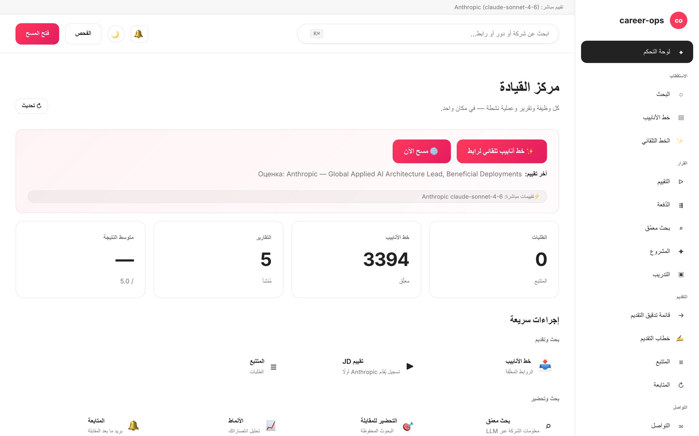

# career-ops-ui

> واجهة ويب أنيقة بأسلوب التوثيق التقني لخط أنابيب البحث عن عمل بالذكاء الاصطناعي — [career-ops](https://github.com/Fighter90/career-ops).
> ابحث عن الوظائف وقيّمها واستكشفها وقدّم طلباتك وتتبّع كل عرض من تبويب واحد في المتصفح — بدلاً من التنقل بين Claude Code والطرفية وملفات markdown.

[English](README.md) | [Español](README.es.md) | [Português (Brasil)](README.pt-BR.md) | [한국어](README.ko-KR.md) | [日本語](README.ja.md) | [Русский](README.ru.md) | [简体中文](README.zh-CN.md) | [繁體中文](README.zh-TW.md) | [Français](README.fr.md) | [Polski](README.pl.md) | [Українська](README.uk.md) | **العربية**

_واجهة غير رسمية — لا علاقة لها بـ career-ops / santifer ولا تحظى بموافقتهما._

[](#الاختبارات)
[](#الاختبارات)
[](#الاختبارات)
[](#المتطلبات)
[](LICENSE)
[](https://github.com/Fighter90/career-ops-ui/releases/tag/v1.75.1)

> **🆕 أحدث إصدار — v1.75.1**
>
> **التكافؤ مع المشروع الأصلي career-ops v1.12.0 — سبعة مصادر وظائف جديدة تصل إلى الماسح.** أصبح بالإمكان الآن اختيار ثلاثة مُجمِّعات للعمل عن بُعد على مستوى اللوحة بأكملها (**RemoteOK** و**Remotive** و**Working Nomads**) وأربعة مُجمِّعات إقليمية مُوجَّهة بالتهيئة (**IBM** و**Arbeitsagentur** و**Glints** و**Jobstreet / SEEK**) في `#/scan`. إضافةً إلى `content_filter` اختياري (تبويب بالكلمات المفتاحية للوصف/المقتطف)، وتقوية كتابة المسح ضد حقن صف TSV وصيغ جداول البيانات (#1098)، و`secondaryLocations` أغنى في Ashby لإظهار الأدوار المؤهَّلة للعمل في الاتحاد الأوروبي (#1073)، والتحقق من شكل تقرير التقييم لدى المزوّدات داخل العملية (#819)، وAntigravity CLI في وثائق المساعدين. يُبنى على v1.74.0 (6 مساعدي ذكاء اصطناعي، منها GitHub Models) وv1.70–73 (12 locales، منها العربية RTL، خطاب التغطية + PDF).
>
> _12 locales · 6 مزوّدات LLM · 14 محوّل ماسح · التكافؤ مع المشروع الأصلي v1.12.0._



<div dir="rtl">

## نبذة عن career-ops

[career-ops](https://career-ops.org) نظام مفتوح المصدر للبحث عن عمل يعمل على شكل أوامر slash داخل أي واجهة سطر أوامر للذكاء الاصطناعي (Claude Code وGemini CLI وCodex وQwen Code وOpenCode وGitHub Copilot CLI وAntigravity CLI — وتعمل واجهات CLI الأخرى المتوافقة مع Claude أيضاً). يقيّم كل وظيفة مقارنةً بسيرتك الذاتية وفق مقياس سداسي الأبعاد من 0,0 إلى 5,0، ويُنشئ ملفات PDF لسيرة ذاتية مخصّصة، ويتتبّع كل طلب محلياً — دون حسابات سحابية أو إرسال تلقائي أو جمع بيانات.

**هذا المستودع (career-ops-ui)** واجهة ويب متكاملة فوق career-ops. تظل واجهة CLI مسؤولة عن ملء النماذج (عبر Playwright MCP) وأوامر slash؛ أما تطبيق الصفحة الواحدة (SPA) فيمنحك سطحاً يشبه نظام CRM في المتصفح فوق نفس الملفات `cv.md` و`data/applications.md` و`reports/`. كلاهما يشتركان في البيانات ذاتها.

**عتبات الإجراء حسب النتيجة** (من [career-ops.org/docs](https://career-ops.org/docs)):

| النتيجة | الخطوة التالية |
|---|---|
| **≥ 4.5** | `/career-ops apply` — تطابق عالٍ، قدّم طلبك فوراً |
| **4.0 – 4.4** | تقديم الطلب أو `/career-ops contacto` للحصول على تزكية |
| **3.5 – 3.9** | `/career-ops deep` — ابحث أولاً عن الشركة |
| **< 3.5** | تجاهل ما لم يكن ثمة سبب محدد |

**الأدلة الرسمية** على [career-ops.org/docs](https://career-ops.org/docs):

- [ما هو career-ops](https://career-ops.org/docs/introduction/what-is-career-ops)
- [مسح بوابات الوظائف](https://career-ops.org/docs/introduction/guides/scan-job-portals)
- [التقديم على وظيفة](https://career-ops.org/docs/introduction/guides/apply-for-a-job)
- [التقييم الجماعي للعروض](https://career-ops.org/docs/introduction/guides/batch-evaluate-offers)
- [إعداد Playwright](https://career-ops.org/docs/introduction/guides/set-up-playwright)

## الميزات الرئيسية

| الصفحة | الوصف |
|---|---|
| **لوحة التحكم** | عدادات إجمالية، متوسط النتائج، آخر الطلبات والتقارير |
| **المسح** | زر 🌐 Scan يُشغّل جميع المصادر المُهيّأة (Greenhouse / Ashby / Lever / Workable / SmartRecruiters / Workday + hh.ru / Habr Career) في مرور واحد؛ نتائج فورية عبر SSE |
| **خط الأنابيب (Pipeline)** | إدارة `data/pipeline.md`؛ معاينة آمنة للروابط (حماية SSRF) |
| **التقييم** | الصق وصف الوظيفة ← نتيجة 0–5 عبر Anthropic أو Gemini؛ أو نموذج جاهز للنسخ |
| **البحث المعمّق** | استكشاف الشركة عبر Anthropic SDK؛ تُحفَظ النتائج في `interview-prep/` |
| **المتتبّع** | جدول مصفّى للطلبات فوق `data/applications.md` |
| **السيرة الذاتية (CV)** | محرر markdown مباشر مع معاينة جانبية وحماية XSS من جهة الخادم |
| **صحة النظام** | شارات حالة الإعداد؛ تشغيل `doctor.mjs` بنقرة واحدة |
| **المساعدة** | توثيق مدمج بـ 12 لغة (بما فيها العربية) |

## البداية السريعة

> **مهم — career-ops-ui لوحة تحكم *فوق* [`Fighter90/career-ops`](https://github.com/Fighter90/career-ops).** يعمل **داخل** مشروع career-ops بوصفه `career-ops/web-ui/` ويقرأ ملفات `cv.md` و`config/` و`data/` من المجلد الأصلي عبر `../`. **لا يعمل بشكل مستقل** — تحتاج أيضاً إلى مستودع career-ops الأصلي.

### الخيار 1 — أمر curl واحد (موصى به)

</div>

```bash
curl -fsSL https://raw.githubusercontent.com/Fighter90/career-ops-ui/main/bin/setup.sh | bash
```

<div dir="rtl">

يستنسخ **كلا** المستودعين، يُرتّب بنية `career-ops/web-ui/`، يثبّت التبعيات، يُشغّل التشخيص، ويبدأ الخادم على http://127.0.0.1:4317.

### الخيار 2 — إضافة الواجهة إلى مشروع career-ops موجود

</div>

```bash
cd career-ops
git clone https://github.com/Fighter90/career-ops-ui.git web-ui
cd web-ui
npm install
npm start
```

<div dir="rtl">

افتح http://127.0.0.1:4317 في متصفحك.

### أوامر CLI

</div>

```bash
career-ops-ui setup    # bootstrap: تثبيت التبعيات ← تشخيص ← تشغيل
career-ops-ui init     # اختيار مزوّد LLM ولصق مفتاح API (تفاعلي)
career-ops-ui doctor   # التحقق من Node / المشروع / المفاتيح / Playwright
career-ops-ui run      # تشغيل الخادم على http://127.0.0.1:4317
career-ops-ui open     # فتح تبويب لوحة التحكم وإحضاره للأمام
career-ops-ui help     # عرض قائمة جميع الأوامر
```

<div dir="rtl">

### اختيار مزوّد LLM

`init` معالج اختيار المزوّد — اختر **Claude / Claude Code** (`ANTHROPIC_API_KEY`)، أو **Codex / OpenCode** (`OPENAI_API_KEY`)، أو **Qwen Code** (`QWEN_API_KEY`)، أو **Auto** (Anthropic ← Gemini احتياطياً). يمكن ضبط المفاتيح يدوياً:

</div>

```bash
echo "ANTHROPIC_API_KEY=sk-ant-..." >> career-ops/.env
```

<div dir="rtl">

أو من تبويب **إعدادات التطبيق** (`#/config`) في الواجهة — دون إعادة تشغيل الخادم.

## المتطلبات

| | |
|---|---|
| **Node.js** | ≥ 18 (نظام `fetch` الأصلي و`node:test`) |
| **career-ops** | مستنسَخ ومُهيَّأ (انظر أعلاه) |
| **اختياري** | `ANTHROPIC_API_KEY` أو `GEMINI_API_KEY` في `.env` للمشروع الأصلي، لتقييم الوظائف بنقرة واحدة |

## البنية المعمارية باختصار

</div>

```
career-ops/
├─ cv.md
├─ portals.yml
├─ config/
├─ data/
└─ web-ui/          ← هذا المستودع
   ├─ server/       # Express + 15 وحدة مسارات
   ├─ public/       # vanilla JS SPA — بدون bundler
   └─ tests/        # 1086 unit + 70 Playwright + 43 e2e
```

<div dir="rtl">

للخادم تبعيتان إنتاجيتان فقط: `express` و`js-yaml`. لا transpile، لا bundler — حجم الواجهة بالكامل أقل من 30 كيلوبايت.

## التوثيق الكامل

التوثيق الشامل متاح باللغة الإنجليزية فقط: **[README.md](README.md)**

يتضمن توصيفات تفصيلية لـ:
- REST API الكامل (جميع نقاط النهاية `/api/*`)
- إعداد ماسح بوابات الوظائف (Greenhouse وAshby وLever وWorkable وhh.ru وHabr Career وRSS)
- جميع متغيرات البيئة
- مبادئ الأمان (SSRF وXSS وتحديد معدل الطلبات)
- دليل البنية المعمارية (SDD والاتفاقيات)

الموقع الرسمي: [career-ops.org](https://career-ops.org) · التوثيق: [career-ops.org/docs](https://career-ops.org/docs)

## الاختبارات

</div>

```bash
npm test                    # 1086 اختبار وحدة وتكامل
npm run test:e2e            # 20 اختبار e2e دخاني
npm run test:e2e:full       # 23 اختبار e2e شامل
npm run test:e2e:browser    # 70 اختبار Playwright
npm run test:coverage       # مثل npm test + تغطية V8
```

<div dir="rtl">

## الرخصة

MIT. التفاصيل: [LICENSE](LICENSE).

مبني على [career-ops](https://github.com/Fighter90/career-ops) بقلم [santifer](https://santifer.io).

[](https://github.com/Fighter90/career-ops-ui/graphs/contributors)

</div>
