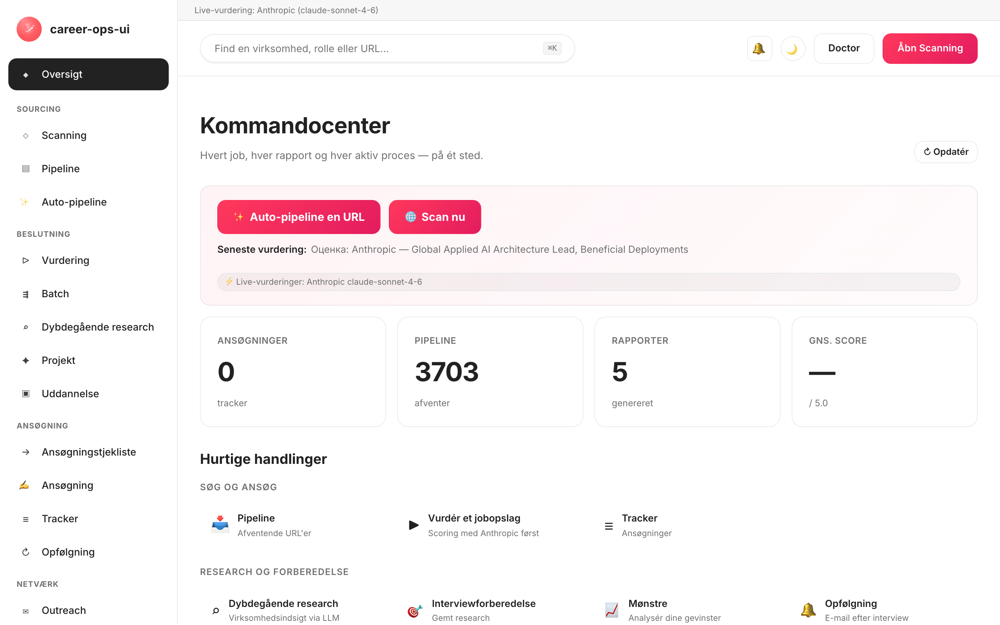

# career-ops-ui

> En ren webgrænseflade i dokumentationsstil til AI-jobsøgningskonveyeren [career-ops](https://github.com/Fighter90/career-ops).
> Søg, evaluér, gå i dybden, ansøg og hold styr på hvert tilbud fra én browserfane — i stedet for at hoppe mellem Claude Code, terminaler og markdown-filer.

[English](README.md) | [Español](README.es.md) | [Português (Brasil)](README.pt-BR.md) | [한국어](README.ko-KR.md) | [日本語](README.ja.md) | [Русский](README.ru.md) | [简体中文](README.zh-CN.md) | [繁體中文](README.zh-TW.md) | [Français](README.fr.md) | [Polski](README.pl.md) | [Українська](README.uk.md) | **Dansk** | [العربية](README.ar.md)

_Uofficiel grænseflade — ikke tilknyttet eller godkendt af career-ops / santifer._

[](#tests)
[](#tests)
[](#tests)
[](#krav)
[](LICENSE)
[](https://github.com/Fighter90/career-ops-ui/releases/tag/v1.80.0)

> **🆕 Seneste udgivelse — v1.80.0**
>
> **Fem scan-forbedringer** (idéer fra [job-crawler](https://github.com/bracketouverte/job-crawler), genimplementeret): en **Teamtailor**-kilde — sites pr. tenant `<slug>.teamtailor.com` via deres offentlige `/jobs.rss`-feed (**27 adaptere** i alt); **kildekarantæne** — døde 404/410-kilder registreres og springes over ved senere scanninger (selvhelende efter 14 dage), hvilket dræber den tilbagevendende støj fra døde slugs; et **Max per source**-loftfelt (∞ som standard); et **Posted within**-aldersfilter (24t / 7d / 30d); og **gemte søgninger + ★ favoritter** på `#/scan`, gemt i `localStorage` med defensiv validering. Bygger videre på v1.79.0 (We Work Remotely), v1.78.x (landefilter, auto-opdatering, Enter→Scan, klikbart logo), v1.77.0 (dansk) og v1.76.0 (ATS-kilder pr. tenant, `trust_filter`).
>
> _13 lokaliteter · 6 LLM-providere · 27 scanneradaptere · gemte søgninger + favoritter · paritet med forælderens career-ops v1.14.0._

<!-- DO NOT REVERT: this is the EN README; localized clones MUST switch to their own ./images/dashboard-<locale>.png (es / pt-BR / ko-KR / ja / ru / zh-CN / zh-TW). Generated by scripts/capture-dashboard-screenshots.mjs. -->


## Om career-ops

[career-ops](https://career-ops.org) er et open source-jobsøgningssystem, der kører som slash-kommandoer inde i enhver AI-kodnings-CLI (Claude Code, Gemini CLI, Codex, Qwen Code, OpenCode, GitHub Copilot CLI, Antigravity CLI — andre Claude-kompatible CLI'er virker også via den samme slash-kommandoflade). Modelagnostisk. Det evaluerer hvert opslag op mod dit CV med en seksdimensionel 0.0–5.0-rubrik, genererer skræddersyede PDF-CV'er og holder styr på hver ansøgning lokalt — ingen skykonti, ingen telemetri, ingen automatisk indsendelse.

**Dette repository (career-ops-ui)** er en poleret webgrænseflade ovenpå. CLI'en ejer fortsat formularudfyldning (via Playwright MCP) og slash-kommandotilstande; SPA'en giver dig en CRM-lignende browserflade over de samme `cv.md` / `data/applications.md` / `reports/`-filer. Begge deler de samme data.

**Handlingstærskler efter score** (fra [career-ops.org/docs](https://career-ops.org/docs)):

| Score | Næste skridt |
|---|---|
| **≥ 4.5** | `/career-ops apply` — høj match, send med det samme |
| **4.0 – 4.4** | ansøg, eller `/career-ops contacto` for en varm introduktion |
| **3.5 – 3.9** | `/career-ops deep` — undersøg først |
| **< 3.5** | spring over, medmindre du har en bestemt grund |

**Kanoniske vejledninger** på [career-ops.org/docs](https://career-ops.org/docs):

- [Hvad er career-ops](https://career-ops.org/docs/introduction/what-is-career-ops)
- [Scan jobportaler](https://career-ops.org/docs/introduction/guides/scan-job-portals)
- [Ansøg et job](https://career-ops.org/docs/introduction/guides/apply-for-a-job)
- [Batch-evaluér tilbud](https://career-ops.org/docs/introduction/guides/batch-evaluate-offers)
- [Opsæt Playwright](https://career-ops.org/docs/introduction/guides/set-up-playwright)

**Tilstandsreference** (forælderens slash-kommandoer, som web-ui'en fremviser som sider/knapper) — [career-ops.org/docs/reference/modes](https://career-ops.org/docs/reference/modes):

| Tilstand | web-ui | Tilstand | web-ui |
|---|---|---|---|
| [auto-pipeline](https://career-ops.org/docs/reference/modes/auto-pipeline) | `#/auto` | [pipeline](https://career-ops.org/docs/reference/modes/pipeline) | `#/pipeline` |
| [oferta](https://career-ops.org/docs/reference/modes/oferta) | `#/evaluate` | [ofertas](https://career-ops.org/docs/reference/modes/ofertas) | `#/evaluate` |
| [deep](https://career-ops.org/docs/reference/modes/deep) | `#/deep` | [contacto](https://career-ops.org/docs/reference/modes/contacto) | `#/contacto` |
| [interview-prep](https://career-ops.org/docs/reference/modes/interview-prep) | `#/interview-prep` | [pdf](https://career-ops.org/docs/reference/modes/pdf) | Generér PDF |
| [training](https://career-ops.org/docs/reference/modes/training) | `#/training` | [project](https://career-ops.org/docs/reference/modes/project) | `#/project` |
| [tracker](https://career-ops.org/docs/reference/modes/tracker) | `#/tracker` | [patterns](https://career-ops.org/docs/reference/modes/patterns) | `#/patterns` |
| [followup](https://career-ops.org/docs/reference/modes/followup) | `#/followup` | [apply](https://career-ops.org/docs/reference/modes/apply) | `#/apply` |
| cover | `#/cover` | — | — |

**Portaladaptere** — [career-ops.org/docs/reference/portals](https://career-ops.org/docs/reference/portals): [Greenhouse](https://career-ops.org/docs/reference/portals/greenhouse) · [Ashby](https://career-ops.org/docs/reference/portals/ashby) · [Lever](https://career-ops.org/docs/reference/portals/lever) (plus Workable / SmartRecruiters / Workday + RU-kilder — se `#/scan`).

**AI-assistenter** som career-ops kører inde i (web-ui'en er det selvstændige alternativ): Claude Code, Gemini CLI, Codex, Qwen Code, OpenCode, GitHub Copilot CLI, Antigravity CLI. Web-ui'ens ⚡ live-funktioner afbilder disse til API-providere i **`#/config`**: Claude Code→Anthropic, Gemini CLI→Gemini, Codex→OpenAI, Qwen Code→Qwen, OpenCode→any/OpenRouter, GitHub Copilot CLI→GitHub Models, Antigravity CLI→Gemini.

## Installér en AI-kodningsassistent (til forælderens career-ops-CLI)

career-ops kører som slash-kommandoer **inde i** en AI-kodningsassistent — installér **én** og log ind, før du fortsætter (forælderens [Quick Start](https://career-ops.org/docs)):

| Assistent | Installation | web-ui `#/config`-provider |
|---|---|---|
| **Claude Code** | [docs.anthropic.com → Claude Code](https://docs.anthropic.com/en/docs/claude-code) | Anthropic (`ANTHROPIC_API_KEY`) |
| **Gemini CLI** | [github.com/google-gemini/gemini-cli](https://github.com/google-gemini/gemini-cli) | Gemini (`GEMINI_API_KEY`) |
| **Codex** | [github.com/openai/codex](https://github.com/openai/codex) | OpenAI (`OPENAI_API_KEY`) |
| **Qwen Code** | [github.com/QwenLM/qwen-code](https://github.com/QwenLM/qwen-code) | Qwen (`QWEN_API_KEY`) |
| **OpenCode** | [opencode.ai](https://opencode.ai) | any / OpenRouter (`OPENROUTER_API_KEY`) |
| **GitHub Copilot CLI** | [github.com/github/gh-copilot](https://github.com/github/gh-copilot) | GitHub Models (`GITHUB_MODELS_API_KEY`) |
| **Antigravity CLI** | [antigravity.google](https://antigravity.google) | Gemini (`GEMINI_API_KEY`) |

> **Web-ui'en er det selvstændige alternativ** — den behøver ingen installeret CLI. Dens ⚡ Run-live-funktioner kalder provider-API'erne direkte; sæt **én vilkårlig** nøgle i `#/config` (eller `career-ops-ui init`), så virker den headless. Foretrækker du CLI'en, så kør career-ops inde i din valgte assistent og brug web-ui'en udelukkende som dashboardet over de samme filer.

## Start og initialisér i én kommando

> **Vigtigt — career-ops-ui er et dashboard *ovenpå* [`Fighter90/career-ops`](https://github.com/Fighter90/career-ops).** Det kører **inde i** et career-ops-projekt som `career-ops/web-ui/` og læser dine `cv.md`, `config/`, `data/` fra den overordnede mappe via `../`. Det virker **ikke** selvstændigt — du har også brug for det overordnede `career-ops`-repo. Klon det ikke alene og kør `init`; brug en af de to muligheder nedenfor.

### Mulighed 1 — én curl (anbefalet: sætter alt op)

```bash
curl -fsSL https://raw.githubusercontent.com/Fighter90/career-ops-ui/main/bin/setup.sh | bash
```

Kloner **begge** repoer, arrangerer `career-ops/web-ui/`-strukturen, installerer afhængigheder, kører doctor og starter serveren på http://127.0.0.1:4317 — og åbner derefter dashboardet.

### Mulighed 2 — tilføj UI'en til et eksisterende career-ops-projekt

Hvis du allerede har career-ops konfigureret og blot vil have dashboardet, så klon UI'en **inde i** det som `web-ui`:

```bash
cd career-ops                                                   # ← dit eksisterende career-ops-projekt
git clone https://github.com/Fighter90/career-ops-ui.git web-ui
cd web-ui
npm install
npx career-ops-ui init        # interactive: pick LLM provider + paste its key → parent career-ops/.env
```

Den indlejrede `web-ui/`-struktur er præcis det, der gør UI'en i stand til at finde dine `../cv.md`, `../config/`, `../data/`. Kør `npm link` **én gang**, hvis du hellere vil skrive det blotte `career-ops-ui <verb>` i stedet for `npx career-ops-ui <verb>`.

### CLI-verberne

```bash
career-ops-ui setup    # bootstrap: install deps → doctor → run (SKIP_START=1 to stop before run)
career-ops-ui init     # pick LLM provider + paste its key (interactive)
career-ops-ui doctor   # verify Node / project / keys / Playwright (exit 0 ⇔ all required green)
career-ops-ui run      # launch the server at http://127.0.0.1:4317
career-ops-ui open     # open + RAISE the dashboard tab in your browser
career-ops-ui help     # list every verb
```

Sæt `npx ` foran (f.eks. `npx career-ops-ui run`), hvis du ikke kørte `npm link`. Efter `setup`/`run` åbnes fanen **og bringes i forgrunden** automatisk; sæt `NO_OPEN=1` for at deaktivere auto-åbning (headless / CI).

### Vælg din LLM-provider

`init` er provider-guiden — vælg **Claude / Claude Code** (`ANTHROPIC_API_KEY`), **Gemini / Gemini CLI** (`GEMINI_API_KEY`), **Codex / OpenCode CLI** (`OPENAI_API_KEY`) eller **Auto** (Anthropic → Gemini-fallback). Nøgler indtastes med ekko slået fra og skrives til den overordnede `career-ops/.env` via den samme validerede sti som API-nøglefanen i `#/config`. Ikke-interaktiv form til CI:

```bash
career-ops-ui init --provider claude --anthropic-key sk-ant-… --yes
career-ops-ui init --provider gemini --gemini-key …          --yes
career-ops-ui init --provider auto   --openai-key sk-…       --yes
```

Eller sæt den manuelt: `echo "ANTHROPIC_API_KEY=sk-ant-…" >> career-ops/.env`. Provideren sætter `LLM_PROVIDER` (`auto` | `claude` | `gemini`); skift den når som helst fra **`#/config` → API keys** uden at genstarte.

### Fejlfinding af `init`

Hvis `career-ops-ui init` fejler, eller kommandoen ikke findes (almindeligt lige efter et `git pull`):

```bash
cd career-ops/web-ui
npm install
npx career-ops-ui init        # npx runs the local bin even without `npm link`
```

Sørg for:

- At du kører den **inde fra `career-ops/web-ui/`** — ikke fra en selvstændig `career-ops-ui/`-klon.
- At den **overordnede `career-ops/`-mappe findes** og indeholder `cv.md` og `config/`. Hvis du klonede career-ops-ui alene, så flyt den (eller klon igen), så den ligger på `career-ops/web-ui/` — eller kør blot curl'en fra Mulighed 1, som arrangerer strukturen for dig.
- `career-ops-ui doctor` (eller `npx career-ops-ui doctor`) udskriver præcis, hvad der mangler.

---

## Hvorfor?

[career-ops](https://github.com/Fighter90/career-ops) er et kraftfuldt Claude-Code-drevet jobsøgningssystem: indsæt et JD → få en 0-5 match-score, et ATS-optimeret PDF og en tracker-post. Det fungerer fremragende inde i Claude Code, men dataene ligger spredt over `cv.md`, `data/applications.md`, `reports/*.md`, `data/pipeline.md`, `portals.yml`, `config/profile.yml` — let at miste overblikket over, svært at skimme.

`career-ops-ui` lægger en poleret UI ovenpå:

- **Auto-pipeline** — indsæt én job-URL på `#/auto`, klik én gang: validér → hent → evaluér → gem rapport → tilføj til tracker, med en levende tilgængelig stepper og deep-links til artefakter.
- **Gennemse** trackeren, rapporterne og pipeline som et CRM.
- **Udløs** scanninger (Greenhouse / Ashby / Lever / Workable / SmartRecruiters / Workday **og** hh.ru / Habr Career / Trudvsem / GetMatch / GeekJob) og se live SSE-logfiler.
- **Evaluér** et JD live via Anthropic (foretrukket) eller Gemini, eller få en kopiér-indsæt-prompt til Claude Code, hvis ingen API-nøgle er sat.
- **Dybdegående research** af virksomheder live via Anthropic SDK med cv-/profil-/tilstandsfiler indlejret automatisk.
- **Redigér** `cv.md` med side-om-side markdown-forhåndsvisning og server-side XSS-sanering.
- **Vedligehold** systemet: doctor, verify, normalize, dedup, merge — ét klik hver.
- **Multi-CLI:** kører identisk fra Claude Code, Codex, Cursor, Aider eller Gemini CLI — `CLAUDE.md` / `AGENTS.md` / `GEMINI.md`-shims peger på én enkelt kilde til sandheden.

Det er rene tilføjelser: intet inde i `career-ops/` ændres. Alle dine tilpasninger forbliver dine.

---

## Hurtig start

### 1. Installér career-ops først

```bash
git clone https://github.com/Fighter90/career-ops.git
cd career-ops
```

Følg [career-ops onboarding](https://github.com/Fighter90/career-ops#first-run--onboarding), så `cv.md`, `config/profile.yml` og `portals.yml` findes.

### 2. Læg career-ops-ui ind i det

```bash
git clone https://github.com/Fighter90/career-ops-ui.git web-ui
```

Dit træ ser nu sådan ud:

```
career-ops/
├─ cv.md
├─ portals.yml
├─ config/
├─ data/
├─ modes/
├─ reports/
├─ scan.mjs … doctor.mjs … (etc)
└─ web-ui/                 ← dette repository
   ├─ bin/start.sh
   ├─ package.json
   ├─ server/
   ├─ public/
   └─ tests/
```

### 3. Start

```bash
bash web-ui/bin/start.sh
```

Scriptet:

1. Tjekker Node ≥ 18.
2. `npm install` (kun ved første kørsel, tre afhængigheder — Express + js-yaml + multer).
3. Starter Express-serveren på `127.0.0.1:4317`.
4. Åbner http://127.0.0.1:4317/ i din standardbrowser.

Brugerdefineret port / vært:

```bash
PORT=8080 bash web-ui/bin/start.sh
HOST=0.0.0.0 PORT=4317 bash web-ui/bin/start.sh   # eksponér på LAN
```

Hvis du klonede repoet et andet sted (ikke som `career-ops/web-ui`), så peg på career-ops via env:

```bash
CAREER_OPS_ROOT=/path/to/career-ops bash bin/start.sh
```

---

## Første kørsel — ren tilstand

`career-ops/data/pipeline.md` leveres med to QA-fixtur-URL'er (`example.com/qa-fixture-*`), så testsuiten kan køre hermetisk. På en frisk klon vil du se Pipeline vise `2 pending` — det er ikke rigtige jobs. Ryd dem før din første scanning:

```bash
make clean-test-fixtures        # removes pipeline.md fixture rows + qa-fixture-* applications.md rows
npm start
```

Åbn http://127.0.0.1:4317. Pipeline-tælleren bør nu vise `0 pending`. Makefilen er idempotent — at køre den igen på et rent træ er en no-op.

---

## Krav

| | |
| --- | --- |
| **Node.js** | ≥ 18 (bruger native `fetch`, `node:test`) |
| **career-ops** | Klonet og onboardet — se ovenfor |
| **Valgfrit** | `GEMINI_API_KEY` i `.env` i det overordnede projekt (gratis-niveau-modellen `gemini-2.0-flash`) til JD-evaluering med ét klik. Ellers returnerer UI'en en kopiér-indsæt-prompt til Claude. |
| **Valgfrit** | Kør fra en russisk IP / VPN, hvis hh.ru returnerer 403. Habr Career virker fra enhver IP uanset. |
| **Valgfrit** | Playwright (allerede en transitiv afhængighed af career-ops) til e2e-testsuiten. |

---

## Hvad du får — pr. side

| Side             | Hvad den gør                                                                                                       |
| ---------------- | ------------------------------------------------------------------------------------------------------------------ |
| **Dashboard**    | Aggregerede tællinger (apps / pipeline / rapporter), gennemsnitlig score, statusfordeling, seneste 5 apps + seneste rapport.         |
| **Scan**         | **🌐 Enkelt Scan-knap** — kører hver aktiveret kilde i ét hug (Greenhouse / Ashby / Lever / Workable / SmartRecruiters / Workday for EN, hh.ru + Habr Career + Trudvsem + GetMatch + GeekJob for RU). Live SSE-logstreaming + klikbar resultattabel med filtre for lokation / Remote-Hybrid-badge / relocation-flag / løn / kilde og dynamiske stak-/niveau-/nøgleords-chips. Active-Companies-kortet oplister hver sporet board med dens API-sundhed. |
| **Pipeline**     | CRUD på `data/pipeline.md`. Server-side preview-proxy (SSRF-sikker, validering af redirect pr. hop, 8 KB body-loft). Hop direkte fra en URL til evaluering.       |
| **Evaluate**     | Indsæt JD → **Anthropic først** (foretrukket når begge nøgler findes), derefter Gemini, derefter manuel prompt-fallback. Anthropic-stien indlejrer cv / profil / `_shared.md` / `oferta.md` automatisk (REVIEW-A1). Gem JD til `jds/` er valgfrit. |
| **Deep research**| Samme fallback-kæde som Evaluate. Live Anthropic returnerer ~10-30 KB jordforbundet markdown gemt til `interview-prep/<company>-<role>.md`. |
| **Modes**        | 7 generiske tilstandssider (`/#/project`, `/#/training`, `/#/followup`, `/#/batch`, `/#/contacto`, `/#/interview-prep`, `/#/patterns`) med den samme Anthropic / Gemini / manuelle fallback. |
| **Apply helper** | Genererer en indsendelsestjekliste; selve Playwright-formularudfyldningen forbliver i `/career-ops apply` inde i Claude Code. |
| **Tracker**      | Filtrerbar tabel over `data/applications.md` (status, score, fritekst). Ét-klik `normalize-statuses.mjs` / `dedup-tracker.mjs` / `merge-tracker.mjs`. Pipe- + newline-escapes er GFM-kompatible — navne som `"Acme \| Co"` overlever round-trip uden tab. |
| **Reports**      | Gennemse og læs hver rapport under `reports/` med parset header (Score / Legitimacy / URL).                       |
| **CV**           | Live markdown-editor til `cv.md` med side-om-side forhåndsvisning + ét-klik `cv-sync-check.mjs` + 📁 Upload CV. Server-side XSS-strip ved gem (`<script>`, `javascript:`, `on*=`-handlere). |
| **Profile**      | Skrivebeskyttet visning af `config/profile.yml` + arketyper — UI-venligt resumé.                                         |
| **App settings** | In-UI-editor til den overordnede `.env`'s nøgler: `ANTHROPIC_API_KEY`, `GEMINI_API_KEY`, model-overrides, port / vært. Hemmeligheder maskeres ved læsning. |
| **Health**       | Alle opsætningstjek i OK / OPTIONAL / FAIL-badges + knapper til at køre `doctor.mjs` og `verify-pipeline.mjs`.           |
| **Help**         | In-app Markdown-brugervejledning (`/#/help`), lokaliseret til alle 9 understøttede sprog (en / es / fr / pt-BR / ko-KR / ja / ru / zh-CN / zh-TW). |
| **Activity log** | Revisionsspor af hver tilstandsændrende forespørgsel (writes, runs, scans). Hemmeligheder redigeret. |
| **Notifications** 🔔 *(v1.58.34 / v1.58.35)* | Klokke i topbjælken med rødt ulæst-badge. Klik for at glide en skuffe ind, der oplister de seneste 50 toasts (pr. fane, pr. session) — Success / Error / Info-progress, hver med et lokaliseret tidsstempel, den menneskelige besked og ethvert `(METHOD /path · HTTP NNN)`-postfiks gemt i en `<details>`. Hjælp **§18** dokumenterer hver kategori. Skuffen åbner **kun** ved klik på klokken (eller tastatur Enter / Space); lukkes via ×, Esc eller ved at klikke på klokken igen. |

Globale tastaturgenveje:

- `Ctrl+K` / `Cmd+K` — fokusér på den globale søgning. Footer-hintet tilpasser sig pr. platform (⌘K på macOS/iOS, Ctrl+K andre steder) med det lokaliserede verbum (v1.58.20).
- Indsættelse af en URL i den globale søgning tilføjer den automatisk til pipeline.
- `Esc` — luk enhver åben modal **eller** notifikationsskuffen (v1.58.34).

---

## Scan

Token-fri portalscanning, der faktisk returnerer ledige stillinger. **Én 🌐 Scan-knap** i UI'en kører hver konfigureret kilde i ét enkelt sweep:

- **Greenhouse / Ashby / Lever / Workable / SmartRecruiters / Workday** — offentlig boards-api for hver virksomhed i `portals.yml::tracked_companies` med et genkendeligt ATS-mønster. Den medfølgende liste dækker Stripe, GitLab, Vercel, Cloudflare, Datadog, Discord, Elastic, Grafana Labs, CockroachDB, Fastly, Twilio, Coinbase, Reddit, Robinhood, Affirm, Lyft, Linear, Supabase, PostHog, Ramp, Modal Labs, Railway, Browserbase, JetBrains — udvid eller beskær frit.
- **RSS-boards** — ethvert jobboard, der eksponerer et RSS/Atom-feed (LaraJobs, WeWorkRemotely, RemoteOK, golangprojects, …). Tilføj `provider: rss` + feed-URL'en til `portals.yml` — ingen kodeændringer påkrævet.
- **Aggregatorboards (v1.75.0)** — syv board-brede / konfigurationsstyrede kilder ud over ATS'er pr. virksomhed: **RemoteOK / Remotive / Working Nomads** (board-brede remote-feeds, vælg med `provider: remoteok|remotive|workingnomads`) og **IBM / Arbeitsagentur / Glints / Jobstreet · SEEK** (konfigurationsstyret, hver læser en `<provider>:`-blok pr. post). Se `docs/portals-examples.md` for kopiér-indsæt-`tracked_companies`-poster. De kører det samme `title_filter` / `location_filter` / `content_filter` + dedup + pipeline-append-flow som enhver anden kilde.
- **hh.ru** — HTML-scrape af `hh.ru/search/vacancy`. Virker fra enhver IP, ingen nøgle, ingen proxy. (JSON-API'en `api.hh.ru` bruges ikke — den returnerer nu 403 til enhver programmatisk klient uanset IP/User-Agent; websiden leverer fulde resultater til enhver browserlignende klient, så vi scraper den, på samme måde som Habr Career scrapes.)
- **Habr Career** — HTML-scrape af `career.habr.com/vacancies`. Virker fra enhver IP, ingen auth.

### RSS-adapter

Peg scanneren på et hvilket som helst RSS-baseret jobboard ved at tilføje en post med `provider: rss` og en `rss:` (eller `feed_url:`)-nøgle til `portals.yml`:

```yaml
tracked_companies:
  - name: LaraJobs
    provider: rss
    rss: https://larajobs.com/feed
    enabled: true
  - name: WeWorkRemotely
    provider: rss
    rss: https://weworkremotely.com/remote-jobs.rss
    enabled: true
```

Adapteren parser `<item>`-blokke ved hjælp af en lille regex-baseret parser (ingen XML-bibliotek nødvendigt). Den udtrækker `title`, `link` (→ `url`), `pubDate` (→ `date`) og `description` (→ `snippet`, HTML strippet). Remote-status udledes af `/remote|anywhere/i` i titlen eller beskrivelsen; virksomhedsnavnet hentes fra `dc:creator`, et "Company — Role"-titelmønster eller feed-værtsnavnet som fallback. Det samme normalisér → filtrér → dedup → pipeline-append-flow gælder som for ATS-adaptere.

Alle kilder går gennem den samme pipeline: normalisér → filtrér (`title_filter.positive` / `title_filter.negative`) → dedup mod `data/scan-history.tsv` + `data/pipeline.md` + `data/applications.md` → append til `data/pipeline.md` → gem hele resultatsættet til `data/last-scan.json` til UI'ens filtrerbare tabel.

Konfigurér via `portals.yml`:

```yaml
title_filter:
  positive: [backend, engineer, senior, tech lead, golang, php]
  negative: [junior, intern, frontend, ios, android]
tracked_companies:
  - { name: Stripe, enabled: true, careers_url: https://job-boards.greenhouse.io/stripe }
  - { name: Linear, enabled: true, careers_url: https://jobs.ashbyhq.com/linear }
  # ...
russian_portals:
  sources: ["hh", "habr"]   # one or both
  area: 113                  # 1=Moscow, 2=SPb, 113=Russia, 1001=remote
  per_page: 50
  only_remote: false
  queries: ["Senior PHP", "Senior Go", "Tech Lead"]
```

Alle kilder flyder gennem ét enkelt SSE-endpoint: `/api/stream/scan?source=ats|regional|both`. **🌐 Scan**-UI-knappen kalder `source=both`, så hver adapter (Greenhouse / Ashby / Lever / Workable / SmartRecruiters / Workday + hh.ru + Habr Career + Trudvsem + GetMatch + GeekJob) kører i én forbindelse. Respekterer `AbortSignal` ved klientafbrydelse — ingen forældreløse fetches.

---

## Arkitektur

```
career-ops-ui/
├─ CLAUDE.md                 # project-level agent instructions (canonical)
├─ AGENTS.md                 # Codex / Aider / generic CLI shim → CLAUDE.md
├─ GEMINI.md                 # Gemini CLI shim → CLAUDE.md
├─ .aiignore                 # exclusion list for AI tools
├─ .claude/                  # Claude Code agent config
│  ├─ agents/                # 3 project-specific subagents (route, view, test isolation)
│  └─ commands/               # slash-command stubs
├─ bin/start.sh              # one-shot launcher (Node check → npm install → server → open browser)
├─ package.json              # 2 runtime deps: express, js-yaml
├─ server/
│  ├─ index.mjs              # ~130 LOC orchestrator: middleware + 12 register<Topic>Routes(app) calls + SPA catch-all
│  └─ lib/
│     ├─ paths.mjs           # absolute paths to career-ops files (CAREER_OPS_ROOT aware)
│     ├─ parsers.mjs         # markdown / pipeline / report parsers (GFM-compliant pipe escapes)
│     ├─ runner.mjs          # runNodeScript() + streamNodeScript() with SIGTERM→SIGKILL escalation + 30 min cap
│     ├─ security.mjs        # isValidJobUrl, stripDangerousMarkdown, sanitizeJobDescription, isPubliclyExposed
│     ├─ prompts.mjs         # bundleProjectContext, buildEvaluationPrompt, buildDeepPrompt, buildModePrompt
│     ├─ store.mjs           # safeReadApps/Pipeline/Reports, checkProfileCustomized, ensureRussianPortalsDefaults
│     ├─ anthropic.mjs       # minimal Anthropic SDK adapter (runAnthropic, hasAnthropicKey, hasGeminiKey)
│     ├─ env-config.mjs      # .env round-trip with secret masking + validation
│     ├─ activity-log.mjs    # JSONL audit trail middleware (secrets redacted)
│     ├─ dotenv.mjs          # tiny dotenv loader
│     ├─ en-scanner.mjs      # in-process Greenhouse/Ashby/Lever orchestrator (AbortSignal aware)
│     ├─ ru-scanner.mjs      # in-process hh.ru + Habr orchestrator (AbortSignal aware)
│     ├─ sources/
│     │  ├─ greenhouse.mjs   # boards-api.greenhouse.io client
│     │  ├─ ashby.mjs        # api.ashbyhq.com client
│     │  ├─ lever.mjs        # api.lever.co client
│     │  ├─ hh.mjs           # hh.ru/search/vacancy HTML scraper (paginated, UA-aware)
│     │  └─ habr.mjs         # career.habr.com HTML parser (no cheerio, regex only)
│     └─ routes/             # 12 route modules — one per topic (P-2)
│        ├─ activity.mjs     # /api/activity
│        ├─ config.mjs       # /api/config (parent .env round-trip)
│        ├─ content.mjs      # /api/cv, /api/profile, /api/portals, /api/modes
│        ├─ health.mjs       # /api/health, /api/dashboard
│        ├─ help.mjs         # /api/help/:lang
│        ├─ jds.mjs          # /api/jds CRUD
│        ├─ llm.mjs          # /api/evaluate, /api/deep, /api/mode/:slug, /api/apply-helper, /api/interview-prep*
│        ├─ pipeline.mjs     # /api/pipeline + SSRF-safe preview proxy
│        ├─ reports.mjs      # /api/reports
│        ├─ runners.mjs      # /api/run/* + /api/stream/{scan,liveness,pdf} + /api/output/pdfs
│        ├─ scan.mjs         # /api/stream/scan-{ru,en} + /api/scan-results
│        └─ tracker.mjs      # /api/tracker
├─ public/                   # static SPA — no build step
│  ├─ index.html
│  ├─ css/app.css            # design tokens (docs-style palette)
│  └─ js/
│     ├─ api.js              # fetch wrapper + connection-banner state + UI helpers + safe markdown renderer
│     ├─ router.js           # hash-based router with 404 fallback + alias support
│     ├─ app.js              # boot + global keyboard handlers + mobile sidebar drawer
│     ├─ lib/{i18n,skills}.js
│     └─ views/              # one file per page (dashboard, scan, pipeline, evaluate, deep, apply, tracker, reports, cv, settings, health, config, help, activity, mode-page)
├─ docs/                     # public reference: architecture, API, data-flows, SDD, conventions, reviews
│  ├─ PROJECT.md             # what / why / for-whom
│  ├─ ROADMAP.md             # current milestone + completed history
│  ├─ PRODUCTION-READINESS.md # honest deployment-gate assessment
│  ├─ sdd/{SDD-GUIDE,CONVENTIONS}.md
│  ├─ architecture/{OVERVIEW,SERVER,FRONTEND,API,DATA-FLOWS}.md
│  └─ reviews/REVIEW-*.md
└─ tests/                    # 1000 unit + 70 Playwright + 23/23 e2e:full + 20 e2e:smoke (baseline @ v1.60.0)
   ├─ parsers.test.mjs       # markdown / pipeline / report parsers (pure functions)
   ├─ api.test.mjs           # every endpoint, ephemeral server, no network
   ├─ {ru,en}-scanner.test.mjs   # mocked fetch
   ├─ pipeline-preview.test.mjs   # per-hop redirect validation (REVIEW-B1)
   ├─ anthropic.test.mjs     # SDK adapter + log-guard test (REVIEW-B4)
   ├─ url-validation.test.mjs    # SSRF reject sweep (FIX-M3 + M6 + M7)
   ├─ cv-xss.test.mjs        # stripDangerousMarkdown round-trip
   ├─ jd-sanitize.test.mjs   # sanitizeJobDescription
   ├─ help.test.mjs / help-ui.test.mjs    # i18n parity across all 8 locales
   ├─ playwright-smoke.mjs   # 12 browser flows (CV save, tracker, pipeline, evaluate, config, etc.)
   └─ e2e{,-comprehensive}.mjs   # full Playwright walkthrough
```

### Hvorfor intet build-trin?

Vanilla HTML/CSS/JS holder overfladearealet bittesmå: ét `npm install` af to afhængigheder, og du kører. Ingen Webpack, ingen Vite, ingen `node_modules` af undergang. Hele UI'en er < 30 KB minificeret. Vil du have hot-reload under udvikling, bruger `npm run dev` Nodes indbyggede `--watch`.

### Spec-Driven Development

Ikke-trivielle ændringer går gennem GSD-konveyeren (`gsd-*`-skills fra `superpowers@claude-plugins-official`):

```
discuss → spec → plan → execute → verify → review
```

Offentlig reference: [`docs/sdd/SDD-GUIDE.md`](docs/sdd/SDD-GUIDE.md). Alle planlægningsartefakter ligger under `.planning/` (gitignored). `docs/`-træet er den langlivede offentlige kontrakt.

---

## API-reference

Alle endpoints under `/api/*`. JSON ind / JSON ud medmindre andet er angivet.

### Health & dashboard

| Method | Path                     | Response                                                                    |
| ------ | ------------------------ | --------------------------------------------------------------------------- |
| GET    | `/api/health`            | `{ ok, warnings, version, parentVersion, checks: [{name, ok, required, value?}] }` |
| GET    | `/api/dashboard`         | `{ counts, avgScore, byStatus, recent, pipeline, lastReport }`              |
| GET    | `/api/status/providers`  | `{ activeProvider, activeModel, keysConfigured }` — LLM readiness for the onboarding banner + ⚡ cost hint (v1.55.3); includes `openrouter` (v1.57.0) |
| GET    | `/api/openrouter/models` | `{ models:[{id,name,context_length}], fallback, cached }` — OpenRouter catalogue proxy for the `#/config` model dropdown (v1.57.0) |
| GET    | `/api/activity?limit&type` | tail of `data/activity.jsonl` audit trail                                 |
| GET    | `/api/help/:lang`        | localized in-app user guide (fallback: `en.md`)                             |

### App settings (parent .env round-trip)

| Method | Path             | Purpose                                                                |
| ------ | ---------------- | ---------------------------------------------------------------------- |
| GET    | `/api/config`    | known env keys with secrets masked                                     |
| POST   | `/api/config`    | validate + write parent `.env`; applies to `process.env` in-place      |

### Data files

| Method | Path                                | Purpose                                                                |
| ------ | ----------------------------------- | ---------------------------------------------------------------------- |
| GET    | `/api/tracker`                      | `{ rows: [parsed applications.md] }`                                   |
| POST   | `/api/tracker`                      | body `{ company, role, score?, status?, url?, notes?, date? }` — dedup-aware (case-insensitive on company + role) |
| GET    | `/api/pipeline`                     | `{ urls: [...] }`                                                      |
| POST   | `/api/pipeline`                     | body `{ url }` → adds to `data/pipeline.md` with dedup + `isValidJobUrl` |
| GET    | `/api/pipeline/preview?url=…`       | server-side fetch proxy (per-hop SSRF check, ≤3 redirects, 8 KB cap) |
| DELETE | `/api/pipeline?url=…`               | removes a URL                                                          |
| GET    | `/api/reports`                      | parsed list of `reports/*.md`                                          |
| GET    | `/api/reports/:slug`                | full markdown + parsed header                                          |
| GET    | `/api/jds`                          | list of saved JD files                                                 |
| GET    | `/api/jds/:name`                    | text/plain — raw JD                                                    |
| POST   | `/api/jds`                          | body `{ text, slug? }` → saves to `jds/`                               |
| DELETE | `/api/jds/:name`                    | unlink (`.txt` suffix required)                                        |
| GET    | `/api/cv`                           | `{ markdown }`                                                         |
| PUT    | `/api/cv`                           | body `{ markdown }` → writes `cv.md` (XSS-stripped, ≤1 MB)             |
| GET    | `/api/profile`                      | `{ profile: yaml-parsed, raw: text }`                                  |
| GET    | `/api/portals`                      | `{ portals: yaml-parsed, raw: text }`                                  |
| GET    | `/api/modes`                        | list of mode files                                                     |
| GET    | `/api/modes/:name`                  | text/plain — raw mode prompt                                           |
| GET    | `/api/output/pdfs`                  | list of generated PDFs                                                 |
| GET    | `/api/output/pdfs/:name`            | download (`Content-Disposition: attachment`)                          |
| GET    | `/api/interview-prep`               | list of saved deep-research files                                      |
| GET    | `/api/interview-prep/:name`         | `{ name, markdown }`                                                   |
| DELETE | `/api/interview-prep/:name`         | unlink (`.md` suffix required)                                         |

### Script runners (buffered, one-shot)

| Method | Path                    | Wraps                       |
| ------ | ----------------------- | --------------------------- |
| POST   | `/api/run/doctor`       | `node doctor.mjs`           |
| POST   | `/api/run/verify`       | `node verify-pipeline.mjs`  |
| POST   | `/api/run/normalize`    | `node normalize-statuses.mjs` |
| POST   | `/api/run/dedup`        | `node dedup-tracker.mjs`    |
| POST   | `/api/run/merge`        | `node merge-tracker.mjs`    |
| POST   | `/api/run/sync-check`   | `node cv-sync-check.mjs`    |

Alle bufrede kørsler har et loft på 60 s; SIGTERM → SIGKILL-eskalering efter en grace-periode på 5 s.

### Streams (SSE)

| Method | Path                          | Streams                            |
| ------ | ----------------------------- | ---------------------------------- |
| GET    | `/api/stream/scan`            | legacy `node scan.mjs` (subprocess)|
| GET    | `/api/stream/scan?source=ats\|regional\|both` | consolidated in-process scanner SSE — query: `dryRun=1`, `company=…` (ATS only). |
| GET    | `/api/stream/liveness`        | `node check-liveness.mjs`          |
| GET    | `/api/stream/pdf`             | `node generate-pdf.mjs`            |

SSE-eventtyper:

```
event: start    data: { script, args?, writeFiles? }
event: log      data: { stream: "stdout"|"stderr", line: string }
event: done     data: { code, counts?, errors? }
event: error    data: { message }
```

### LLM-endpoints (Anthropic-first → Gemini → manuel fallback)

| Method | Path                                | Purpose                                                                          |
| ------ | ----------------------------------- | -------------------------------------------------------------------------------- |
| POST   | `/api/evaluate`                     | body `{ jd, save? }` → JD evaluation (A–G sections per `oferta.md`)              |
| POST   | `/api/evaluate/test-gemini`         | smoke check `GEMINI_API_KEY`                                                     |
| POST   | `/api/evaluate/test-anthropic`      | smoke check `ANTHROPIC_API_KEY`                                                  |
| POST   | `/api/deep`                         | body `{ company, role?, run? }` → deep-research prompt or live grounded markdown |
| POST   | `/api/mode/:slug`                   | generic mode runner; allowlist: `batch`, `contacto`, `followup`, `interview-prep`, `patterns`, `project`, `training` |
| POST   | `/api/apply-helper`                 | body `{ url, jd? }` → application checklist                                      |
| GET    | `/api/scan-results`                 | `{ en: {when, fresh[], filtered[], errors[]}, ru: { ... } }` — last scan         |
| GET    | `/api/scan/regional/config`         | effective regional-scanner config (queries, negatives, sources). |

Når `run: true` er sat på `/api/deep` eller `/api/mode/:slug`, foretrækker serveren Anthropic (når begge nøgler findes), indlejrer `cv.md` + `config/profile.yml` + `modes/_shared.md` + den relevante tilstandsskabelon i en `<project_context>`-blok og returnerer modellens jordforbundne markdown direkte. Blødt loft: 200 KB på den samlede prompt — overløb returnerer 413.

---

## Tests

```bash
npm test                       # 1000 unit/integration tests
npm run test:e2e               # 20 smoke e2e (boots own server)
npm run test:e2e:full          # 23 comprehensive e2e
npm run test:e2e:browser       # 70 Playwright browser (smoke + full-cycle + forms + locale-sweep)
npm run test:coverage          # same as `npm test` plus V8 coverage
```

| Suite                       | Tests | What                                                                                                       |
| --------------------------- | ----- | ---------------------------------------------------------------------------------------------------------- |
| `node --test tests/*.test.mjs` (unit + integration) | **1000** | Every endpoint, ephemeral server, no network. 110 files: parsers, scanners (mocked), runners, anthropic/openai, security headers, XSS, JD sanitize, URL validation, i18n parity, + the v1.55→v1.56 UX-fix suites. |
| `tests/e2e.mjs` (smoke)      | 20    | Playwright headless: every route renders, basic flows.                                                     |
| `tests/e2e-comprehensive.mjs` | 23    | Full Playwright walkthrough: 11 routes + 12 functional flows.                                              |
| `npm run test:e2e:browser` (`playwright-smoke` + `playwright-full-cycle` + `playwright-forms` + `playwright-locale-sweep`) | **70** | Browser-driven: dashboard render, navigation, language switch, 404, health, tracker round-trip, pipeline add + invalid-URL sweep, reports, evaluate manual fallback, config keys masked, CV PUT XSS strip, pipeline preview 400, auto-pipeline SSE. |
| **Total**                   | **1113** | **0 fails, 0 flakes**                                                                                    |

Dækning: ~95.7 % linjer / ~87 % grene via `--experimental-test-coverage`.

Parsere er rene funktioner (ingen I/O) — testet mod rigtige datafragmenter fra `applications.md`, `pipeline.md` og `reports/*.md`. API-tests booter Express-appen på en flygtig port og udøver hvert endpoint ende-til-ende. Scanner-tests mocker `fetch`, så de består, selv hvis hh.ru blokerer din IP. Playwright-browser-smoke kører mod in-process-serveren og løser Playwright via det overordnede projekts `node_modules` — ingen ny afhængighed i `web-ui/`.

CI kører unit- + e2e- + Playwright-matricen ved hvert push til `main` mod Node 18 / 20 / 22.

---

## Konfiguration

Miljøvariabler (læses ved serverstart, alle valgfri undtagen hvor andet er angivet):

| Var                  | Default            | Purpose                                                                            |
| -------------------- | ------------------ | ---------------------------------------------------------------------------------- |
| `PORT`               | `4317`             | Express bind port                                                                  |
| `HOST`               | `127.0.0.1`        | Express bind host. CSP attaches when non-loopback; auth gate planned for v2.0.0.   |
| `CAREER_OPS_ROOT`    | `..` from script   | Where to find `cv.md`, `data/`, `portals.yml`, `modes/`, etc.                      |
| `ANTHROPIC_API_KEY`  | unset              | Enables `/api/evaluate`, `/api/deep`, `/api/mode/:slug` live mode (preferred when both keys set). |
| `ANTHROPIC_MODEL`    | `claude-sonnet-4-6` | Override Anthropic model.                                                         |
| `GEMINI_API_KEY`     | unset              | Forwarded to `gemini-eval.mjs` and used as fallback for `/api/evaluate`.           |
| `GEMINI_MODEL`       | `gemini-2.0-flash` | Override Gemini model.                                                             |
| `OPENAI_API_KEY`     | unset              | Headless live-eval (3rd in the `auto` order) + parent Codex/OpenAI CLI flow.       |
| `OPENAI_MODEL`       | `gpt-5-codex`      | Override OpenAI model.                                                             |
| `QWEN_API_KEY`       | unset              | Headless live-eval via DashScope OpenAI-compatible (4th in the `auto` order).      |
| `QWEN_MODEL`         | `qwen-max`         | Override Qwen model.                                                               |
| `OPENROUTER_API_KEY` | unset              | Headless live-eval via OpenRouter — one key, 300+ models (5th / last in `auto`).   |
| `OPENROUTER_MODEL`   | `openrouter/auto`  | `vendor/model` id. Catalogue loaded live from `GET /api/openrouter/models`.        |

`portals.yml`-udvidelsen som denne UI genkender (tilføj til din eksisterende fil i det overordnede projekt):

```yaml
russian_portals:
  sources: ["hh", "habr"]
  area: 113          # hh.ru area id
  per_page: 50
  only_remote: false
  queries: ["Senior PHP", "Тимлид Go", ...]
```

Du kan også udvide enhver virksomhedspost med en eksplicit `api:`-URL. Se [`docs/portals-examples.md`](docs/portals-examples.md) (i dette repo) for klar-til-indsæt-blokke til 24 verificerede virksomheder.

---

## Sikkerhedsnoter

- Serveren binder til `127.0.0.1` som standard — aldrig eksponeret mod internettet uden eksplicit `HOST=0.0.0.0`.
- **Sti-sanering (v1.21.0)**: hver `:name` / `:slug`-ruteparameter går gennem `sanitizePathName()` i `server/lib/security.mjs` — stripper ikke-`[\w-.]`, fjerner indledende punktum-rækker, sammenfolder interne punktum-rækker, sætter loft ved 200 tegn, tom → 400. Erstatter 10 duplikerede regex-kopier, der tidligere lod `..pdf` / `....md` slippe igennem.
- **DNS-rebind-forsvar (v1.21.0)**: `/api/pipeline/preview` og `/api/auto-pipeline` ruter gennem `server/lib/safe-fetch.mjs::safeGet` — ét DNS-opslag, fastlåst TCP-forbindelse, SNI/Host rettet mod det oprindelige værtsnavn. Intet andet opslag, intet TOCTOU-vindue.
- **Mutex på samtidig skrivning (v1.21.0)**: `tracker.mjs`, `pipeline.mjs` (POST + DELETE) og `auto-pipeline.mjs`'s tracker-trin ombryder read-modify-write i `withFileLock(path, fn)` fra `server/lib/file-lock.mjs`. Samtidige POST'er taber ikke længere rækker.
- **LLM rate-limit (v1.21.0)**: `/api/evaluate`, `/api/deep`, `/api/mode/:slug`, `/api/auto-pipeline` bærer `llmRateLimit` fra `server/lib/rate-limit.mjs`. **No-op på loopback**; 10 req/min/IP på `HOST=0.0.0.0`. Konfigurerbar via `LLM_RATE_LIMIT="N/Ws"`. 429 + `Retry-After`.
- **CV XSS-strip (v1.22.0-hærdning)**: `stripDangerousMarkdown` er nu entity-aware — afkoder `&lt;`, `&gt;`, `&#NN;`, `&#xHH;` før regex-strip, så `&lt;script&gt;`- og `java&#115;cript:`-payloads ikke kan omgå den.
- Subprocess-kald bruger `spawn` med arg-arrays — **ingen shell-interpolation, nogensinde**. `bash`-runneren bruger `--noprofile --norc` for at ignorere `~/.bashrc`.
- Streaming-endpoints dræber barneprocessen ved klientafbrydelse (ingen forældreløse scannere).
- Skrive-endpoints rører kun kendte career-ops-stier: `data/`, `jds/`, `cv.md`, `config/`, `portals.yml`, `output/`, `reports/`, `interview-prep/`, `modes/_profile.md`. Aldrig andre steder.
- Forbindelsesbanneret pinger `/api/health` med eksponentiel backoff (3 s → 6 s → 12 s → 24 s → 60 s), mens forbindelsen er afbrudt, og rydder automatisk op ved genoprettelse (v1.22.0 M-6).

---

## Begrænsninger

De fuldt LLM-drevne tilstande (`oferta`, `deep`, `contacto`, `apply`, `batch`, `patterns`, `followup`) har brug for en LLM for faktisk at køre. Web-UI'en løser en provider fra `auto`-rækkefølgen **Anthropic → Gemini → OpenAI → Qwen → OpenRouter** (eller hvad `LLM_PROVIDER` fastlåser):

1. **Anthropic (foretrukket)** — sæt `ANTHROPIC_API_KEY` i det overordnede projekts `.env`. Ruter gennem `runAnthropic` med `cv.md` / `config/profile.yml` / `modes/_shared.md` / tilstandsskabelon indlejret automatisk (REVIEW-A1). Verificeret live i v1.8.0+ med `claude-sonnet-4-6`, der returnerede 26 KB jordforbundet markdown for et deep-research-kald.
2. **`gemini-eval.mjs`** som fallback — virker ud af boksen, når kun `GEMINI_API_KEY` er sat.
3. **OpenAI / Qwen / OpenRouter** — zero-dep OpenAI-kompatible klienter (`_tailProvider()`-stien). **OpenRouter** (v1.57.0) er den mest fleksible: én `OPENROUTER_API_KEY` fronter 300+ modeller fra hvert større lab, og `#/config`-model-rullemenuen fyldes live fra `GET /api/openrouter/models` (server-side proxy, CSP-sikker, kurateret offline-fallback).
4. **Kopiér-indsæt-prompt** — når ingen nøgle er sat, genererer UI'en en klar prompt formateret til Claude Code / ChatGPT / Gemini Web.

Det eksisterende `/career-ops apply` Playwright-formularudfyldningsflow inde i Claude Code forbliver den eneste måde at virkelig auto-udfylde ansøgningsformularer på — UI'ens *Apply helper* genererer en tjekliste i stedet.

For vurderingen af produktionsparathed (deployment-gates, risikoregister, udskudt arbejde) se [`docs/PRODUCTION-READINESS.md`](docs/PRODUCTION-READINESS.md). TL;DR: klar til single-tenant loopback; LAN-eksponering afventer v2.0 P-12 auth-gate.

---

## Lokalisering

UI'en leverer **9 lokaliteter** — `en`, `es`, `fr`, `pt-BR`, `ko`, `ja`, `ru`, `zh-CN`, `zh-TW`. Siden **v1.60.0 (I18N-SPLIT)** ligger oversættelser **én fil pr. lokalitet** under [`public/js/lib/locales/`](public/js/lib/locales/) — `i18n-dict.<lang>.js`, hver en flad `key → string`-tabel — plus en delt `i18n-dict.aliases.js`. [`i18n-dict.js`](public/js/lib/i18n-dict.js) samler dem til `window.__I18N_DICT`; [`i18n.js`](public/js/lib/i18n.js) løser `t('key', 'fallback')`. Intet build-trin, ingen runtime-fetch — en oversætter redigerer en enkelt sprogfil isoleret.

**Tilføj eller ændr en streng:**

```js
// public/js/lib/locales/i18n-dict.en.js   →   'scan.newButton': 'Run scan',
// public/js/lib/locales/i18n-dict.es.js   →   'scan.newButton': 'Ejecutar búsqueda',
// …add the same key to all 9 locale files (parity is gated)
```

Brug den derefter via `data-i18n="scan.newButton"` i markup eller `t('scan.newButton')` i JS, og kør `npm test`. For at tilføje et helt nyt sprog skal du registrere det i `i18n.js` (`LANGS` + `detect()`), assembleren, `index.html` og det lokalitetstællende værktøj.

📖 **Fuld vejledning:** [`docs/LOCALIZATION.md`](docs/LOCALIZATION.md) — opbygningen pr. lokalitet, `@alias`-mekanismen, tilføjelse af en ny lokalitet trin for trin og hver i18n-CI-gate.

---

## Bidrag

Issues og PR'er er velkomne. Husregler:

- Kør `npm test` før push — **284 checks green** er barren (plus 12 Playwright, hvis du rører UI).
- Ikke-trivielle ændringer går gennem GSD-konveyeren. Se [`docs/sdd/SDD-GUIDE.md`](docs/sdd/SDD-GUIDE.md).
- Modificér ikke noget i det overordnede `career-ops/`-projekt fra dette repo. Hele pointen er, at dette er et ikke-invasivt overlay. Hårde regler i [`CLAUDE.md`](CLAUDE.md).
- Conventional commits: `feat`, `fix`, `refactor`, `docs`, `test`, `chore`, `perf`, `ci`. Valgfrit scope: `feat(scan):`. Breaking change: `feat!:`.
- Tests skal være CI-isolerede — bootstrap fixtures via `mkdtempSync` eller `CAREER_OPS_ROOT=$(mktemp -d)`.

Kører du repoet fra en ikke-Claude-CLI (Codex, Aider, Cursor, Gemini)? Læs [`AGENTS.md`](AGENTS.md) eller [`GEMINI.md`](GEMINI.md) — begge shimmer til den kanoniske `CLAUDE.md`.

---

---

## 🌍 Getting Started — første skridt efter installation

Efter installationen med én kommando har du to tomme git-kloner, scaffoldet med
starter-filerne `cv.md`, `config/profile.yml`, `portals.yml`, `data/applications.md`
og `data/pipeline.md`, der indeholder **EDIT ME**-markører. Health-siden
bør allerede være helt grøn ved første start. Erstat pladsholderne med
dine rigtige data:

### 1. Opret dit CV (`cv.md`)

Du har tre muligheder:

- **Mulighed A — indsæt et eksisterende CV:** åbn `career-ops/cv.md`, erstat
  EDIT-ME-pladsholderne med dit rigtige CV i ren markdown
  (sektioner: Summary, Experience, Projects, Education, Skills). Jo enklere
  jo bedre — `career-ops` læser det som ren tekst.
- **Mulighed B — upload fra UI'en:** klik **CV** i sidebjælken →
  **📁 Upload CV** → vælg din `.md` / `.txt`-fil → gennemse forhåndsvisningen →
  klik **💾 Save**.
- **Mulighed C — giv din LinkedIn-URL til Claude Code:** åbn Claude Code i
  `career-ops/`, kør `/career-ops`, indsæt din LinkedIn-URL og bed om
  *"extract my CV from this and write it to cv.md"*.

Gør hver metric specifik (f.eks. *"reduced p99 latency by 38%"* ikke
*"improved performance"*). Evalueringskonveyeren læser metrics direkte
fra denne fil.

### 2. Redigér din profil (`config/profile.yml`)

```bash
$EDITOR career-ops/config/profile.yml
```

Erstat pladsholderne for fuldt navn, e-mail, lokation, LinkedIn, mål-
roller, arketyper, lønmål. **Arketyperne** er det vigtigste
felt — det er sådan, hvert JD matches mod dig.

### 3. Justér scanneren (`portals.yml`)

```bash
$EDITOR career-ops/portals.yml
```

Sæt `title_filter.positive` (f.eks. `"PHP"`, `"Go"`, `"Backend"`, `"Senior"`)
og `title_filter.negative` (f.eks. `"Junior"`, `"Java"`, `"iOS"`) til din
stak og senioritet. Den medfølgende `tracked_companies`-liste indeholder allerede
3 verificerede Greenhouse / Ashby-boards (GitLab, Vercel, Linear). For 24+ flere
klar-til-indsæt-blokke se [`docs/portals-examples.md`](docs/portals-examples.md).

Vil du have hh.ru / Habr Career-scanning, så redigér `russian_portals:`-blokken,
som setup-scriptet oprettede — tilføj dine søgeforespørgsler (f.eks. `"Senior PHP"`,
`"Тимлид Go"`).

### 4. (Valgfrit) LLM-API-nøgler

UI'en foretrækker Anthropic over Gemini, når begge findes. Enten eller
ingen virker — uden en nøgle returnerer **Evaluate** en kopiér-indsæt-prompt
til Claude Code i stedet.

```bash
# Anthropic (preferred)
echo "ANTHROPIC_API_KEY=sk-ant-..." >> career-ops/.env
# Gemini (fallback)
echo "GEMINI_API_KEY=AIza..." >> career-ops/.env
```

Eller sæt dem via siden **App settings** i UI'en (`/#/config`) — samme
fil, masked-on-read, anvendt på `process.env` med det samme.

### 5. Verificér og kom i gang

Genindlæs Health-siden — hvert påkrævet tjek bør være grønt. Derefter:

1. Klik **🌐 Scan** → vent ~5 sekunder → Greenhouse / Ashby / Lever / Workable / SmartRecruiters / Workday +
   hh.ru / Habr Career scannes, ledige stillinger dukker op i tabellen nedenfor.
2. Klik på en titel → det oprindelige opslag åbnes i en ny fane.
3. Filtrér efter stak-chips (PHP / Go / Backend / Senior), indtil du ser
   noget lovende.
4. Kopiér URL'en → indsæt den i **Pipeline** → klik **Evaluate** for at
   score den 0-5 live (Anthropic / Gemini) eller få en manuel prompt.
5. Rapporter lander i `reports/`, tracker i `data/applications.md`,
   live deep-research i `interview-prep/`. Alt synligt i UI'en.

> Oversættelser af denne vejledning findes i hver sprogspecifik README:
> [English](README.md) · [Español](README.es.md) · [Português (Brasil)](README.pt-BR.md) · [한국어](README.ko-KR.md) · [日本語](README.ja.md) · [Русский](README.ru.md) · [简体中文](README.zh-CN.md) · [繁體中文](README.zh-TW.md) · [Français](README.fr.md) · [Polski](README.pl.md) · [Українська](README.uk.md) · [العربية](README.ar.md)

---

## Licens

MIT. Se [LICENSE](LICENSE).

Bygget oven på [career-ops](https://github.com/Fighter90/career-ops) af [santifer](https://santifer.io). Tak for den geniale konveyer.

## Bidragydere

Tak til alle, der hjælper med at bygge career-ops-ui. Projektet vedligeholdes af [Fighter90](https://github.com/Fighter90) og forbedres af bidrag fra fællesskabet — se den fulde liste på [bidragyder-grafen](https://github.com/Fighter90/career-ops-ui/graphs/contributors).

[](https://github.com/Fighter90/career-ops-ui/graphs/contributors)
