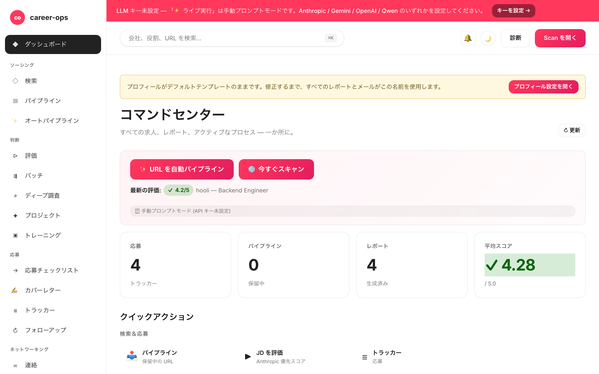

# career-ops-ui

> [career-ops](https://github.com/santifer/career-ops) AI 求人検索パイプラインのための クリーンな docs-style Web インターフェース。
> Claude Code、ターミナル、Markdown ファイルの間を行き来する代わりに — 単一のブラウザタブから、すべてのオファーを検索、評価、ディープダイブ、応募、追跡できます。

[English](README.md) | [Español](README.es.md) | [Português (Brasil)](README.pt-BR.md) | [한국어](README.ko-KR.md) | **日本語** | [Русский](README.ru.md) | [简体中文](README.zh-CN.md) | [繁體中文](README.zh-TW.md)

[](README.md#tests)
[](#tests)
[](README.md#requirements)
[](LICENSE)
[](https://github.com/Fighter90/career-ops-ui/releases/tag/v1.19.0)

> 📦 **v1.9.1** — サーバを 130 行のオーケストレータ + `server/lib/routes/` の 12 ルートモジュールに分割。`/api/evaluate` の Anthropic パリティ (両キー存在時は優先)。マルチ CLI シム (`AGENTS.md`、`GEMINI.md`) で Codex / Aider / Cursor / Gemini CLI に対応。**unit 284 + Playwright smoke 12**。Production-readiness 評価: [`docs/PRODUCTION-READINESS.md`](docs/PRODUCTION-READINESS.md)。シングルテナント loopback デプロイ可能。LAN 公開用の auth gate は v2.0 (P-12)。



## career-ops について

[career-ops](https://career-ops.org) は、AI コーディング CLI (Claude Code、Codex、Cursor、Gemini CLI、GitHub Copilot CLI) 内でスラッシュコマンドとして動作するオープンソースの求職システムです。モデル非依存。6 次元 0.0–5.0 ルーブリックで各求人を CV と照合し、カスタマイズされた PDF レジュメを生成し、すべての応募をローカルで追跡します — クラウドアカウントなし、テレメトリなし、自動送信なし。

**このリポジトリ (career-ops-ui)** は CLI の上に磨かれた Web インターフェースです。CLI は form-fill (Playwright MCP 経由) とスラッシュコマンドモードを引き続き所有; SPA は同じ `cv.md` / `data/applications.md` / `reports/` の上に CRM スタイルのサーフェスを提供します。データ共有。

**Score 別アクション閾値** ([career-ops.org/docs](https://career-ops.org/docs)):

| Score | 次のステップ |
|---|---|
| **≥ 4.5** | `/career-ops apply` — 高フィット、即応募 |
| **4.0 – 4.4** | 応募、または `/career-ops contacto` (warm intro) |
| **3.5 – 3.9** | `/career-ops deep` — 先に調査 |
| **< 3.5** | 特別な理由がなければスキップ |

**正規ガイド** ([career-ops.org/docs](https://career-ops.org/docs)):

- [What is career-ops](https://career-ops.org/docs/introduction/what-is-career-ops)
- [Scan job portals](https://career-ops.org/docs/introduction/guides/scan-job-portals)
- [Apply for a job](https://career-ops.org/docs/introduction/guides/apply-for-a-job)
- [Batch-evaluate offers](https://career-ops.org/docs/introduction/guides/batch-evaluate-offers)
- [Set up Playwright](https://career-ops.org/docs/introduction/guides/set-up-playwright)

## ワンコマンドインストール

```bash
curl -fsSL https://raw.githubusercontent.com/Fighter90/career-ops-ui/main/bin/setup.sh | bash
```

このコマンドは両方のリポジトリ(career-ops + career-ops-ui)をクローンし、依存関係をインストールし、http://127.0.0.1:4317 でサーバーを起動します。

## なぜ?

[career-ops](https://github.com/santifer/career-ops) は強力な Claude Code ベースの求人検索システムです: JD を貼り付けると → 0-5 のフィットスコア、ATS 最適化された PDF、トラッカーエントリが得られます。Claude Code 内ではうまく動作しますが、データは `cv.md`、`data/applications.md`、`reports/*.md`、`data/pipeline.md`、`portals.yml`、`config/profile.yml` に分散していて — 失いやすく、ざっと見るのが難しい。

`career-ops-ui` はその上に洗練された UI を載せます:

- **閲覧** — トラッカー、レポート、パイプラインを CRM のように。
- **トリガー** — スキャン(Greenhouse / Ashby / Lever / Workable / SmartRecruiters / Workday **および** hh.ru / Habr Career)を実行し、ライブ SSE ログを見る。
- **評価** — Gemini API で JD を評価するか、Claude 用のコピペプロンプトを取得。
- **編集** — サイドバイサイドの Markdown プレビュー付きで `cv.md` を編集。
- **メンテナンス** — doctor、verify、normalize、dedup、merge — それぞれワンクリック。

純粋に追加のみです: `career-ops/` 内部は何も変更されません。カスタマイズはそのまま残ります。

## ページごとの機能

| ページ            | 機能                                                                                                              |
| ---------------- | ----------------------------------------------------------------------------------------------------------------- |
| **Dashboard**    | 集計カウント (apps / pipeline / reports)、平均スコア、ステータス内訳、最新 5 件の apps + 最新レポート。                       |
| **Scan**         | **🌐 単一の 🌐 Scan ボタン** — 1 回のスイープで有効なすべてのソースを実行 (EN: Greenhouse / Ashby / Lever / Workable / SmartRecruiters / Workday、RU: hh.ru + Habr Career)。ライブ SSE ログ + stack/level チップフィルターと location / Remote-Hybrid / reloc / source フィルター付きの結果テーブル。 |
| **Pipeline**     | `data/pipeline.md` への CRUD。URL から評価へ直接ジャンプ。                                                              |
| **Evaluate**     | JD を貼り付け → `GEMINI_API_KEY` が設定されていれば `gemini-eval.mjs` を実行; なければ Claude 用のコピペ可能なプロンプトを返す。 |
| **Deep research**| 指定された会社/役割について、`modes/deep.md` の完全なプロンプトを生成。                                                       |
| **Apply helper** | 応募チェックリストを生成; 実際の Playwright フォーム入力は Claude Code 内の `/career-ops apply` のまま。                       |
| **Tracker**      | `data/applications.md` 上のフィルター可能なテーブル(ステータス、スコア、自由テキスト)。normalize/dedup/merge のワンクリックボタン。 |
| **Reports**      | `reports/` 内のすべてのレポートを、解析済みヘッダー (Score / Legitimacy / URL) 付きで閲覧・読む。                              |
| **CV**           | `cv.md` のライブ Markdown エディター + サイドバイサイドプレビュー + sync-check。                                              |
| **Profile**      | `config/profile.yml` + アーキタイプの読み取り専用ビュー。                                                                  |
| **Health**       | OK / OPTIONAL / FAIL バッジですべてのセットアップチェック + `doctor.mjs` および `verify-pipeline.mjs` 実行ボタン。               |

## 必要要件

| | |
| --- | --- |
| **Node.js** | ≥ 18 |
| **career-ops** | クローン済みで onboarded |
| **オプション** | ワンクリック JD 評価のための `.env` の `GEMINI_API_KEY` |
| **オプション** | ロシア国外で実行していて hh.ru API の 403 を減らしたい場合は `.env` の `(server uses default UA)` |

## スタックとレベルのチップフィルター

求人テーブルには以下のマルチセレクトチップが含まれます:

- **Stack:** PHP, Symfony, Laravel, Go, Rust, Node.js, TypeScript, Python, Ruby, Java, C#/.NET, C++, Backend, Frontend, Fullstack, Microservices, High-load, Distributed, DevOps/SRE, Data, ML/AI, Mobile, Security, Database, Cloud, API
- **Level:** Lead/Tech Lead, Architect, Manager, Principal/Staff, Senior, Middle, Junior

各カテゴリ内でマルチセレクト (OR)、カテゴリ間で交差 (AND)。カウントが表示され、結果のあるチップのみが表示されます。

## 完全なドキュメント

完全なアーキテクチャ、API リファレンス、高度な設定、セキュリティノートについては、[英語の README](README.md) を参照してください。

## ライセンス

MIT。[santifer](https://santifer.io) による [career-ops](https://github.com/santifer/career-ops) の上に構築。

---

## 🌍 Getting Started — インストール後の最初のステップ

ワンコマンドインストール後、2 つのクローンされたリポジトリとスキャフォールドファイル(`cv.md`、`config/profile.yml`、`portals.yml`、`data/applications.md`、`data/pipeline.md` — **EDIT ME** マーカー入り)があります。Health ページは初回起動で全て緑のはずです。プレースホルダーを実際のデータに置き換えてください:

### 1. CV を作成 (`cv.md`)

- **A — 既存の履歴書を貼り付け:** `career-ops/cv.md` にクリーンな markdown で。
- **B — UI からアップロード:** **CV** クリック → **📁 履歴書をアップロード** → `.md`/`.txt` 選択 → プレビュー確認 → **💾 保存** クリック。
- **C — Claude Code に LinkedIn を渡す:** Claude Code で `/career-ops` 実行、「CV を抽出して cv.md に書いて」と依頼。

### 2. プロフィール (`config/profile.yml`)

プレースホルダーを置換: 名前、メール、場所、LinkedIn、対象役割、**archetypes** (最重要)、給与範囲。

### 3. スキャナー (`portals.yml`)

`title_filter.positive`/`negative` を調整。3 つの board (GitLab、Vercel、Linear) があらかじめ設定。詳細: [`docs/portals-examples.md`](docs/portals-examples.md)。

### 4. (オプション) Gemini API key

```bash
echo "GEMINI_API_KEY=your-key" >> career-ops/.env
```

### 5. 確認して開始

Health → すべて緑。**🌐 すべてのソースを検索** → チップフィルター付きテーブル → URL コピー → **Pipeline** → **Evaluate**。

完全なドキュメント (アーキテクチャ、API、セキュリティ): [英語の README](README.md)。

---

## ✨ v1.16.0 の新機能(サーバーサイド auto-pipeline)

> **大きな UX 変更。** v1.15.0 まで `#/pipeline → #/evaluate → #/cv → #/tracker` を介して 5 回の手動クリックが必要でした。今は単一の `✨ Auto-pipeline a URL` ボタン(`#/dashboard` および `Cmd+K → URL 貼り付け → Enter`)で全パイプラインを観測可能な SSE タイムラインで実行します。

### 動作
1. **URL 検証**(SSRF + DNS-rebind ゲート)。
2. **JD 取得** SSRF-safe プロキシ経由。
3. **CV と評価**(Anthropic または Gemini)、markdown から 0–5 スコア抽出。
4. **レポート保存** `reports/<slug>.md` へ(新エンドポイント `POST /api/reports`)。
5. **トラッカーに行追加** レポート + URL を参照。

```bash
# 直接 curl(CI / smoke):
curl -N -X POST http://127.0.0.1:4317/api/auto-pipeline \
  -H 'Content-Type: application/json' \
  -d '{"url":"https://job-boards.greenhouse.io/anthropic/jobs/4567"}'
```

SSE イベント: `start → step (×5) → done` または `error`。どのステップでもクリーンに失敗、チェーンは停止して完了した分のみ返します。

### v1.16.0 その他のハイライト
- **SmartRecruiters ページネーション** — 最初の 100 件だけではなく全ページを巡回。安全キャップ: 30 ページ / 3000 ジョブ。
- **Workday CAPTCHA-fallback** — CAPTCHA でブロックされた tenant はもうスキャン全体を中止しません。Active Companies カードに 🔒 chip をレンダリング;他の tenant は続行。
- **`#/scan` source filter** — adapter registry から再構築されたドロップダウン: 6 ATSes + hh.ru + Habr、アルファベット順、geo prefix なし。
- **`scripts/import-trending-companies.mjs`** — `docs/portals-examples.md` の 13 trending 企業を検証し `portals.yml` に貼れる YAML を出力。`npm run import:trending` で実行。
- **CI workflow** — `.github/workflows/dashboard-screenshots.yml` が 8 つの hero PNG を再生成し、コミットされていない視覚的 drift があるとビルド失敗。

### 参考
- 完全なドキュメント: [英語 README](README.md) — アーキテクチャ/API/セキュリティセクションがある 585 行。
- アプリ内ヘルプ: `#/help`(16 セクション × 8 ロケール)。
- CHANGELOG: [`CHANGELOG.ja.md`](CHANGELOG.ja.md)。
- 標準ドキュメント: [career-ops.org/docs](https://career-ops.org/docs)。

---

## アーキテクチャ

| レイヤー | Stack | ファイル |
|---|---|---|
| Server | Node ≥18, Express 4, js-yaml, multer | `server/index.mjs` (~130 LOC)、`server/lib/routes/*.mjs` (13 モジュール) |
| SPA | Vanilla JS、hash-router、フレームワークなし | `public/index.html`、`public/js/{app,router,api}.js`、`public/js/views/*.js` |
| Styling | hand-written CSS、docs-style トークン、dark theme | `public/css/app.css` |
| Tests | `node --test` (TAP)、Express in-process | `tests/*.test.mjs`、Playwright |
| Build | なし — ファイル as-is 配信 | — |

サーバーは親ファイル(`../cv.md`、`../config/profile.yml` など)を読み、明示的なユーザーアクション(`POST /api/tracker`、`PUT /api/cv`、`POST /api/reports`、`POST /api/auto-pipeline`)でのみ書き込みます。

## API リファレンス

主要なエンドポイント(完全なリストは [英語 README](README.md#api-reference)):

| Method + Path | 目的 |
|---|---|
| `GET /api/health` | system status + 18 checks |
| `GET /api/dashboard` | counts + score-thresholds + activity tail |
| `GET /api/scan-results` | 最新 scan + `workdayFallback` (v1.17+) |
| `GET /api/stream/scan?source=ats\|regional\|both` | 統合 SSE |
| `POST /api/pipeline { url }` | URL 追加(SSRF ゲート) |
| `GET /api/pipeline/preview?url=` | SSRF-safe プロキシ + DNS-rebind guard |
| `POST /api/evaluate { jd, save?, mode? }` | Anthropic / Gemini / manual eval |
| `POST /api/reports { slug, markdown }` | `reports/<slug>.md` に永続化 (v1.16+) |
| `POST /api/auto-pipeline { url }` | SSE 5-step orchestrator (v1.16+) |
| `POST /api/tracker { company, role, … }` | `data/applications.md` に append |
| `GET /api/modes/_profile` + `PUT` | `modes/_profile.md` エディタ (v1.15+) |
| `POST /api/stream/pdf/inline` | Playwright 経由の SSE PDF |

## セキュリティノート

- **CSP** 厳格: `script-src 'self'`、`'unsafe-inline'` なし。ハンドラは `addEventListener` 経由。
- **SSRF**: ユーザー URL のフェッチは `isValidJobUrl()` を通過 — loopback、private IP、危険な scheme、安全でない redirect を拒否。
- **XSS**: 入力 markdown は `stripDangerousMarkdown()` を通過。
- **DNS-rebind guard**: `/api/pipeline/preview` および auto-pipeline。
- **Headers**: `X-Content-Type-Options: nosniff`、`X-Frame-Options: DENY`、`Referrer-Policy: same-origin`。
- **Body caps**: 5 MB JSON、1 MB report、256 KB profile/modes_profile、10 MB CV upload。
- Auth なし — single-tenant loopback only。LAN auth → P-12 (v2.0)。

## テスト

- `npm test` — **427** 単体 + 統合。`CAREER_OPS_ROOT=$(mktemp -d)` で隔離。
- `npm run test:coverage` — **94 % 行 / 83 % ブランチ**。
- `npm run test:e2e` — 20 smoke E2E。
- `npm run test:e2e:full` — 23 comprehensive E2E。
- `npm run test:e2e:browser` — **32** Playwright(smoke + full-cycle + auto-pipeline シナリオ)。

## A11y (v1.17+)

- ARIA roles: `banner`、`navigation`、`main`、`dialog`、`status`、`search`。
- モーダルのフォーカストラップ + click owner へのフォーカス復元。
- sidebar-toggle の `aria-expanded` 同期。
- global search ラベルは `visually-hidden` クラス経由。

## 制限事項

- **Single-tenant、loopback only** — ログインなし、マルチユーザーなし。
- **PDF は親に Playwright が必要**。
- **Live LLM は ANTHROPIC_API_KEY または GEMINI_API_KEY が必要**;キーなしなら manual prompt。
- **Workday CAPTCHA-gated tenants** は graceful fallback(no jobs);`/career-ops scan` を使用。

## License

MIT — [LICENSE](LICENSE) を参照。

---

## なぜ career-ops-ui か

career-ops は CLI として優秀です:URL 貼り付け → /career-ops → report + PDF + tracker 行。しかし CLI は以下を表示しません:

- スキャンされたすべての求人の**フィルタ可能なテーブルビュー**(filter chips、scope、salary、remote/hybrid バッジ);
- KPI カウント + 最新スキャン + 最新レポートを持つ**ダッシュボード**;
- `cv.md` 用の**マークダウンエディタ** + サイドバイサイドのライブプレビュー;
- レポート + apply-checklist + interview-prep の保存ファイルの**ページネーション**;
- いつ何が書かれたかを監査するための**アクティビティ履歴**。

この UI は CLI をエンジン(Claude Code / Codex / Cursor)として保持し、同じ `cv.md` / `data/applications.md` / `reports/` の上に CRM スタイルのパネルを追加します。データ共有。ロックインなし。

## 要件

- **Node.js ≥ 18.** 20.x と 22.x でテスト済み。
- **macOS / Linux**(Windows は WSL 経由)。
- **親 career-ops** がこのリポジトリの隣にクローン(または `CAREER_OPS_ROOT=…`)。
- **オプション**: Playwright + chromium(PDF + auto-pipeline 用)。
- **オプション**: ANTHROPIC_API_KEY または GEMINI_API_KEY(キーなしでも manual-prompt モードで動作)。

## ページ別の機能

| ページ | 機能 |
|---|---|
| `#/dashboard` | KPI + 最新スキャン + 最新レポート + ✨ Auto-pipeline CTA |
| `#/scan` | 単一 🌐 Scan ボタン、6 ATSes + hh.ru + Habr へ fan-out、live SSE log、フィルタ可能な結果テーブル |
| `#/pipeline` | URL キュー、インラインプレビュー SSRF-safe、dedup |
| `#/evaluate` | JD → 0–5 スコア(Anthropic / Gemini / manual prompt) |
| `#/batch` | batch evaluate offers 用の TSV エディタ(v1.13+) |
| `#/deep` | 会社 + 役割ごとのディープリサーチ |
| `#/apply` | Apply チェックリスト(form フィールド + key notes) |
| `#/tracker` | 各評価の GFM テーブル + status / score フィルタ |
| `#/reports` | ページネーションされたマークダウンレポートリスト + score thresholds カード |
| `#/interview-prep` | 保存されたリサーチファイル |
| `#/cv` | マークダウンエディタ + live preview + Generate PDF |
| `#/profile` | YAML プレビュー + Career framing カード(modes/_profile.md) |
| `#/config` | API キー、Profile YAML、Modes エディタ |
| `#/health` | 18 のシステム状態チェック |
| `#/activity` | すべての state-changing リクエストの監査ログ |
| `#/help` | 16 セクション × 8 ロケール |

## 設定

```bash
# career-ops/.env
ANTHROPIC_API_KEY=sk-ant-…          # オプションだが推奨
GEMINI_API_KEY=AIza…                # オプション fallback
ANTHROPIC_MODEL=claude-sonnet-4-6   # オプション override
GEMINI_MODEL=gemini-2.0-flash       # オプション override
PORT=4317                           # オプション、デフォルト
HOST=127.0.0.1                      # オプション、デフォルト
CAREER_OPS_ROOT=/path/to/career-ops # オプション、デフォルト ../
```

## 貢献

PR 歓迎。[`docs/sdd/CONVENTIONS.md`](docs/sdd/CONVENTIONS.md) に従ってください:

- Conventional Commits(`feat`、`fix`、`docs`、`chore` など)。
- テストが non-trivial 変更をカバー(`npm test` がパスする必要あり)。
- spec での正当化なしに新しい runtime deps なし。
- parent ファイルの編集なし — CLAUDE.md hard rule #1。

Issues / discussions: <https://github.com/Fighter90/career-ops-ui/issues>。
