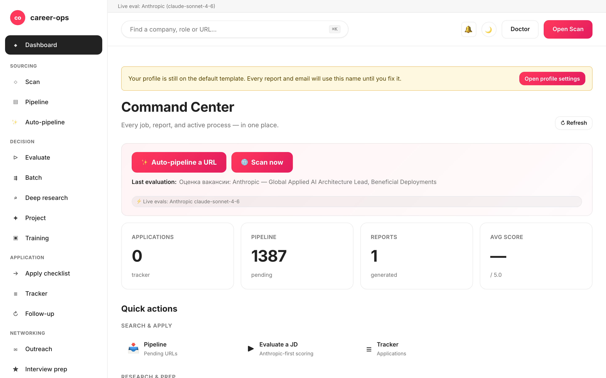

# career-ops-ui

> [career-ops](https://github.com/santifer/career-ops) AI 求人検索パイプラインのための、クリーンな docs スタイルの Web インターフェース。
> Claude Code、ターミナル、Markdown ファイルの間を行き来する代わりに — 単一のブラウザタブから、すべてのオファーを検索、評価、ディープダイブ、応募、追跡できます。

[English](README.md) | [Español](README.es.md) | [Português (Brasil)](README.pt-BR.md) | [한국어](README.ko-KR.md) | **日本語** | [Русский](README.ru.md) | [简体中文](README.zh-CN.md) | [繁體中文](README.zh-TW.md)

[](#tests)
[](#tests)
[](#requirements)
[](LICENSE)
[](https://github.com/Fighter90/career-ops-ui/releases/tag/v1.19.0)



## career-ops について

[career-ops](https://career-ops.org) は、任意の AI コーディング CLI(Claude Code、Codex、Cursor、Gemini CLI、GitHub Copilot CLI)内でスラッシュコマンドとして動作するオープンソースの求職システムです。モデル非依存。6 次元 0.0–5.0 ルーブリックで各求人を CV と照合し、カスタマイズされた PDF レジュメを生成し、すべての応募をローカルで追跡します — クラウドアカウントなし、テレメトリなし、自動送信なし。

**このリポジトリ (career-ops-ui)** はその上に磨かれた Web インターフェースを載せたものです。CLI は引き続き form-fill(Playwright MCP 経由)とスラッシュコマンドモードを所有し、SPA は同じ `cv.md` / `data/applications.md` / `reports/` ファイル群の上に CRM スタイルのブラウザサーフェスを提供します。両者は同じデータを共有します。

**スコア別アクション閾値** ([career-ops.org/docs](https://career-ops.org/docs) より):

| スコア | 次のステップ |
|---|---|
| **≥ 4.5** | `/career-ops apply` — 高フィット、即時応募 |
| **4.0 – 4.4** | 応募、または `/career-ops contacto` で warm intro |
| **3.5 – 3.9** | `/career-ops deep` — 先に調査 |
| **< 3.5** | 特別な理由がなければスキップ |

**正規ガイド** ([career-ops.org/docs](https://career-ops.org/docs)):

- [What is career-ops](https://career-ops.org/docs/introduction/what-is-career-ops)
- [Scan job portals](https://career-ops.org/docs/introduction/guides/scan-job-portals)
- [Apply for a job](https://career-ops.org/docs/introduction/guides/apply-for-a-job)
- [Batch-evaluate offers](https://career-ops.org/docs/introduction/guides/batch-evaluate-offers)
- [Set up Playwright](https://career-ops.org/docs/introduction/guides/set-up-playwright)

## ワンコマンドインストール

```bash
curl -fsSL https://raw.githubusercontent.com/Fighter90/career-ops-ui/main/bin/setup.sh | bash
```

このコマンドは両方のリポジトリ(career-ops + career-ops-ui)をクローンし、依存関係をインストールし、http://127.0.0.1:4317 でサーバーを起動します。

---

## なぜ?

[career-ops](https://github.com/santifer/career-ops) は強力な Claude Code 駆動の求人検索システムです: JD を貼り付ければ → 0-5 のフィットスコア、ATS 最適化された PDF、トラッカーエントリが得られます。Claude Code 内ではうまく動作しますが、データは `cv.md`、`data/applications.md`、`reports/*.md`、`data/pipeline.md`、`portals.yml`、`config/profile.yml` に分散していて — 失いやすく、ざっと見るのが難しいのです。

`career-ops-ui` はその上に洗練された UI を載せます:

- **閲覧** — トラッカー、レポート、パイプラインを CRM のように。
- **トリガー** — スキャン(Greenhouse / Ashby / Lever / Workable / SmartRecruiters / Workday **および** hh.ru / Habr Career)を実行し、ライブ SSE ログを観測。
- **評価** — Anthropic(優先)または Gemini で JD をライブ評価、API キーが未設定なら Claude Code 用のコピー&ペースト可能なプロンプトを取得。
- **ディープリサーチ** — Anthropic SDK で企業をライブ調査、cv / profile / mode ファイルを自動的にインライン化。
- **編集** — サイドバイサイドの Markdown プレビューとサーバーサイド XSS サニタイズ付きで `cv.md` を編集。
- **メンテナンス** — doctor、verify、normalize、dedup、merge — それぞれワンクリック。
- **マルチ CLI:** Claude Code、Codex、Cursor、Aider、Gemini CLI のいずれからも同一に駆動 — `CLAUDE.md` / `AGENTS.md` / `GEMINI.md` のシムが単一のソース・オブ・トゥルースを指します。

純粋に追加のみです: `career-ops/` 内部は何も変更されません。カスタマイズはすべてそのまま残ります。

---

## クイックスタート

### 1. まず career-ops をインストール

```bash
git clone https://github.com/santifer/career-ops.git
cd career-ops
```

[career-ops オンボーディング](https://github.com/santifer/career-ops#first-run--onboarding) に従い、`cv.md`、`config/profile.yml`、`portals.yml` が存在する状態にします。

### 2. career-ops-ui をその中にドロップ

```bash
git clone https://github.com/Fighter90/career-ops-ui.git web-ui
```

ツリーは次のようになります:

```
career-ops/
├─ cv.md
├─ portals.yml
├─ config/
├─ data/
├─ modes/
├─ reports/
├─ scan.mjs … doctor.mjs … (etc)
└─ web-ui/                 ← このリポジトリ
   ├─ bin/start.sh
   ├─ package.json
   ├─ server/
   ├─ public/
   └─ tests/
```

### 3. 起動

```bash
bash web-ui/bin/start.sh
```

このスクリプトは:

1. Node ≥ 18 を確認します。
2. `npm install` を実行(初回のみ、依存は Express + js-yaml の 2 つだけ)。
3. Express サーバーを `127.0.0.1:4317` で起動します。
4. デフォルトブラウザで http://127.0.0.1:4317/ を開きます。

カスタムポート / ホスト:

```bash
PORT=8080 bash web-ui/bin/start.sh
HOST=0.0.0.0 PORT=4317 bash web-ui/bin/start.sh   # LAN に公開
```

リポジトリを別の場所(`career-ops/web-ui` 以外)にクローンした場合は、環境変数で career-ops を指定:

```bash
CAREER_OPS_ROOT=/path/to/career-ops bash bin/start.sh
```

---

## 必要要件

| | |
| --- | --- |
| **Node.js** | ≥ 18 (ネイティブ `fetch`、`node:test` を使用) |
| **career-ops** | クローン済みでオンボーディング完了 — 上記参照 |
| **オプション** | 親プロジェクトの `.env` 内の `GEMINI_API_KEY`(無料 tier モデル `gemini-2.0-flash`)、ワンクリック JD 評価用。なければ UI は Claude 用のコピー&ペースト可能なプロンプトを返します。 |
| **オプション** | hh.ru が 403 を返す場合は、ロシアの IP / VPN から実行。Habr Career は IP に関係なく動作します。 |
| **オプション** | Playwright(career-ops の推移的依存関係として既にインストール済み)、e2e テストスイート用。 |

---

## 提供機能 — ページ別

| ページ            | 機能                                                                                                              |
| ---------------- | ----------------------------------------------------------------------------------------------------------------- |
| **Dashboard**    | 集計カウント(apps / pipeline / reports)、平均スコア、ステータス内訳、最新 5 件の apps + 最新レポート。 |
| **Scan**         | **🌐 単一の Scan ボタン** — 1 回のスイープで有効なすべてのソースを実行(EN は Greenhouse / Ashby / Lever / Workable / SmartRecruiters / Workday、RU は hh.ru + Habr Career)。ライブ SSE ログストリーミング + location / Remote-Hybrid バッジ / relocation フラグ / salary / source フィルターと動的な stack / level / keyword チップ付きのクリック可能な結果テーブル。Active-Companies カードに追跡中の全 board と API ヘルスが表示されます。 |
| **Pipeline**     | `data/pipeline.md` への CRUD。サーバーサイドプレビュープロキシ(SSRF セーフ、hop ごとの redirect 検証、8 KB body 上限)。URL から評価へ直接ジャンプ。 |
| **Evaluate**     | JD を貼り付け → **Anthropic 優先**(両方のキーがあれば優先)、次に Gemini、次に手動プロンプトのフォールバック。Anthropic パスは cv / profile / `_shared.md` / `oferta.md` を自動的にインライン化(REVIEW-A1)。JD を `jds/` に保存するオプションあり。 |
| **Deep research**| Evaluate と同じフォールバックチェーン。ライブ Anthropic は ~10–30 KB のグラウンドされた markdown を返し、`interview-prep/<company>-<role>.md` に保存。 |
| **Modes**        | 7 つの汎用モードページ(`/#/project`、`/#/training`、`/#/followup`、`/#/batch`、`/#/contacto`、`/#/interview-prep`、`/#/patterns`)が同じ Anthropic / Gemini / 手動フォールバックを使用。 |
| **Apply helper** | 応募チェックリストを生成; 実際の Playwright フォーム入力は Claude Code 内の `/career-ops apply` のまま。 |
| **Tracker**      | `data/applications.md` 上のフィルター可能なテーブル(status、score、自由テキスト)。`normalize-statuses.mjs` / `dedup-tracker.mjs` / `merge-tracker.mjs` のワンクリック。パイプと改行のエスケープは GFM 準拠 — `"Acme \| Co"` のような名前もロスレスにラウンドトリップ。 |
| **Reports**      | `reports/` 内のすべてのレポートを、解析済みヘッダー(Score / Legitimacy / URL)付きで閲覧・読む。 |
| **CV**           | `cv.md` のライブ Markdown エディター + サイドバイサイドプレビュー + ワンクリック `cv-sync-check.mjs` + 📁 CV アップロード。保存時にサーバーサイド XSS ストリップ(`<script>`、`javascript:`、`on*=` ハンドラ)。 |
| **Profile**      | `config/profile.yml` + アーキタイプの読み取り専用ビュー — UI フレンドリーなサマリー。 |
| **App settings** | 親 `.env` キー用の UI 内エディタ: `ANTHROPIC_API_KEY`、`GEMINI_API_KEY`、モデルのオーバーライド、port / host。シークレットは読み取り時にマスクされます。 |
| **Health**       | すべてのセットアップチェックを OK / OPTIONAL / FAIL バッジで表示 + `doctor.mjs` および `verify-pipeline.mjs` を実行するボタン。 |
| **Help**         | アプリ内 Markdown ユーザーガイド(`/#/help`)、サポートする 8 言語すべてにローカライズ(en / es / pt-BR / ko-KR / ja / ru / zh-CN / zh-TW)。 |
| **Activity log** | すべての状態変更リクエスト(書き込み、実行、スキャン)の監査証跡。シークレットは編集済み。 |

グローバルキーボードショートカット:

- `Ctrl+K` / `Cmd+K` — グローバル検索にフォーカス。
- グローバル検索に URL を貼り付けると、自動的にパイプラインに追加されます。
- `Esc` — 開いているモーダルを閉じる。

---

## Scan

実際に求人を返す、ゼロトークンのポータルスキャン。UI 内の **1 つの 🌐 Scan ボタン** が、設定されたすべてのソースを 1 回のスイープで実行します:

- **Greenhouse / Ashby / Lever / Workable / SmartRecruiters / Workday** — 認識可能な ATS パターンを持つ `portals.yml::tracked_companies` 内のすべての企業に対する公開 boards-api。同梱リストは Stripe、GitLab、Vercel、Cloudflare、Datadog、Discord、Elastic、Grafana Labs、CockroachDB、Fastly、Twilio、Coinbase、Reddit、Robinhood、Affirm、Lyft、Linear、Supabase、PostHog、Ramp、Modal Labs、Railway、Browserbase、JetBrains をカバー — 自由に拡張または削減できます。
- **hh.ru** — 公開 API(RU 以外の IP からは 403 を返す; ロシアの IP / VPN から実行するか、スキップ — 同一ソースからの連続 403 は結合され、実行中にソースが無効化されます)。サーバーは妥当なデフォルト User-Agent を出荷します; パワーユーザーはロシアの IP / VPN 経由でオーバーライド可能です。
- **Habr Career** — `career.habr.com/vacancies` の HTML スクレイプ。任意の IP から動作、認証不要。

すべてのソースは同じパイプラインを通ります: normalize → filter(`title_filter.positive` / `title_filter.negative`)→ `data/scan-history.tsv` + `data/pipeline.md` + `data/applications.md` に対する dedup → `data/pipeline.md` に追加 → UI のフィルター可能なテーブル用に完全な結果セットを `data/last-scan.json` に保存。

`portals.yml` で設定:

```yaml
title_filter:
  positive: [backend, engineer, senior, tech lead, golang, php]
  negative: [junior, intern, frontend, ios, android]
tracked_companies:
  - { name: Stripe, enabled: true, careers_url: https://job-boards.greenhouse.io/stripe }
  - { name: Linear, enabled: true, careers_url: https://jobs.ashbyhq.com/linear }
  # ...
russian_portals:
  sources: ["hh", "habr"]   # 一方または両方
  area: 113                  # 1=モスクワ, 2=SPb, 113=ロシア全土, 1001=リモート
  per_page: 50
  only_remote: false
  queries: ["Senior PHP", "Senior Go", "Tech Lead"]
```

すべてのソースは単一の SSE エンドポイント `/api/stream/scan?source=ats|regional|both` を経由します。**🌐 Scan** UI ボタンは `source=both` を呼び出すので、すべてのアダプタ(Greenhouse / Ashby / Lever / Workable / SmartRecruiters / Workday + hh.ru + Habr Career)が 1 つの接続で実行されます。クライアント切断時の `AbortSignal` を尊重します — 孤児 fetch は発生しません。

---

## アーキテクチャ

```
career-ops-ui/
├─ CLAUDE.md                 # プロジェクトレベルのエージェント指示(正規)
├─ AGENTS.md                 # Codex / Aider / 汎用 CLI シム → CLAUDE.md
├─ GEMINI.md                 # Gemini CLI シム → CLAUDE.md
├─ .aiignore                 # AI ツール用の除外リスト
├─ .claude/                  # Claude Code エージェント設定
│  ├─ agents/                # 3 つのプロジェクト固有サブエージェント (route, view, test isolation)
│  └─ commands/               # スラッシュコマンドスタブ
├─ bin/start.sh              # ワンショットランチャー (Node チェック → npm install → server → ブラウザを開く)
├─ package.json              # ランタイム依存 2 つ: express, js-yaml
├─ server/
│  ├─ index.mjs              # ~130 LOC オーケストレータ: middleware + 12 個の register<Topic>Routes(app) コール + SPA catch-all
│  └─ lib/
│     ├─ paths.mjs           # career-ops ファイルへの絶対パス (CAREER_OPS_ROOT 対応)
│     ├─ parsers.mjs         # markdown / pipeline / report パーサー (GFM 準拠の pipe エスケープ)
│     ├─ runner.mjs          # runNodeScript() + streamNodeScript()、SIGTERM→SIGKILL エスカレーション + 30 分上限
│     ├─ security.mjs        # isValidJobUrl, stripDangerousMarkdown, sanitizeJobDescription, isPubliclyExposed
│     ├─ prompts.mjs         # bundleProjectContext, buildEvaluationPrompt, buildDeepPrompt, buildModePrompt
│     ├─ store.mjs           # safeReadApps/Pipeline/Reports, checkProfileCustomized, ensureRussianPortalsDefaults
│     ├─ anthropic.mjs       # 最小限の Anthropic SDK アダプタ (runAnthropic, hasAnthropicKey, hasGeminiKey)
│     ├─ env-config.mjs      # シークレットマスキングとバリデーション付きの .env ラウンドトリップ
│     ├─ activity-log.mjs    # JSONL 監査証跡 middleware (シークレット編集済み)
│     ├─ dotenv.mjs          # 軽量 dotenv ローダ
│     ├─ en-scanner.mjs      # in-process Greenhouse/Ashby/Lever オーケストレータ (AbortSignal 対応)
│     ├─ ru-scanner.mjs      # in-process hh.ru + Habr オーケストレータ (AbortSignal 対応)
│     ├─ sources/
│     │  ├─ greenhouse.mjs   # boards-api.greenhouse.io クライアント
│     │  ├─ ashby.mjs        # api.ashbyhq.com クライアント
│     │  ├─ lever.mjs        # api.lever.co クライアント
│     │  ├─ hh.mjs           # api.hh.ru クライアント (UA 対応)
│     │  └─ habr.mjs         # career.habr.com HTML パーサー (cheerio なし、regex のみ)
│     └─ routes/             # 12 ルートモジュール — トピックごとに 1 つ (P-2)
│        ├─ activity.mjs     # /api/activity
│        ├─ config.mjs       # /api/config (親 .env ラウンドトリップ)
│        ├─ content.mjs      # /api/cv, /api/profile, /api/portals, /api/modes
│        ├─ health.mjs       # /api/health, /api/dashboard
│        ├─ help.mjs         # /api/help/:lang
│        ├─ jds.mjs          # /api/jds CRUD
│        ├─ llm.mjs          # /api/evaluate, /api/deep, /api/mode/:slug, /api/apply-helper, /api/interview-prep*
│        ├─ pipeline.mjs     # /api/pipeline + SSRF-safe プレビュープロキシ
│        ├─ reports.mjs      # /api/reports
│        ├─ runners.mjs      # /api/run/* + /api/stream/{scan,liveness,pdf} + /api/output/pdfs
│        ├─ scan.mjs         # /api/stream/scan-{ru,en} + /api/scan-results
│        └─ tracker.mjs      # /api/tracker
├─ public/                   # 静的 SPA — ビルドステップなし
│  ├─ index.html
│  ├─ css/app.css            # デザイントークン (docs スタイルパレット)
│  └─ js/
│     ├─ api.js              # fetch ラッパー + 接続バナー状態 + UI ヘルパー + 安全な markdown レンダラー
│     ├─ router.js           # 404 フォールバック + alias サポート付きの hash ベースルーター
│     ├─ app.js              # boot + グローバルキーボードハンドラ + モバイル sidebar drawer
│     ├─ lib/{i18n,skills}.js
│     └─ views/              # ページごとに 1 ファイル (dashboard, scan, pipeline, evaluate, deep, apply, tracker, reports, cv, settings, health, config, help, activity, mode-page)
├─ docs/                     # パブリックリファレンス: architecture, API, data-flows, SDD, conventions, reviews
│  ├─ PROJECT.md             # what / why / for-whom
│  ├─ ROADMAP.md             # 現在のマイルストーン + 完了履歴
│  ├─ PRODUCTION-READINESS.md # 誠実なデプロイメントゲート評価
│  ├─ sdd/{SDD-GUIDE,CONVENTIONS}.md
│  ├─ architecture/{OVERVIEW,SERVER,FRONTEND,API,DATA-FLOWS}.md
│  └─ reviews/REVIEW-*.md
└─ tests/                    # 284 unit + 12 Playwright + 23 e2e:full + 20 e2e:smoke
   ├─ parsers.test.mjs       # markdown / pipeline / report パーサー (pure functions)
   ├─ api.test.mjs           # 全エンドポイント、ephemeral server、ネットワークなし
   ├─ {ru,en}-scanner.test.mjs   # mocked fetch
   ├─ pipeline-preview.test.mjs   # hop ごとの redirect 検証 (REVIEW-B1)
   ├─ anthropic.test.mjs     # SDK アダプタ + log-guard test (REVIEW-B4)
   ├─ url-validation.test.mjs    # SSRF reject sweep (FIX-M3 + M6 + M7)
   ├─ cv-xss.test.mjs        # stripDangerousMarkdown ラウンドトリップ
   ├─ jd-sanitize.test.mjs   # sanitizeJobDescription
   ├─ help.test.mjs / help-ui.test.mjs    # 全 8 ロケールの i18n parity
   ├─ playwright-smoke.mjs   # 12 ブラウザフロー (CV 保存、tracker、pipeline、evaluate、config など)
   └─ e2e{,-comprehensive}.mjs   # 完全な Playwright walkthrough
```

### なぜビルドステップがないのか?

バニラ HTML/CSS/JS は表面積を極小に保ちます: 2 つの依存の `npm install` 1 回で動きます。Webpack なし、Vite なし、悪夢の `node_modules` なし。UI 全体は minify で 30 KB 未満。開発中のホットリロードが欲しい場合は、`npm run dev` が Node の組み込み `--watch` を使います。

### Spec-Driven Development

非自明な変更は GSD パイプライン(`superpowers@claude-plugins-official` の `gsd-*` skills)を通ります:

```
discuss → spec → plan → execute → verify → review
```

パブリックリファレンス: [`docs/sdd/SDD-GUIDE.md`](docs/sdd/SDD-GUIDE.md)。すべてのプランニングアーティファクトは `.planning/` 配下(gitignore 済み)に存在します。`docs/` ツリーは長期的なパブリック契約です。

---

## API リファレンス

すべてのエンドポイントは `/api/*` 配下。特に記載がない限り JSON in / JSON out。

### Health とダッシュボード

| Method | Path                     | Response                                                                    |
| ------ | ------------------------ | --------------------------------------------------------------------------- |
| GET    | `/api/health`            | `{ ok, warnings, version, parentVersion, checks: [{name, ok, required, value?}] }` |
| GET    | `/api/dashboard`         | `{ counts, avgScore, byStatus, recent, pipeline, lastReport }`              |
| GET    | `/api/activity?limit&type` | `data/activity.jsonl` 監査証跡の tail                                       |
| GET    | `/api/help/:lang`        | ローカライズされたアプリ内ユーザーガイド(フォールバック: `en.md`)            |

### アプリ設定(親 .env ラウンドトリップ)

| Method | Path             | 目的                                                                   |
| ------ | ---------------- | ---------------------------------------------------------------------- |
| GET    | `/api/config`    | シークレットがマスクされた既知の env キー                              |
| POST   | `/api/config`    | バリデート + 親 `.env` 書き込み; `process.env` にインプレース適用      |

### データファイル

| Method | Path                                | 目的                                                                   |
| ------ | ----------------------------------- | ---------------------------------------------------------------------- |
| GET    | `/api/tracker`                      | `{ rows: [parsed applications.md] }`                                   |
| POST   | `/api/tracker`                      | body `{ company, role, score?, status?, url?, notes?, date? }` — dedup 対応(company + role で大文字小文字区別なし) |
| GET    | `/api/pipeline`                     | `{ urls: [...] }`                                                      |
| POST   | `/api/pipeline`                     | body `{ url }` → dedup + `isValidJobUrl` 付きで `data/pipeline.md` に追加 |
| GET    | `/api/pipeline/preview?url=…`       | サーバーサイド fetch プロキシ(hop ごと SSRF チェック、redirect ≤3、8 KB 上限) |
| DELETE | `/api/pipeline?url=…`               | URL を削除                                                             |
| GET    | `/api/reports`                      | `reports/*.md` のパース済みリスト                                       |
| GET    | `/api/reports/:slug`                | 完全な markdown + パース済みヘッダー                                    |
| GET    | `/api/jds`                          | 保存済み JD ファイルのリスト                                            |
| GET    | `/api/jds/:name`                    | text/plain — 生の JD                                                   |
| POST   | `/api/jds`                          | body `{ text, slug? }` → `jds/` に保存                                 |
| DELETE | `/api/jds/:name`                    | unlink(`.txt` サフィックス必須)                                      |
| GET    | `/api/cv`                           | `{ markdown }`                                                         |
| PUT    | `/api/cv`                           | body `{ markdown }` → `cv.md` を書き込み(XSS ストリップ済み、≤1 MB)  |
| GET    | `/api/profile`                      | `{ profile: yaml-parsed, raw: text }`                                  |
| GET    | `/api/portals`                      | `{ portals: yaml-parsed, raw: text }`                                  |
| GET    | `/api/modes`                        | モードファイルのリスト                                                  |
| GET    | `/api/modes/:name`                  | text/plain — 生のモードプロンプト                                       |
| GET    | `/api/output/pdfs`                  | 生成された PDF のリスト                                                 |
| GET    | `/api/output/pdfs/:name`            | ダウンロード(`Content-Disposition: attachment`)                       |
| GET    | `/api/interview-prep`               | 保存済み deep-research ファイルのリスト                                 |
| GET    | `/api/interview-prep/:name`         | `{ name, markdown }`                                                   |
| DELETE | `/api/interview-prep/:name`         | unlink(`.md` サフィックス必須)                                       |

### スクリプトランナー(バッファ済み、ワンショット)

| Method | Path                    | ラップする対象                |
| ------ | ----------------------- | --------------------------- |
| POST   | `/api/run/doctor`       | `node doctor.mjs`           |
| POST   | `/api/run/verify`       | `node verify-pipeline.mjs`  |
| POST   | `/api/run/normalize`    | `node normalize-statuses.mjs` |
| POST   | `/api/run/dedup`        | `node dedup-tracker.mjs`    |
| POST   | `/api/run/merge`        | `node merge-tracker.mjs`    |
| POST   | `/api/run/sync-check`   | `node cv-sync-check.mjs`    |

すべてのバッファ実行は 60 秒で上限; 5 秒の猶予後に SIGTERM → SIGKILL エスカレーション。

### ストリーム(SSE)

| Method | Path                          | ストリームの中身                   |
| ------ | ----------------------------- | ---------------------------------- |
| GET    | `/api/stream/scan`            | レガシー `node scan.mjs` (subprocess) |
| GET    | `/api/stream/scan?source=ats\|regional\|both` | 統合されたインプロセス scanner SSE — クエリ: `dryRun=1`、`company=…` (ATS のみ)。 |
| GET    | `/api/stream/liveness`        | `node check-liveness.mjs`          |
| GET    | `/api/stream/pdf`             | `node generate-pdf.mjs`            |

SSE イベント種別:

```
event: start    data: { script, args?, writeFiles? }
event: log      data: { stream: "stdout"|"stderr", line: string }
event: done     data: { code, counts?, errors? }
event: error    data: { message }
```

### LLM エンドポイント(Anthropic 優先 → Gemini → 手動フォールバック)

| Method | Path                                | 目的                                                                             |
| ------ | ----------------------------------- | -------------------------------------------------------------------------------- |
| POST   | `/api/evaluate`                     | body `{ jd, save? }` → JD 評価(`oferta.md` ごとの A–G セクション)                |
| POST   | `/api/evaluate/test-gemini`         | `GEMINI_API_KEY` の smoke チェック                                              |
| POST   | `/api/evaluate/test-anthropic`      | `ANTHROPIC_API_KEY` の smoke チェック                                           |
| POST   | `/api/deep`                         | body `{ company, role?, run? }` → deep-research プロンプトまたはライブ grounded markdown |
| POST   | `/api/mode/:slug`                   | 汎用モードランナー; allowlist: `batch`, `contacto`, `followup`, `interview-prep`, `patterns`, `project`, `training` |
| POST   | `/api/apply-helper`                 | body `{ url, jd? }` → 応募チェックリスト                                         |
| GET    | `/api/scan-results`                 | `{ en: {when, fresh[], filtered[], errors[]}, ru: { ... } }` — 最新スキャン     |
| GET    | `/api/scan/regional/config`         | 有効な regional-scanner 設定(queries、negatives、sources)。 |

`/api/deep` または `/api/mode/:slug` で `run: true` が設定されると、サーバーは(両方のキーが存在する場合)Anthropic を優先し、`cv.md` + `config/profile.yml` + `modes/_shared.md` + 該当するモードテンプレートを `<project_context>` ブロックにインライン化し、モデルの grounded markdown を直接返します。ソフトキャップ: 組み立てられたプロンプトで 200 KB — オーバーフローは 413 を返します。

---

## テスト

```bash
npm test                       # 284 unit/integration tests
npm run test:e2e               # 20 smoke e2e(独自サーバーを起動)
npm run test:e2e:full          # 23 comprehensive e2e
npm run test:e2e:browser       # 12 Playwright browser-smoke
npm run test:coverage          # `npm test` と同じ + V8 coverage
```

| スイート                       | テスト数 | 内容                                                                                                       |
| --------------------------- | ----- | ---------------------------------------------------------------------------------------------------------- |
| `node --test tests/*.test.mjs` (unit + integration) | **284** | 全エンドポイント、ephemeral server、ネットワークなし。parser、scanner(モック)、runner、anthropic、security headers、XSS、JD sanitize、URL validation、i18n parity を含む。 |
| `tests/e2e.mjs` (smoke)      | 20    | Playwright headless: すべての route がレンダリング、基本的なフロー。                                     |
| `tests/e2e-comprehensive.mjs` | 23    | 完全な Playwright walkthrough: 11 routes + 12 機能フロー。                                              |
| `tests/playwright-smoke.mjs` (`npm run test:e2e:browser`) | **12** | ブラウザ駆動 smoke: dashboard レンダリング、ナビゲーション、言語切替、404、health、tracker ラウンドトリップ (BF-1)、pipeline 追加 + 無効 URL sweep、reports 空、evaluate 手動フォールバック、config キーマスク、CV PUT XSS ストリップ、pipeline preview 400。 |
| **合計**                   | **339** | **0 失敗、0 フレーク**                                                                                    |

カバレッジ: `--experimental-test-coverage` 経由で ~93% 行 / ~83% ブランチ。

パーサーは pure functions(I/O なし)— `applications.md`、`pipeline.md`、`reports/*.md` の実データ断片に対してテスト。API テストは ephemeral port で Express アプリを起動し、すべてのエンドポイントを end-to-end でエクササイズ。スキャナーテストは `fetch` をモックするので、hh.ru があなたの IP をブロックしてもパスします。Playwright ブラウザ smoke はインプロセスサーバーに対して実行し、Playwright を親プロジェクトの `node_modules` 経由で解決します — `web-ui/` に新しい依存はありません。

CI は `main` への各プッシュで Node 18 / 20 / 22 に対して unit + e2e + Playwright マトリックスを実行します。

---

## 設定

環境変数(サーバー起動時に読み取り、特記されたもの以外すべてオプション):

| 変数                 | デフォルト          | 目的                                                                              |
| -------------------- | ------------------ | ---------------------------------------------------------------------------------- |
| `PORT`               | `4317`             | Express bind port                                                                  |
| `HOST`               | `127.0.0.1`        | Express bind host。非 loopback の場合に CSP が付与; auth gate は v2.0.0 で計画中。 |
| `CAREER_OPS_ROOT`    | スクリプトからの `..`   | `cv.md`、`data/`、`portals.yml`、`modes/` などの場所。                          |
| `ANTHROPIC_API_KEY`  | 未設定              | `/api/evaluate`、`/api/deep`、`/api/mode/:slug` のライブモードを有効化(両方のキーが設定されている場合に優先)。 |
| `ANTHROPIC_MODEL`    | `claude-sonnet-4-6` | Anthropic モデルをオーバーライド。                                                |
| `GEMINI_API_KEY`     | 未設定              | `gemini-eval.mjs` に転送、`/api/evaluate` のフォールバックとして使用。            |
| `GEMINI_MODEL`       | `gemini-2.0-flash` | Gemini モデルをオーバーライド。                                                    |
| `(server uses default UA)`      | 未設定              | hh.ru User-Agent をオーバーライド(RU 以外 IP からの 403 削減に有効)            |

この UI が認識する `portals.yml` 拡張(親プロジェクトの既存ファイルに追加):

```yaml
russian_portals:
  sources: ["hh", "habr"]
  area: 113          # hh.ru area id
  per_page: 50
  only_remote: false
  queries: ["Senior PHP", "Тимлид Go", ...]
```

任意の company エントリに明示的な `api:` URL を拡張することもできます。検証済み 24 社向けの貼り付け可能なブロックは [`docs/portals-examples.md`](docs/portals-examples.md)(このリポジトリ内)を参照してください。

---

## セキュリティノート

- サーバーはデフォルトで `127.0.0.1` にバインド — 明示的な `HOST=0.0.0.0` なしにインターネットに公開されません。
- クライアントからのすべてのファイルパス入力はサニタイズされます(`replace(/[^\w\-.]/g, '')`)。
- サブプロセスの呼び出しは arg 配列で `spawn` を使用 — **シェル補間は一切なし**。
- ストリーミングエンドポイントは、クライアント切断時に子プロセスを kill します(孤児スキャナーなし)。
- 書き込みエンドポイントは既知の career-ops パスのみに触れます: `data/`、`jds/`、`cv.md`、`config/`、`portals.yml`、`output/`。それ以外は決して。
- 接続バナーは切断中 3 秒ごとに `/api/health` を ping し、復旧時に自動クリアします — toast スパムなし。

---

## 制限事項

完全に LLM 駆動のモード(`oferta`、`deep`、`contacto`、`apply`、`batch`、`patterns`、`followup`)は実際に動作するために LLM を必要とします。Web UI は 3 つのオプションを提供します:

1. **Anthropic(優先)** — 親プロジェクトの `.env` に `ANTHROPIC_API_KEY` を設定。`runAnthropic` 経由でルーティングし、`cv.md` / `config/profile.yml` / `modes/_shared.md` / モードテンプレートを自動的にインライン化(REVIEW-A1)。v1.8.0+ で `claude-sonnet-4-6` を使用したライブ確認済み、deep-research コールで 26 KB の grounded markdown を返します。
2. **`gemini-eval.mjs`** をフォールバックとして — `GEMINI_API_KEY` のみが設定されている場合にそのまま動作。
3. **コピー&ペーストプロンプト** — キーが設定されていない場合、UI は Claude Code / ChatGPT / Gemini Web 用にフォーマットされた準備済みプロンプトを生成します。

Claude Code 内の既存の `/career-ops apply` Playwright フォーム入力フローは、応募フォームを真に自動入力する唯一の方法のままです — UI の *Apply helper* は代わりにチェックリストを生成します。

production-readiness 評価(デプロイメントゲート、リスク登録簿、繰延作業)については [`docs/PRODUCTION-READINESS.md`](docs/PRODUCTION-READINESS.md) を参照してください。TL;DR: シングルテナント loopback に対して準備完了; LAN 公開は v2.0 P-12 auth gate を待っています。

---

## 貢献

Issue と PR を歓迎します。House rules:

- プッシュ前に `npm test` を実行 — バーは **284 checks green**(UI に触れる場合は + 12 Playwright)。
- 非自明な変更は GSD パイプラインを通ります。[`docs/sdd/SDD-GUIDE.md`](docs/sdd/SDD-GUIDE.md) 参照。
- このリポジトリから親 `career-ops/` プロジェクト内のものを修正しないこと。全体的な要点は、これが非侵襲的なオーバーレイであることです。Hard rules は [`CLAUDE.md`](CLAUDE.md)。
- Conventional commits: `feat`、`fix`、`refactor`、`docs`、`test`、`chore`、`perf`、`ci`。オプションスコープ: `feat(scan):`。Breaking change: `feat!:`。
- テストは CI 隔離である必要があります — `mkdtempSync` または `CAREER_OPS_ROOT=$(mktemp -d)` でフィクスチャをブートストラップ。

Claude 以外の CLI(Codex、Aider、Cursor、Gemini)からリポジトリを駆動しますか? [`AGENTS.md`](AGENTS.md) または [`GEMINI.md`](GEMINI.md) を読んでください — どちらも正規の `CLAUDE.md` にシムされています。

---

---

## 🌍 Getting Started — インストール後の最初のステップ

ワンコマンドインストール後、2 つの空の git クローンがあり、スターター `cv.md`、`config/profile.yml`、`portals.yml`、`data/applications.md`、`data/pipeline.md` ファイル(**EDIT ME** マーカー入り)がスキャフォールドされています。Health ページは初回起動で全て緑のはずです。プレースホルダーを実際のデータに置き換えてください:

### 1. CV を作成 (`cv.md`)

3 つのオプションがあります:

- **オプション A — 既存の履歴書を貼り付け:** `career-ops/cv.md` を開き、EDIT-ME プレースホルダーを実際の履歴書でクリーンな markdown に置き換えます(セクション: Summary、Experience、Projects、Education、Skills)。シンプルなほど良い — `career-ops` はそれをプレーンテキストとして読みます。
- **オプション B — UI からアップロード:** サイドバーの **CV** をクリック → **📁 CV をアップロード** → `.md` / `.txt` ファイルを選択 → プレビューを確認 → **💾 保存** をクリック。
- **オプション C — Claude Code に LinkedIn URL を渡す:** `career-ops/` で Claude Code を開き、`/career-ops` を実行、LinkedIn URL を貼り付け、*「これから CV を抽出して cv.md に書いてください」* と依頼します。

すべてのメトリックを具体的にしてください(例: *「p99 レイテンシを 38% 削減」* — *「パフォーマンスを改善」* ではなく)。評価パイプラインはこのファイルから直接メトリックを読み取ります。

### 2. プロフィールを編集 (`config/profile.yml`)

```bash
$EDITOR career-ops/config/profile.yml
```

フルネーム、メール、場所、LinkedIn、対象役割、archetypes、給与目標のプレースホルダーを置き換えます。**archetypes** が最も重要なフィールドです — それがすべての JD があなたに照合される方法です。

### 3. スキャナーをチューン (`portals.yml`)

```bash
$EDITOR career-ops/portals.yml
```

`title_filter.positive`(例: `"PHP"`、`"Go"`、`"Backend"`、`"Senior"`)と `title_filter.negative`(例: `"Junior"`、`"Java"`、`"iOS"`)をあなたのスタックとシニアリティに設定します。同梱の `tracked_companies` リストには既に 3 つの検証済み Greenhouse / Ashby ボード(GitLab、Vercel、Linear)が含まれています。さらに 24 個以上の貼り付け可能なブロックは [`docs/portals-examples.md`](docs/portals-examples.md) を参照してください。

hh.ru / Habr Career スキャンが必要な場合は、セットアップスクリプトが作成した `russian_portals:` ブロックを編集 — 検索クエリを追加します(例: `"Senior PHP"`、`"Тимлид Go"`)。

### 4. (オプション) LLM API キー

UI は両方が存在する場合 Anthropic を Gemini より優先します。いずれかまたはどちらもなしで動作 — キーがない場合、**Evaluate** は代わりに Claude Code 用のコピー&ペースト可能なプロンプトを返します。

```bash
# Anthropic(優先)
echo "ANTHROPIC_API_KEY=sk-ant-..." >> career-ops/.env
# Gemini(フォールバック)
echo "GEMINI_API_KEY=AIza..." >> career-ops/.env
```

または、UI の **App settings** ページ(`/#/config`)経由で設定 — 同じファイル、読み取り時にマスク、`process.env` に即座に適用されます。

### 5. 確認して作業開始

Health ページを更新 — 必須のすべてのチェックが緑になっているはずです。次に:

1. **🌐 Scan** をクリック → ~5 秒待つ → Greenhouse / Ashby / Lever / Workable / SmartRecruiters / Workday +
   hh.ru / Habr Career がスキャンされ、下のテーブルに求人が表示されます。
2. 任意のタイトルをクリック → 元の投稿が新しいタブで開きます。
3. 有望なものが見つかるまで、stack チップ(PHP / Go / Backend / Senior)でフィルタします。
4. URL をコピー → **Pipeline** に貼り付け → **Evaluate** をクリックしてライブ(Anthropic / Gemini)で 0-5 にスコアリングするか、手動プロンプトを取得します。
5. レポートは `reports/` に、トラッカーは `data/applications.md` に、ライブ deep-research は `interview-prep/` に着地します。すべて UI で表示可能です。

> このガイドの翻訳は各言語固有の README に存在します:
> [Español](README.es.md) · [Português (Brasil)](README.pt-BR.md) ·
> [한국어](README.ko-KR.md) · [日本語](README.ja.md) ·
> [Русский](README.ru.md) · [简体中文](README.zh-CN.md) ·
> [繁體中文](README.zh-TW.md)

---

## ライセンス

MIT。[LICENSE](LICENSE) を参照してください。

[santifer](https://santifer.io) による [career-ops](https://github.com/santifer/career-ops) の上に構築。素晴らしいパイプラインに感謝。
