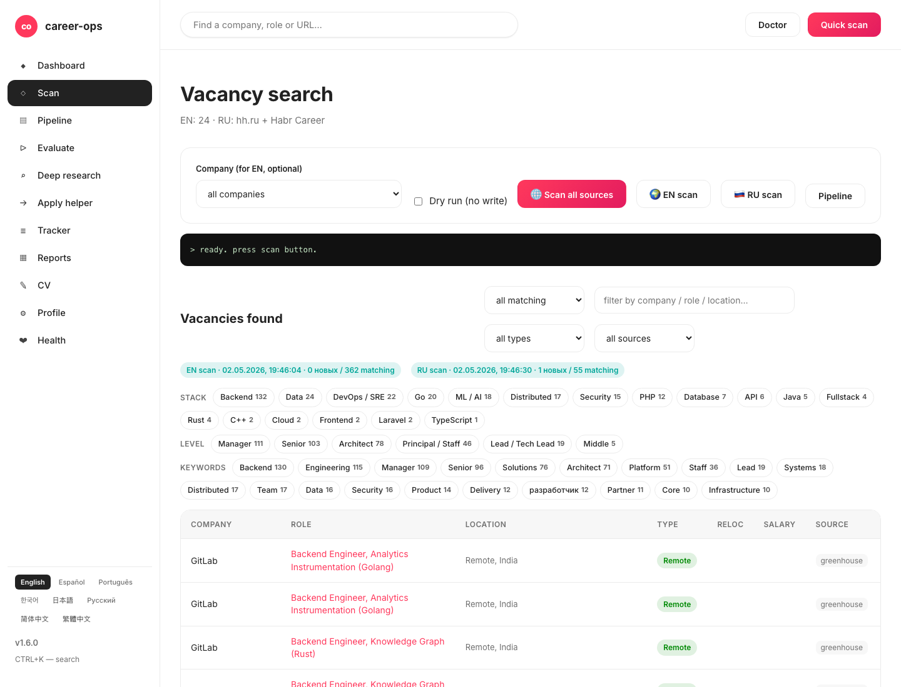

# career-ops-ui

> [career-ops](https://github.com/santifer/career-ops) AI 구직 파이프라인을 위한 Airbnb 스타일 웹 인터페이스.
> Claude Code, 터미널, 마크다운 파일 사이를 오가는 대신 — 단일 브라우저 탭에서 모든 채용 공고를 검색, 평가, 심층 조사, 지원, 추적할 수 있습니다.

[English](README.md) | [Español](README.es.md) | [Português (Brasil)](README.pt-BR.md) | **한국어** | [日本語](README.ja.md) | [Русский](README.ru.md) | [简体中文](README.cn.md) | [繁體中文](README.zh-TW.md)

[](README.md#tests)
[](README.md#requirements)
[](LICENSE)



## 한 줄 설치

```bash
curl -fsSL https://raw.githubusercontent.com/Fighter90/career-ops-ui/main/bin/setup.sh | bash
```

이 명령은 두 저장소(career-ops + career-ops-ui)를 클론하고, 의존성을 설치하고, http://127.0.0.1:4317에서 서버를 시작합니다.

## 왜?

[career-ops](https://github.com/santifer/career-ops)는 강력한 Claude Code 기반 구직 시스템입니다: JD를 붙여넣으면 → 0-5 적합도 점수, ATS 최적화 PDF, 트래커 항목을 받습니다. Claude Code 내부에서는 잘 작동하지만, 데이터가 `cv.md`, `data/applications.md`, `reports/*.md`, `data/pipeline.md`, `portals.yml`, `config/profile.yml` 사이에 흩어져 있어 — 잃어버리기 쉽고, 훑어보기 어렵습니다.

`career-ops-ui`는 그 위에 세련된 UI를 얹습니다:

- **탐색** — 트래커, 보고서, 파이프라인을 CRM처럼.
- **실행** — 스캔(Greenhouse / Ashby / Lever **및** hh.ru / Habr Career)을 트리거하고 실시간 SSE 로그를 확인.
- **평가** — Gemini API로 JD 평가하거나 Claude용 복붙 프롬프트 받기.
- **편집** — 사이드 바이 사이드 마크다운 미리보기로 `cv.md` 편집.
- **유지보수** — doctor, verify, normalize, dedup, merge — 각각 한 번의 클릭으로.

순수 추가 기능입니다: `career-ops/` 내부는 아무것도 변경되지 않습니다. 커스터마이징은 그대로 유지됩니다.

## 페이지별 기능

| 페이지            | 기능                                                                                                              |
| ---------------- | ----------------------------------------------------------------------------------------------------------------- |
| **Dashboard**    | 집계된 카운트(apps / pipeline / reports), 평균 점수, 상태별 분류, 최근 5개 apps + 최신 보고서.                                  |
| **Scan**         | **두 개의 스캐너:** 🌍 EN scan (Greenhouse/Ashby/Lever, 24+ 검증된 board) + 🇷🇺 RU scan (hh.ru API + Habr Career HTML 스크래핑). 실시간 SSE 로그 + stack/level chip 필터와 location / Remote-Hybrid / reloc / source 필터가 있는 결과 테이블. |
| **Pipeline**     | `data/pipeline.md`에 대한 CRUD. URL에서 평가로 바로 점프.                                                                  |
| **Evaluate**     | JD 붙여넣기 → `GEMINI_API_KEY`가 설정되어 있으면 `gemini-eval.mjs` 실행; 없으면 Claude용 복붙 가능 프롬프트 반환.            |
| **Deep research**| 지정된 회사/역할에 대해 `modes/deep.md` 전체 프롬프트 생성.                                                                  |
| **Apply helper** | 지원 체크리스트 생성; 실제 Playwright 폼 채우기는 Claude Code의 `/career-ops apply`에 그대로 유지.                                |
| **Tracker**      | `data/applications.md`에 대한 필터링 가능한 테이블(상태, 점수, 자유 텍스트). normalize/dedup/merge 원클릭 버튼.                |
| **Reports**      | `reports/`의 모든 보고서를 파싱된 헤더(Score / Legitimacy / URL)와 함께 탐색 및 읽기.                                       |
| **CV**           | `cv.md`의 실시간 마크다운 에디터 + 사이드 바이 사이드 미리보기 + sync-check.                                                  |
| **Profile**      | `config/profile.yml` + 아키타입의 read-only 보기.                                                                       |
| **Health**       | OK / OPTIONAL / FAIL 배지로 모든 setup 체크 + `doctor.mjs` 및 `verify-pipeline.mjs` 실행 버튼.                              |

## 요구사항

| | |
| --- | --- |
| **Node.js** | ≥ 18 |
| **career-ops** | 클론되고 onboarded됨 |
| **선택사항** | 원클릭 JD 평가를 위한 `.env`의 `GEMINI_API_KEY` |
| **선택사항** | 러시아 외부에서 실행 중이고 hh.ru API의 403 응답을 줄이고 싶다면 `.env`의 `HH_USER_AGENT` |

## 스택 및 레벨용 칩 필터

채용 공고 테이블에는 다음을 위한 multi-select 칩이 포함되어 있습니다:

- **Stack:** PHP, Symfony, Laravel, Go, Rust, Node.js, TypeScript, Python, Ruby, Java, C#/.NET, C++, Backend, Frontend, Fullstack, Microservices, High-load, Distributed, DevOps/SRE, Data, ML/AI, Mobile, Security, Database, Cloud, API
- **Level:** Lead/Tech Lead, Architect, Manager, Principal/Staff, Senior, Middle, Junior

각 카테고리 내에서 multi-select(OR), 카테고리 간 교차(AND). 카운트가 표시되며, 결과가 있는 칩만 나타납니다.

## 전체 문서

전체 아키텍처, API 레퍼런스, 고급 설정, 보안 노트는 — [영문 README](README.md) 참조.

## 라이선스

MIT. [santifer](https://santifer.io)의 [career-ops](https://github.com/santifer/career-ops) 위에 구축됨.

---

## 🌍 Getting Started — 설치 후 첫 단계

one-command install 후 두 개의 클론된 저장소와 스캐폴드 파일(`cv.md`, `config/profile.yml`, `portals.yml`, `data/applications.md`, `data/pipeline.md` — **EDIT ME** 마커 포함)이 있습니다. Health 페이지가 첫 실행에서 모두 녹색이어야 합니다. 플레이스홀더를 실제 데이터로 교체:

### 1. CV 만들기 (`cv.md`)

- **A — 기존 이력서 붙여넣기:** `career-ops/cv.md`를 깔끔한 markdown으로.
- **B — UI에서 업로드:** **CV** 클릭 → **📁 이력서 업로드** → `.md`/`.txt` 선택 → preview 확인 → **💾 저장** 클릭.
- **C — Claude Code에 LinkedIn 전달:** Claude Code에서 `/career-ops` 실행, "내 CV를 추출해서 cv.md에 작성해줘" 요청.

### 2. 프로필 (`config/profile.yml`)

플레이스홀더 교체: 이름, 이메일, 위치, LinkedIn, 타겟 역할, **archetypes** (가장 중요), 급여 범위.

### 3. 스캐너 (`portals.yml`)

`title_filter.positive`/`negative` 조정. 3개 board(GitLab, Vercel, Linear) 사전 설정. 더 많은 정보: [`docs/portals-examples.md`](docs/portals-examples.md).

### 4. (선택) Gemini API key

```bash
echo "GEMINI_API_KEY=your-key" >> career-ops/.env
```

### 5. 확인 및 시작

Health → 모두 녹색. **🌐 모든 소스 검색** → chip 필터 테이블 → URL 복사 → **Pipeline** → **Evaluate**.

전체 문서 (아키텍처, API, 보안): [영어 README](README.md).
