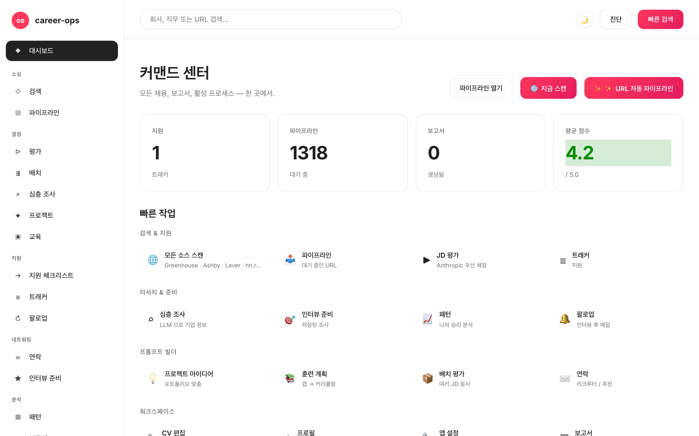

# career-ops-ui

> [career-ops](https://github.com/santifer/career-ops) AI 구직 파이프라인을 위한 깔끔한 docs-style 웹 인터페이스.
> Claude Code, 터미널, 마크다운 파일 사이를 오가는 대신 — 단일 브라우저 탭에서 모든 채용 공고를 검색, 평가, 심층 조사, 지원, 추적할 수 있습니다.

[English](README.md) | [Español](README.es.md) | [Português (Brasil)](README.pt-BR.md) | **한국어** | [日本語](README.ja.md) | [Русский](README.ru.md) | [简体中文](README.zh-CN.md) | [繁體中文](README.zh-TW.md)

[](README.md#tests)
[](#tests)
[](README.md#requirements)
[](LICENSE)
[](https://github.com/Fighter90/career-ops-ui/releases/tag/v1.16.0)

> 📦 **v1.9.1** — 서버를 130줄 오케스트레이터 + `server/lib/routes/`의 12개 라우트 모듈로 리팩터링. `/api/evaluate`의 Anthropic 패리티(두 키 모두 있을 때 우선). 멀티 CLI 심(`AGENTS.md`, `GEMINI.md`)으로 Codex / Aider / Cursor / Gemini CLI 지원. **unit 284개 + Playwright smoke 12개**. 전체 production-readiness 평가: [`docs/PRODUCTION-READINESS.md`](docs/PRODUCTION-READINESS.md). 싱글 테넌트 loopback 배포 준비 완료; LAN 노출용 auth gate는 v2.0 (P-12)에서 제공.



## career-ops 소개

[career-ops](https://career-ops.org)는 모든 AI 코딩 CLI(Claude Code, Codex, Cursor, Gemini CLI, GitHub Copilot CLI) 안에서 슬래시 명령으로 실행되는 오픈소스 구직 시스템입니다. 모델 무관. 각 공고를 6차원 0.0–5.0 루브릭으로 CV와 매칭하고, 맞춤형 PDF 이력서를 생성하며, 모든 지원을 로컬에서 추적합니다 — 클라우드 계정 없음, 텔레메트리 없음, 자동 제출 없음.

**이 저장소(career-ops-ui)**는 CLI 위에 다듬은 웹 인터페이스입니다. CLI는 form-fill(Playwright MCP 경유)과 슬래시 명령 모드를 계속 소유; SPA는 동일한 `cv.md` / `data/applications.md` / `reports/` 위에 CRM 스타일 표면을 제공합니다. 데이터 공유.

**Score 별 액션 임계값** ([career-ops.org/docs](https://career-ops.org/docs)):

| Score | 다음 단계 |
|---|---|
| **≥ 4.5** | `/career-ops apply` — 높은 적합도, 즉시 지원 |
| **4.0 – 4.4** | 지원 또는 `/career-ops contacto` (warm intro) |
| **3.5 – 3.9** | `/career-ops deep` — 먼저 리서치 |
| **< 3.5** | 특별한 이유 없으면 건너뜀 |

**캐노니컬 가이드** ([career-ops.org/docs](https://career-ops.org/docs)):

- [What is career-ops](https://career-ops.org/docs/introduction/what-is-career-ops)
- [Scan job portals](https://career-ops.org/docs/introduction/guides/scan-job-portals)
- [Apply for a job](https://career-ops.org/docs/introduction/guides/apply-for-a-job)
- [Batch-evaluate offers](https://career-ops.org/docs/introduction/guides/batch-evaluate-offers)
- [Set up Playwright](https://career-ops.org/docs/introduction/guides/set-up-playwright)

## 한 줄 설치

```bash
curl -fsSL https://raw.githubusercontent.com/Fighter90/career-ops-ui/main/bin/setup.sh | bash
```

이 명령은 두 저장소(career-ops + career-ops-ui)를 클론하고, 의존성을 설치하고, http://127.0.0.1:4317에서 서버를 시작합니다.

## 왜?

[career-ops](https://github.com/santifer/career-ops)는 강력한 Claude Code 기반 구직 시스템입니다: JD를 붙여넣으면 → 0-5 적합도 점수, ATS 최적화 PDF, 트래커 항목을 받습니다. Claude Code 내부에서는 잘 작동하지만, 데이터가 `cv.md`, `data/applications.md`, `reports/*.md`, `data/pipeline.md`, `portals.yml`, `config/profile.yml` 사이에 흩어져 있어 — 잃어버리기 쉽고, 훑어보기 어렵습니다.

`career-ops-ui`는 그 위에 세련된 UI를 얹습니다:

- **탐색** — 트래커, 보고서, 파이프라인을 CRM처럼.
- **실행** — 스캔(Greenhouse / Ashby / Lever / Workable / SmartRecruiters / Workday **및** hh.ru / Habr Career)을 트리거하고 실시간 SSE 로그를 확인.
- **평가** — Gemini API로 JD 평가하거나 Claude용 복붙 프롬프트 받기.
- **편집** — 사이드 바이 사이드 마크다운 미리보기로 `cv.md` 편집.
- **유지보수** — doctor, verify, normalize, dedup, merge — 각각 한 번의 클릭으로.

순수 추가 기능입니다: `career-ops/` 내부는 아무것도 변경되지 않습니다. 커스터마이징은 그대로 유지됩니다.

## 페이지별 기능

| 페이지            | 기능                                                                                                              |
| ---------------- | ----------------------------------------------------------------------------------------------------------------- |
| **Dashboard**    | 집계된 카운트(apps / pipeline / reports), 평균 점수, 상태별 분류, 최근 5개 apps + 최신 보고서.                                  |
| **Scan**         | **🌐 단일 🌐 Scan 버튼** — 한 번에 모든 활성화된 소스를 스캔(ATS adapters (Greenhouse / Ashby / Lever / Workable / SmartRecruiters / Workday) + regional portals (hh.ru / Habr Career)). 실시간 SSE 로그 + stack/level chip 필터와 location / Remote-Hybrid / reloc / source 필터가 있는 결과 테이블. |
| **Pipeline**     | `data/pipeline.md`에 대한 CRUD. URL에서 평가로 바로 점프.                                                                  |
| **Evaluate**     | JD 붙여넣기 → `GEMINI_API_KEY`가 설정되어 있으면 `gemini-eval.mjs` 실행; 없으면 Claude용 복붙 가능 프롬프트 반환.            |
| **Deep research**| 지정된 회사/역할에 대해 `modes/deep.md` 전체 프롬프트 생성.                                                                  |
| **Apply helper** | 지원 체크리스트 생성; 실제 Playwright 폼 채우기는 Claude Code의 `/career-ops apply`에 그대로 유지.                                |
| **Tracker**      | `data/applications.md`에 대한 필터링 가능한 테이블(상태, 점수, 자유 텍스트). normalize/dedup/merge 원클릭 버튼.                |
| **Reports**      | `reports/`의 모든 보고서를 파싱된 헤더(Score / Legitimacy / URL)와 함께 탐색 및 읽기.                                       |
| **CV**           | `cv.md`의 실시간 마크다운 에디터 + 사이드 바이 사이드 미리보기 + sync-check.                                                  |
| **Profile**      | `config/profile.yml` + 아키타입의 read-only 보기.                                                                       |
| **Health**       | OK / OPTIONAL / FAIL 배지로 모든 setup 체크 + `doctor.mjs` 및 `verify-pipeline.mjs` 실행 버튼.                              |

## 요구사항

| | |
| --- | --- |
| **Node.js** | ≥ 18 |
| **career-ops** | 클론되고 onboarded됨 |
| **선택사항** | 원클릭 JD 평가를 위한 `.env`의 `GEMINI_API_KEY` |
| **선택사항** | 러시아 외부에서 실행 중이고 hh.ru API의 403 응답을 줄이고 싶다면 `.env`의 `HH_USER_AGENT` |

## 스택 및 레벨용 칩 필터

채용 공고 테이블에는 다음을 위한 multi-select 칩이 포함되어 있습니다:

- **Stack:** PHP, Symfony, Laravel, Go, Rust, Node.js, TypeScript, Python, Ruby, Java, C#/.NET, C++, Backend, Frontend, Fullstack, Microservices, High-load, Distributed, DevOps/SRE, Data, ML/AI, Mobile, Security, Database, Cloud, API
- **Level:** Lead/Tech Lead, Architect, Manager, Principal/Staff, Senior, Middle, Junior

각 카테고리 내에서 multi-select(OR), 카테고리 간 교차(AND). 카운트가 표시되며, 결과가 있는 칩만 나타납니다.

## 전체 문서

전체 아키텍처, API 레퍼런스, 고급 설정, 보안 노트는 — [영문 README](README.md) 참조.

## 라이선스

MIT. [santifer](https://santifer.io)의 [career-ops](https://github.com/santifer/career-ops) 위에 구축됨.

---

## 🌍 Getting Started — 설치 후 첫 단계

one-command install 후 두 개의 클론된 저장소와 스캐폴드 파일(`cv.md`, `config/profile.yml`, `portals.yml`, `data/applications.md`, `data/pipeline.md` — **EDIT ME** 마커 포함)이 있습니다. Health 페이지가 첫 실행에서 모두 녹색이어야 합니다. 플레이스홀더를 실제 데이터로 교체:

### 1. CV 만들기 (`cv.md`)

- **A — 기존 이력서 붙여넣기:** `career-ops/cv.md`를 깔끔한 markdown으로.
- **B — UI에서 업로드:** **CV** 클릭 → **📁 이력서 업로드** → `.md`/`.txt` 선택 → preview 확인 → **💾 저장** 클릭.
- **C — Claude Code에 LinkedIn 전달:** Claude Code에서 `/career-ops` 실행, "내 CV를 추출해서 cv.md에 작성해줘" 요청.

### 2. 프로필 (`config/profile.yml`)

플레이스홀더 교체: 이름, 이메일, 위치, LinkedIn, 타겟 역할, **archetypes** (가장 중요), 급여 범위.

### 3. 스캐너 (`portals.yml`)

`title_filter.positive`/`negative` 조정. 3개 board(GitLab, Vercel, Linear) 사전 설정. 더 많은 정보: [`docs/portals-examples.md`](docs/portals-examples.md).

### 4. (선택) Gemini API key

```bash
echo "GEMINI_API_KEY=your-key" >> career-ops/.env
```

### 5. 확인 및 시작

Health → 모두 녹색. **🌐 모든 소스 검색** → chip 필터 테이블 → URL 복사 → **Pipeline** → **Evaluate**.

전체 문서 (아키텍처, API, 보안): [영어 README](README.md).

---

## ✨ v1.16.0의 새로운 기능 (서버 사이드 auto-pipeline)

> **큰 UX 변화.** v1.15.0까지는 `#/pipeline → #/evaluate → #/cv → #/tracker`를 거치며 5번의 수동 클릭이 필요했습니다. 이제 단일 `✨ Auto-pipeline a URL` 버튼(`#/dashboard` 및 `Cmd+K → URL 붙여넣기 → Enter`)으로 전체 파이프라인을 관찰 가능한 SSE 타임라인으로 실행합니다.

### 동작 방식
1. **URL 검증** (SSRF + DNS-rebind 게이트).
2. **JD 가져오기** SSRF-safe 프록시 경유.
3. **CV와 평가** (Anthropic 또는 Gemini), markdown에서 0–5 점수 추출.
4. **리포트 저장** `reports/<slug>.md`에 (새 엔드포인트 `POST /api/reports`).
5. **트래커에 행 추가** 리포트 + URL 참조.

```bash
# 직접 curl (CI / smoke):
curl -N -X POST http://127.0.0.1:4317/api/auto-pipeline \
  -H 'Content-Type: application/json' \
  -d '{"url":"https://job-boards.greenhouse.io/anthropic/jobs/4567"}'
```

SSE 이벤트: `start → step (×5) → done` 또는 `error`. 어떤 단계든 깨끗하게 실패하고 체인은 완료된 부분만 반환합니다.

### v1.16.0 기타 하이라이트
- **SmartRecruiters 페이지네이션** — 첫 100개가 아닌 모든 페이지를 순회. 안전 캡: 30페이지 / 3000개 잡.
- **Workday CAPTCHA-fallback** — CAPTCHA로 막힌 테넌트가 전체 스캔을 중단하지 않습니다. Active Companies 카드에 🔒 chip 렌더링; 나머지 테넌트는 계속 진행.
- **`#/scan` source filter** — adapter registry 기반 드롭다운 재구성: 6 ATSes + hh.ru + Habr, 알파벳순, geo prefix 없음.
- **`scripts/import-trending-companies.mjs`** — `docs/portals-examples.md`의 13개 trending 회사를 검증하고 `portals.yml`에 붙여넣을 YAML을 출력. `npm run import:trending` 실행.
- **CI workflow** — `.github/workflows/dashboard-screenshots.yml`가 8개 hero PNG를 재생성하고 커밋되지 않은 시각적 drift가 있으면 빌드 실패.

### 참고
- 전체 문서: [영어 README](README.md) — 아키텍처/API/보안 섹션이 있는 585줄.
- 인앱 도움말: `#/help` (16 섹션 × 8 로케일).
- CHANGELOG: [`CHANGELOG.ko-KR.md`](CHANGELOG.ko-KR.md).
- 표준 문서: [career-ops.org/docs](https://career-ops.org/docs).

---

## 아키텍처

| 레이어 | Stack | 파일 |
|---|---|---|
| Server | Node ≥18, Express 4, js-yaml, multer | `server/index.mjs` (~130 LOC), `server/lib/routes/*.mjs` (13 모듈) |
| SPA | Vanilla JS, hash-router, 프레임워크 없음 | `public/index.html`, `public/js/{app,router,api}.js`, `public/js/views/*.js` |
| Styling | hand-written CSS, docs-style 토큰, dark theme | `public/css/app.css` |
| Tests | `node --test` (TAP), Express in-process | `tests/*.test.mjs`, Playwright |
| Build | 없음 — 파일 as-is 제공 | — |

서버는 부모 파일(`../cv.md`, `../config/profile.yml` 등)을 읽고 명시적 사용자 액션(`POST /api/tracker`, `PUT /api/cv`, `POST /api/reports`, `POST /api/auto-pipeline`)에서만 씁니다.

## API 레퍼런스

핵심 엔드포인트(전체 목록은 [영어 README](README.md#api-reference)):

| Method + Path | 목적 |
|---|---|
| `GET /api/health` | system status + 18 checks |
| `GET /api/dashboard` | counts + score-thresholds + activity tail |
| `GET /api/scan-results` | 최신 scan + `workdayFallback` (v1.17+) |
| `GET /api/stream/scan?source=ats\|regional\|both` | 통합 SSE |
| `POST /api/pipeline { url }` | URL 추가 (SSRF 게이트) |
| `GET /api/pipeline/preview?url=` | SSRF-safe 프록시 + DNS-rebind guard |
| `POST /api/evaluate { jd, save?, mode? }` | Anthropic / Gemini / manual eval |
| `POST /api/reports { slug, markdown }` | `reports/<slug>.md`에 영속화 (v1.16+) |
| `POST /api/auto-pipeline { url }` | SSE 5-step orchestrator (v1.16+) |
| `POST /api/tracker { company, role, … }` | `data/applications.md`에 append |
| `GET /api/modes/_profile` + `PUT` | `modes/_profile.md` 에디터 (v1.15+) |
| `POST /api/stream/pdf/inline` | Playwright 통한 SSE PDF |

## 보안 노트

- **CSP** 엄격: `script-src 'self'`, `'unsafe-inline'` 없음. 핸들러는 `addEventListener` 경유.
- **SSRF**: 사용자 URL 페치는 `isValidJobUrl()` 통과 — loopback, private IP, 위험한 scheme, 안전하지 않은 redirect 거부.
- **XSS**: 입력 markdown은 `stripDangerousMarkdown()` 통과.
- **DNS-rebind guard**: `/api/pipeline/preview` 및 auto-pipeline.
- **Headers**: `X-Content-Type-Options: nosniff`, `X-Frame-Options: DENY`, `Referrer-Policy: same-origin`.
- **Body caps**: 5 MB JSON, 1 MB report, 256 KB profile/modes_profile, 10 MB CV upload.
- Auth 없음 — single-tenant loopback only. LAN auth → P-12 (v2.0).

## 테스트

- `npm test` — **427** 단위 + 통합. `CAREER_OPS_ROOT=$(mktemp -d)` 격리.
- `npm run test:coverage` — **94 % 라인 / 83 % 브랜치**.
- `npm run test:e2e` — 20 smoke E2E.
- `npm run test:e2e:full` — 23 comprehensive E2E.
- `npm run test:e2e:browser` — **32** Playwright (smoke + full-cycle + auto-pipeline 시나리오).

## A11y (v1.17+)

- ARIA roles: `banner`, `navigation`, `main`, `dialog`, `status`, `search`.
- 모달의 포커스 트랩 + click owner로 포커스 복원.
- sidebar-toggle의 `aria-expanded` 동기화.
- global search 라벨은 `visually-hidden` 클래스 경유.

## 제한 사항

- **Single-tenant, loopback only** — 로그인 없음, 다중 사용자 없음.
- **PDF 부모에 Playwright 필요**.
- **Live LLM은 ANTHROPIC_API_KEY 또는 GEMINI_API_KEY 필요**; 키 없으면 manual prompt.
- **Workday CAPTCHA-gated tenants**는 graceful fallback (no jobs); `/career-ops scan` 사용.

## License

MIT — [LICENSE](LICENSE) 참조.
