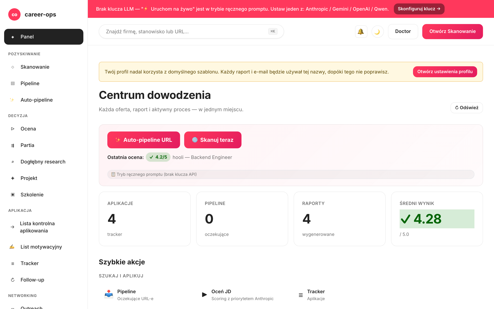

# career-ops-ui

> Przejrzysty interfejs webowy w stylu dokumentacji technicznej dla potoku wyszukiwania pracy opartego na AI — [career-ops](https://github.com/Fighter90/career-ops).
> Przeglądaj oferty, oceniaj je, analizuj szczegółowo, aplikuj i śledź każdą ofertę z jednej karty przeglądarki — zamiast przeskakiwać między Claude Code, terminalem a plikami markdown.

[English](README.md) | [Español](README.es.md) | [Português (Brasil)](README.pt-BR.md) | [한국어](README.ko-KR.md) | [日本語](README.ja.md) | [Русский](README.ru.md) | [简体中文](README.zh-CN.md) | [繁體中文](README.zh-TW.md) | [Français](README.fr.md) | **Polski** | [Українська](README.uk.md) | [Dansk](README.da.md) | [العربية](README.ar.md)

_Nieoficjalny interfejs — niepowiązany z career-ops / santifer ani przez nich nieautoryzowany._

[](#testy)
[](#testy)
[](#testy)
[](#wymagania)
[](LICENSE)
[](https://github.com/Fighter90/career-ops-ui/releases/tag/v1.83.0)

> **🆕 Najnowsze wydanie — v1.83.0**
>
> **Detektor ponownych publikacji / ofert-widm** (parytet z nadrzędnym career-ops v1.15.0): nowy panel **🔁 Ponownie opublikowane / oferty-widma** na `#/scan` oznacza klastry firma+stanowisko ponownie opublikowane pod różnymi adresami URL w ruchomym oknie 90 dni — sygnał przestarzałego potoku / oferty-widma — odczytywany z historii skanowania (`GET /api/scan/reposts`). Bazuje na v1.82.0 (NoDesk), v1.81.0 (13 nowych źródeł) i v1.80.0 (Teamtailor, kwarantanna źródeł, zapisane wyszukiwania).
>
> _13 lokalizacji · 6 dostawców LLM · 41 adapterów skanera · detektor ponownych publikacji · parytet z nadrzędnym career-ops v1.15.0._



## O projekcie career-ops

[career-ops](https://career-ops.org) to system wyszukiwania pracy o otwartym kodzie źródłowym działający jako zestaw poleceń slash wewnątrz dowolnego CLI dla programistów korzystającego z AI (Claude Code, Gemini CLI, Codex, Qwen Code, OpenCode, GitHub Copilot CLI, Antigravity CLI — inne CLI kompatybilne z Claude również działają). Niezależny od modelu. Ocenia każdą ofertę pracy względem Twojego CV w sześciowymiarowej skali 0,0–5,0, generuje dopasowane pliki PDF z CV i śledzi każde zgłoszenie lokalnie — bez kont w chmurze, telemetrii ani automatycznego składania aplikacji.

**Ten repozytoria (career-ops-ui)** to dopracowany interfejs webowy zbudowany na jego bazie. CLI nadal obsługuje wypełnianie formularzy (przez Playwright MCP) i tryby poleceń slash; SPA oferuje powierzchnię w stylu CRM w przeglądarce opartą na tych samych plikach `cv.md` / `data/applications.md` / `reports/`. Oba współdzielą te same dane.

**Progi działania według wyniku** (z [career-ops.org/docs](https://career-ops.org/docs)):

| Wynik | Następny krok |
|---|---|
| **≥ 4,5** | `/career-ops apply` — wysokie dopasowanie, aplikuj od razu |
| **4,0 – 4,4** | aplikuj lub `/career-ops contacto` dla ciepłego wprowadzenia |
| **3,5 – 3,9** | `/career-ops deep` — najpierw zbadaj firmę |
| **< 3,5** | pomiń, chyba że masz konkretny powód |

**Przewodniki kanoniczne** na [career-ops.org/docs](https://career-ops.org/docs):

- [Czym jest career-ops](https://career-ops.org/docs/introduction/what-is-career-ops)
- [Skanowanie portali pracy](https://career-ops.org/docs/introduction/guides/scan-job-portals)
- [Składanie aplikacji](https://career-ops.org/docs/introduction/guides/apply-for-a-job)
- [Masowa ocena ofert](https://career-ops.org/docs/introduction/guides/batch-evaluate-offers)
- [Konfiguracja Playwright](https://career-ops.org/docs/introduction/guides/set-up-playwright)

## Kluczowe funkcje

| Strona | Opis |
|---|---|
| **Panel główny** | Liczniki zbiorcze, średni wynik, ostatnie aplikacje i raporty |
| **Skanowanie** | Przycisk 🌐 Scan uruchamia wszystkie skonfigurowane źródła (Greenhouse / Ashby / Lever / Workable / SmartRecruiters / Workday + hh.ru / Habr Career) jednym kliknięciem; wyniki w czasie rzeczywistym przez SSE |
| **Pipeline** | Zarządzanie `data/pipeline.md`; bezpieczny podgląd URL (ochrona przed SSRF) |
| **Ocena** | Wklej opis stanowiska → wynik 0–5 przez Anthropic lub Gemini; fallback na gotowy prompt |
| **Głęboka analiza** | Badanie firmy przez Anthropic SDK; wyniki zapisywane w `interview-prep/` |
| **Tracker** | Filtrowana tabela aplikacji nad `data/applications.md` |
| **CV** | Edytor markdown na żywo z podglądem bocznym i ochroną XSS |
| **Zdrowie systemu** | Odznaki stanu konfiguracji; uruchamianie `doctor.mjs` jednym kliknięciem |
| **Pomoc** | Wbudowana dokumentacja w 12 językach (włącznie z polskim) |

## Szybki start

> **Ważne — career-ops-ui to panel *nadbudowany na* [`Fighter90/career-ops`](https://github.com/Fighter90/career-ops).** Działa **wewnątrz** projektu career-ops jako `career-ops/web-ui/` i odczytuje pliki `cv.md`, `config/`, `data/` z folderu nadrzędnego przez `../`. **Nie działa samodzielnie** — potrzebujesz również nadrzędnego repozytorium career-ops.

### Opcja 1 — jedno polecenie curl (zalecane)

```bash
curl -fsSL https://raw.githubusercontent.com/Fighter90/career-ops-ui/main/bin/setup.sh | bash
```

Klonuje **oba** repozytoria, organizuje strukturę `career-ops/web-ui/`, instaluje zależności, uruchamia diagnostykę i startuje serwer pod adresem http://127.0.0.1:4317.

### Opcja 2 — dodaj UI do istniejącego projektu career-ops

```bash
cd career-ops
git clone https://github.com/Fighter90/career-ops-ui.git web-ui
cd web-ui
npm install
npm start
```

Otwórz http://127.0.0.1:4317 w przeglądarce.

### Polecenia CLI

```bash
career-ops-ui setup    # bootstrap: instalacja zależności → diagnostyka → uruchomienie
career-ops-ui init     # wybór dostawcy LLM i wklejenie klucza API (interaktywne)
career-ops-ui doctor   # weryfikacja Node / projektu / kluczy / Playwright
career-ops-ui run      # uruchomienie serwera na http://127.0.0.1:4317
career-ops-ui open     # otwarcie i wyeksponowanie karty panelu w przeglądarce
career-ops-ui help     # lista wszystkich poleceń
```

### Wybór dostawcy LLM

`init` to kreator konfiguracji dostawcy — wybierz **Claude / Claude Code** (`ANTHROPIC_API_KEY`), **Codex / OpenCode** (`OPENAI_API_KEY`), **Qwen Code** (`QWEN_API_KEY`) lub **Auto** (Anthropic → fallback Gemini). Klucze można też ustawić ręcznie:

```bash
echo "ANTHROPIC_API_KEY=sk-ant-..." >> career-ops/.env
```

Lub przez zakładkę **Ustawienia aplikacji** (`#/config`) w interfejsie — bez restartu serwera.

## Wymagania

| | |
|---|---|
| **Node.js** | ≥ 18 (natywne `fetch` i `node:test`) |
| **career-ops** | sklonowane i skonfigurowane (patrz wyżej) |
| **Opcjonalnie** | `ANTHROPIC_API_KEY` lub `GEMINI_API_KEY` w `.env` projektu nadrzędnego dla oceny JD jednym kliknięciem |

## Architektura w skrócie

```
career-ops/
├─ cv.md
├─ portals.yml
├─ config/
├─ data/
└─ web-ui/          ← to repozytorium
   ├─ server/       # Express + 15 modułów tras
   ├─ public/       # vanilla JS SPA, bez bundlera
   └─ tests/        # 1086 testów jednostkowych + 70 Playwright + 43 e2e
```

Serwer ma dwie zależności produkcyjne: `express` i `js-yaml`. Brak transpilacji, brak bundlera — cały interfejs to mniej niż 30 KB zminifikowanego kodu.

## Pełna dokumentacja

Kompletna dokumentacja jest dostępna wyłącznie w wersji angielskiej: **[README.md](README.md)**

Zawiera szczegółowe opisy:
- Pełnego API REST (wszystkie endpointy `/api/*`)
- Konfiguracji skanera portali (Greenhouse, Ashby, Lever, Workable, hh.ru, Habr Career, RSS)
- Wszystkich zmiennych środowiskowych
- Zasad bezpieczeństwa (SSRF, XSS, rate limiting)
- Przewodnika po architekturze (SDD, konwencje)

Oficjalna strona: [career-ops.org](https://career-ops.org) · Dokumentacja: [career-ops.org/docs](https://career-ops.org/docs)

## Testy

```bash
npm test                    # 1086 testów jednostkowych/integracyjnych
npm run test:e2e            # 20 smoke e2e
npm run test:e2e:full       # 23 comprehensive e2e
npm run test:e2e:browser    # 70 testów Playwright
npm run test:coverage       # jak npm test + pokrycie V8
```

## Licencja

MIT. Szczegóły: [LICENSE](LICENSE).

Zbudowane na bazie [career-ops](https://github.com/Fighter90/career-ops) autorstwa [santifer](https://santifer.io).

[](https://github.com/Fighter90/career-ops-ui/graphs/contributors)
