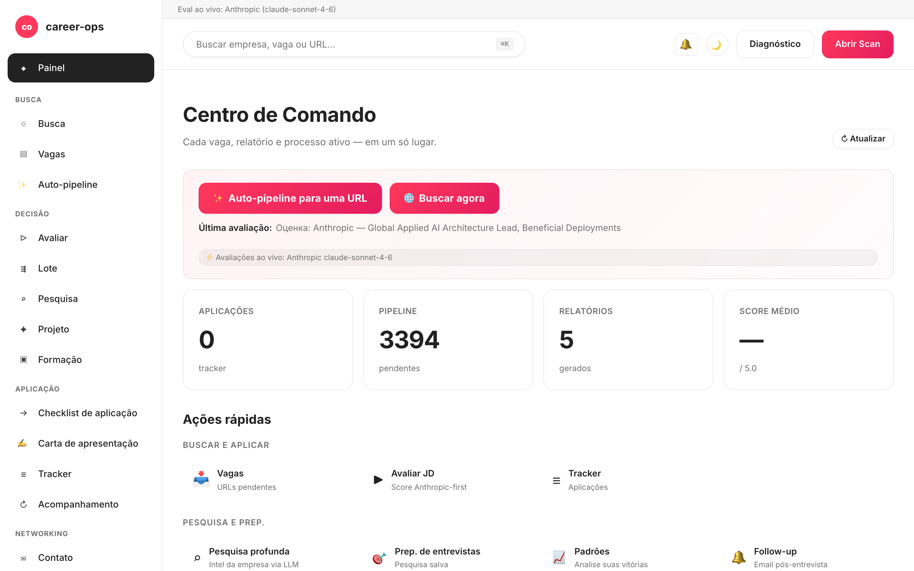

# career-ops-ui

> Interface web limpa, estilo docs, para o pipeline de busca de emprego com IA [career-ops](https://github.com/santifer/career-ops).
> Busque, avalie, faça deep-dive, candidate-se e rastreie cada vaga em uma única aba do navegador — em vez de alternar entre Claude Code, terminais e arquivos markdown.

[English](README.md) | [Español](README.es.md) | **Português (Brasil)** | [한국어](README.ko-KR.md) | [日本語](README.ja.md) | [Русский](README.ru.md) | [简体中文](README.zh-CN.md) | [繁體中文](README.zh-TW.md)

[](#testes)
[](#testes)
[](#requisitos)
[](LICENSE)
[](https://github.com/Fighter90/career-ops-ui/releases/tag/v1.58.39)

> **Recente (v1.55 → v1.58):** **saída de pesquisa limpa e formatada** (#/deep + Pesquisa salva removem andaime `<tool_call>`/`<tool_response>`) + varredura de bugs do relatório QA (`#/followup` data ISO, negrito markdown em citações da ajuda, toast de duplicado honesto, alias `#/outreach`) + **provedor OpenRouter** (uma chave → 300+ modelos, dropdown ao vivo em `#/config`) + correção de «validation failed» em `#/config` (chaves coladas com espaços/quebra de linha agora salvam), banner de onboarding + chip de provedor ativo, custos honestos de ⚡ Executar ao vivo, ETA em `#/auto`, disclosure de Filtros avançados + Stop proeminente em `#/scan`, CTAs hero em `#/dashboard`, virtualização >1000 linhas em `#/pipeline`, paginação de servidor + chips de funil em `#/tracker`, e polimento de acessibilidade — detalhe por versão em [CHANGELOG.pt-BR.md](CHANGELOG.pt-BR.md).

<!-- DO NOT REVERT: locale-specific dashboard screenshot (dashboard-pt-BR.png). Each README uses its own ./images/dashboard-<locale>.png — never replace with dashboard-en.png. Generated by scripts/capture-dashboard-screenshots.mjs. -->


## Sobre o career-ops

O [career-ops](https://career-ops.org) é um sistema open-source de busca de emprego que roda como slash commands dentro de qualquer CLI de IA para código (Claude Code, Codex, OpenCode, Qwen CLI — outras CLIs compatíveis com Claude também funcionam pela mesma superfície de slash-commands). É agnóstico em relação ao modelo. Avalia cada vaga contra o seu CV usando uma rubrica de seis dimensões na escala 0.0–5.0, gera currículos em PDF personalizados e registra cada candidatura localmente — sem contas em nuvem, sem telemetria, sem envio automático.

**Este repositório (career-ops-ui)** é uma interface web polida sobre essa base. O CLI continua responsável pelo preenchimento de formulários (via Playwright MCP) e pelos modos de slash commands; a SPA oferece uma superfície de navegador no estilo CRM sobre os mesmos arquivos `cv.md` / `data/applications.md` / `reports/`. Os dois compartilham os mesmos dados.

**Limiares de ação por score** (extraídos de [career-ops.org/docs](https://career-ops.org/docs)):

| Score | Próximo passo |
|---|---|
| **≥ 4.5** | `/career-ops apply` — fit alto, candidate-se agora |
| **4.0 – 4.4** | candidate-se, ou `/career-ops contacto` para uma intro quente |
| **3.5 – 3.9** | `/career-ops deep` — pesquise antes |
| **< 3.5** | pule, salvo se tiver um motivo específico |

**Guias canônicos** em [career-ops.org/docs](https://career-ops.org/docs):

- [What is career-ops](https://career-ops.org/docs/introduction/what-is-career-ops)
- [Scan job portals](https://career-ops.org/docs/introduction/guides/scan-job-portals)
- [Apply for a job](https://career-ops.org/docs/introduction/guides/apply-for-a-job)
- [Batch-evaluate offers](https://career-ops.org/docs/introduction/guides/batch-evaluate-offers)
- [Set up Playwright](https://career-ops.org/docs/introduction/guides/set-up-playwright)

## Inicie e configure com um único comando

**Caminho mais rápido — um único curl:**

```bash
curl -fsSL https://raw.githubusercontent.com/Fighter90/career-ops-ui/main/bin/setup.sh | bash
```

Esse comando clona os dois repositórios (career-ops + career-ops-ui), instala as dependências, executa o doctor e sobe o servidor em http://127.0.0.1:4317.

**Ou passo a passo com a CLI `career-ops-ui`** (clone → setup → init → run):

```bash
git clone https://github.com/Fighter90/career-ops-ui
cd career-ops-ui
npm link                 # expõe o comando `career-ops-ui` (ou: npx career-ops-ui <verbo>)

career-ops-ui setup      # bootstrap: instala dependências → doctor → run (SKIP_START=1 para parar antes do run)
career-ops-ui init       # interativo: escolha o provedor LLM + cole a chave dele → gravado no .env do projeto pai
career-ops-ui doctor     # verifica Node / projeto / chaves / Playwright (exit 0 ⇔ tudo que é obrigatório no verde)
career-ops-ui run        # sobe o servidor em http://127.0.0.1:4317
career-ops-ui open       # abre + TRAZ PARA FRENTE a aba do painel no seu navegador
career-ops-ui help       # lista todos os verbos
```

Após `setup`/`run` a aba do painel é aberta **e trazida para a frente** automaticamente; `career-ops-ui open` faz o mesmo sob demanda, então você nunca precisa procurar a aba. Defina `NO_OPEN=1` para desativar a abertura automática (headless / CI).

O `setup` executa a cadeia inteira sozinho; os demais verbos também podem ser usados de forma independente. O `init` é o assistente de provedor — escolha **Claude / Claude Code** (`ANTHROPIC_API_KEY`), **Gemini / Gemini CLI** (`GEMINI_API_KEY`), **Codex / OpenCode CLI** (`OPENAI_API_KEY`), ou **Auto** (Anthropic → Gemini como fallback). As chaves são digitadas com o eco suprimido (nada fica no scrollback do shell) e gravadas no `career-ops/.env` do projeto pai pelo mesmo caminho validado que a aba de chaves de API do `#/config` usa. Forma não interativa para CI:

```bash
career-ops-ui init --provider claude --anthropic-key sk-ant-… --yes
career-ops-ui init --provider gemini --gemini-key …       --yes
career-ops-ui init --provider auto   --openai-key sk-…    --yes   # Codex/OpenCode side
```

O provedor que você escolher define `LLM_PROVIDER` (`auto` | `claude` | `gemini`); as rotas ao vivo de evaluate / deep-dive / mode / auto-pipeline do servidor o respeitam. Você pode trocá-lo a qualquer momento em **`#/config` → chaves de API** sem reiniciar.

---

## Por quê?

O [career-ops](https://github.com/santifer/career-ops) é um sistema poderoso de busca de emprego orientado pelo Claude Code: cole uma JD → receba uma nota de aderência 0–5, um PDF otimizado para ATS e uma entrada no rastreador. Funciona muito bem dentro do Claude Code, mas os dados ficam espalhados entre `cv.md`, `data/applications.md`, `reports/*.md`, `data/pipeline.md`, `portals.yml`, `config/profile.yml` — fácil perder algo, difícil bater o olho e ter visão geral.

O `career-ops-ui` coloca uma UI bem feita por cima:

- **Auto-pipeline** — cole uma URL em `#/auto`, um clique: validar → buscar → avaliar → salvar relatório → adicionar ao tracker, com stepper acessível ao vivo e deep-links dos artefatos.
- **Navegue** pelo tracker, relatórios e pipeline como em um CRM.
- **Dispare** scans (Greenhouse / Ashby / Lever / Workable / SmartRecruiters / Workday **e** hh.ru / Habr Career / Trudvsem / GetMatch / GeekJob) e acompanhe logs SSE ao vivo.
- **Avalie** uma JD em tempo real via Anthropic (preferida) ou Gemini; ou receba um prompt pronto para colar no Claude Code, caso nenhuma chave de API esteja configurada.
- **Pesquise empresas** ao vivo via Anthropic SDK, com cv / profile / arquivos de modo embutidos automaticamente.
- **Edite** o `cv.md` com preview markdown lado a lado e sanitização XSS no servidor.
- **Mantenha** o sistema: doctor, verify, normalize, dedup, merge — um clique cada.
- **Multi-CLI:** dirige de forma idêntica a partir do Claude Code, Codex, Cursor, Aider ou Gemini CLI — os shims `CLAUDE.md` / `AGENTS.md` / `GEMINI.md` apontam para uma única fonte da verdade.

É puramente aditivo: nada dentro de `career-ops/` é modificado. Suas customizações permanecem suas.

---

## Início rápido

### 1. Instale o career-ops primeiro

```bash
git clone https://github.com/santifer/career-ops.git
cd career-ops
```

Siga o [onboarding do career-ops](https://github.com/santifer/career-ops#first-run--onboarding) para garantir que `cv.md`, `config/profile.yml` e `portals.yml` existam.

### 2. Coloque o career-ops-ui dentro dele

```bash
git clone https://github.com/Fighter90/career-ops-ui.git web-ui
```

Sua árvore agora fica assim:

```
career-ops/
├─ cv.md
├─ portals.yml
├─ config/
├─ data/
├─ modes/
├─ reports/
├─ scan.mjs … doctor.mjs … (etc)
└─ web-ui/                 ← este repositório
   ├─ bin/start.sh
   ├─ package.json
   ├─ server/
   ├─ public/
   └─ tests/
```

### 3. Suba o servidor

```bash
bash web-ui/bin/start.sh
```

O script faz o seguinte:

1. Verifica se o Node é ≥ 18.
2. Roda `npm install` (apenas na primeira execução, com duas dependências — Express + js-yaml).
3. Inicia o servidor Express em `127.0.0.1:4317`.
4. Abre http://127.0.0.1:4317/ no seu navegador padrão.

Porta / host personalizados:

```bash
PORT=8080 bash web-ui/bin/start.sh
HOST=0.0.0.0 PORT=4317 bash web-ui/bin/start.sh   # expõe na LAN
```

Se você clonou o repositório em outro lugar (não como `career-ops/web-ui`), aponte para o career-ops via variável de ambiente:

```bash
CAREER_OPS_ROOT=/path/to/career-ops bash bin/start.sh
```

---

## Requisitos

| | |
| --- | --- |
| **Node.js** | ≥ 18 (usa `fetch` nativo e `node:test`) |
| **career-ops** | Clonado e com onboarding feito — veja acima |
| **Opcional** | `GEMINI_API_KEY` no `.env` do projeto pai (modelo free-tier `gemini-2.0-flash`) para avaliação de JD com um clique. Sem ela, a UI devolve um prompt pronto para colar no Claude. |
| **Opcional** | Use um IP / VPN russo se o hh.ru responder 403. O Habr Career funciona de qualquer IP. |
| **Opcional** | Playwright (já é dependência transitiva do career-ops) para a suíte de testes e2e. |

---

## O que você ganha — página por página

| Página           | O que faz                                                                                                          |
| ---------------- | ------------------------------------------------------------------------------------------------------------------ |
| **Dashboard**    | Contadores agregados (apps / pipeline / relatórios), score médio, breakdown por status, últimas 5 apps + último relatório. |
| **Scan**         | **🌐 Botão único de Scan** — percorre todas as fontes habilitadas em uma única passagem (Greenhouse / Ashby / Lever / Workable / SmartRecruiters / Workday para EN, hh.ru + Habr Career + Trudvsem + GetMatch + GeekJob para RU). Logs SSE ao vivo + tabela de resultados clicável com filtros por location / badge Remote-Hybrid / flag de relocation / salário / source e chips dinâmicos de stack / nível / palavra-chave. O card Active-Companies lista cada board rastreado com o status da sua API. |
| **Pipeline**     | CRUD sobre `data/pipeline.md`. Proxy de preview no servidor (SSRF-safe, validação de redirect por hop, cap de 8 KB no corpo). Pule direto de uma URL para a avaliação. |
| **Evaluate**     | Cole a JD → **Anthropic-first** (preferida quando ambas as chaves estão presentes), depois Gemini, depois fallback manual. O caminho Anthropic embute automaticamente cv / profile / `_shared.md` / `oferta.md` (REVIEW-A1). Salvar a JD em `jds/` é opcional. |
| **Deep research**| Mesmo encadeamento de fallback do Evaluate. O Anthropic ao vivo devolve ~10–30 KB de markdown fundamentado, salvo em `interview-prep/<company>-<role>.md`. |
| **Modes**        | 7 páginas de modo genéricas (`/#/project`, `/#/training`, `/#/followup`, `/#/batch`, `/#/contacto`, `/#/interview-prep`, `/#/patterns`) com o mesmo fallback Anthropic / Gemini / manual. Dicas WCAG 1.4.1 sinalizam estados pelos ícones, não só pela cor. |
| **Apply helper** | Gera um checklist de candidatura; o preenchimento real do formulário com Playwright continua em `/career-ops apply` dentro do Claude Code. |
| **Tracker**      | Tabela filtrável sobre `data/applications.md` (status, score, texto livre). Botões one-click para `normalize-statuses.mjs` / `dedup-tracker.mjs` / `merge-tracker.mjs`. Os escapes de pipe e newline são GFM-compliant — nomes como `"Acme \| Co"` fazem round-trip sem perda. |
| **Reports**      | Navegue e leia cada relatório em `reports/` com cabeçalho parseado (Score / Legitimacy / URL).                     |
| **CV**           | Editor markdown ao vivo de `cv.md` com preview lado a lado + um clique em `cv-sync-check.mjs` + 📁 Upload de CV. Strip de XSS no servidor ao salvar (`<script>`, `javascript:`, handlers `on*=`). |
| **Profile**      | Visão somente leitura de `config/profile.yml` + arquétipos — resumo amigável para a UI.                            |
| **App settings** | Editor in-UI para chaves do `.env` do projeto pai: `ANTHROPIC_API_KEY`, `GEMINI_API_KEY`, overrides de modelo, port / host. Segredos mascarados na leitura. |
| **Health**       | Todos os checks de setup em badges OK / OPTIONAL / FAIL + botões para rodar `doctor.mjs` e `verify-pipeline.mjs`.   |
| **Help**         | Guia do usuário em Markdown dentro do app (`/#/help`), localizado nos 8 idiomas suportados (en / es / pt-BR / ko-KR / ja / ru / zh-CN / zh-TW). |
| **Activity log** | Trilha de auditoria de cada request que altera estado (escritas, runs, scans). Segredos redigidos. |
| **Notificações** 🔔 *(v1.58.34 / v1.58.35)* | Sino na barra superior com badge vermelho de não lidos. Clique → drawer direito com as últimas 50 toasts (por aba, por sessão) — Sucesso / Erro / Info-progresso, cada uma com hora local, mensagem e, se aplicável, postfix `(MÉTODO /caminho · HTTP NNN)` em `<details>`. A ajuda **§18** documenta cada categoria. O drawer abre **somente** ao clicar no sino (ou Enter / Space); fecha via ×, Esc, ou novo clique. |

Atalhos globais de teclado:

- `Ctrl+K` / `Cmd+K` — foca a busca global.
- Colar uma URL na busca global a adiciona automaticamente ao pipeline.
- `Esc` — fecha qualquer modal aberto.

---

## Scan

Scanning de portais com zero tokens que de fato devolve vagas. **Um único botão 🌐 Scan** na UI percorre cada fonte configurada em uma única varredura:

- **Greenhouse / Ashby / Lever / Workable / SmartRecruiters / Workday** — boards-api pública para cada empresa em `portals.yml::tracked_companies` com um padrão de ATS reconhecível. A lista incluída cobre Stripe, GitLab, Vercel, Cloudflare, Datadog, Discord, Elastic, Grafana Labs, CockroachDB, Fastly, Twilio, Coinbase, Reddit, Robinhood, Affirm, Lyft, Linear, Supabase, PostHog, Ramp, Modal Labs, Railway, Browserbase, JetBrains — estenda ou enxugue à vontade.
- **hh.ru** — API pública (devolve 403 a partir de IPs fora da Rússia; rode com IP / VPN russo, ou simplesmente pule — 403s repetidos da mesma fonte são coalescidos e a fonte é desabilitada no meio do run). O servidor envia um User-Agent default sensato; usuários avançados ainda podem sobrescrever via IP / VPN russo.
- **Habr Career** — scraping HTML de `career.habr.com/vacancies`. Funciona de qualquer IP, sem autenticação.

Todas as fontes passam pelo mesmo pipeline: normalize → filter (`title_filter.positive` / `title_filter.negative`) → dedup contra `data/scan-history.tsv` + `data/pipeline.md` + `data/applications.md` → append em `data/pipeline.md` → salva o conjunto completo de resultados em `data/last-scan.json` para a tabela filtrável da UI.

Configure via `portals.yml`:

```yaml
title_filter:
  positive: [backend, engineer, senior, tech lead, golang, php]
  negative: [junior, intern, frontend, ios, android]
tracked_companies:
  - { name: Stripe, enabled: true, careers_url: https://job-boards.greenhouse.io/stripe }
  - { name: Linear, enabled: true, careers_url: https://jobs.ashbyhq.com/linear }
  # ...
russian_portals:
  sources: ["hh", "habr"]   # uma ou ambas
  area: 113                  # 1=Moscou, 2=SPb, 113=Rússia, 1001=remoto
  per_page: 50
  only_remote: false
  queries: ["Senior PHP", "Senior Go", "Tech Lead"]
```

Todas as fontes fluem por um único endpoint SSE: `/api/stream/scan?source=ats|regional|both`. O botão **🌐 Scan** na UI chama `source=both` para que cada adapter (Greenhouse / Ashby / Lever / Workable / SmartRecruiters / Workday + hh.ru + Habr Career + Trudvsem + GetMatch + GeekJob) rode em uma única conexão. Respeita `AbortSignal` na desconexão do cliente — sem fetches órfãos.

---

## Arquitetura

```
career-ops-ui/
├─ CLAUDE.md                 # instruções de agente nível projeto (canônico)
├─ AGENTS.md                 # shim para Codex / Aider / CLI genérico → CLAUDE.md
├─ GEMINI.md                 # shim para Gemini CLI → CLAUDE.md
├─ .aiignore                 # lista de exclusão para ferramentas de IA
├─ .claude/                  # config de agentes do Claude Code
│  ├─ agents/                # 3 subagentes específicos do projeto (route, view, test isolation)
│  └─ commands/               # stubs de slash command
├─ bin/start.sh              # launcher one-shot (check Node → npm install → server → abre navegador)
├─ package.json              # 2 deps de runtime: express, js-yaml
├─ server/
│  ├─ index.mjs              # orquestrador de ~130 LOC: middleware + 12 chamadas register<Topic>Routes(app) + SPA catch-all
│  └─ lib/
│     ├─ paths.mjs           # caminhos absolutos para os arquivos do career-ops (com awareness de CAREER_OPS_ROOT)
│     ├─ parsers.mjs         # parsers de markdown / pipeline / report (escapes de pipe GFM-compliant)
│     ├─ runner.mjs          # runNodeScript() + streamNodeScript() com escalada SIGTERM→SIGKILL + cap de 30 min
│     ├─ security.mjs        # isValidJobUrl, stripDangerousMarkdown, sanitizeJobDescription, sanitizePathName, isPubliclyExposed
│     ├─ safe-fetch.mjs      # safeGet com DNS pinning + SNI/Host forçado (defesa anti DNS-rebind / TOCTOU)
│     ├─ file-lock.mjs       # withFileLock — mutex por arquivo para read-modify-write atômico
│     ├─ rate-limit.mjs      # llmRateLimit — janela deslizante por IP (no-op em loopback)
│     ├─ prompts.mjs         # bundleProjectContext, buildEvaluationPrompt, buildDeepPrompt, buildModePrompt
│     ├─ store.mjs           # safeReadApps/Pipeline/Reports, checkProfileCustomized, ensureRussianPortalsDefaults
│     ├─ anthropic.mjs       # adapter mínimo do Anthropic SDK (runAnthropic, hasAnthropicKey, hasGeminiKey)
│     ├─ env-config.mjs      # round-trip de .env com mascaramento de segredos + validação
│     ├─ activity-log.mjs    # middleware da trilha de auditoria JSONL (segredos redigidos)
│     ├─ dotenv.mjs          # loader dotenv minúsculo
│     ├─ en-scanner.mjs      # orquestrador in-process Greenhouse/Ashby/Lever (com awareness de AbortSignal)
│     ├─ ru-scanner.mjs      # orquestrador in-process hh.ru + Habr (com awareness de AbortSignal)
│     ├─ sources/
│     │  ├─ greenhouse.mjs   # cliente boards-api.greenhouse.io
│     │  ├─ ashby.mjs        # cliente api.ashbyhq.com
│     │  ├─ lever.mjs        # cliente api.lever.co
│     │  ├─ hh.mjs           # cliente api.hh.ru (com awareness de UA)
│     │  └─ habr.mjs         # parser HTML de career.habr.com (sem cheerio, só regex)
│     └─ routes/             # 12 módulos de rota — um por tópico (P-2)
│        ├─ activity.mjs     # /api/activity
│        ├─ config.mjs       # /api/config (round-trip do .env do pai)
│        ├─ content.mjs      # /api/cv, /api/profile, /api/portals, /api/modes
│        ├─ health.mjs       # /api/health, /api/dashboard
│        ├─ help.mjs         # /api/help/:lang
│        ├─ jds.mjs          # CRUD de /api/jds
│        ├─ llm.mjs          # /api/evaluate, /api/deep, /api/mode/:slug, /api/apply-helper, /api/interview-prep*
│        ├─ pipeline.mjs     # /api/pipeline + proxy de preview SSRF-safe
│        ├─ reports.mjs      # /api/reports
│        ├─ runners.mjs      # /api/run/* + /api/stream/{scan,liveness,pdf} + /api/output/pdfs
│        ├─ scan.mjs         # /api/stream/scan-{ru,en} + /api/scan-results
│        └─ tracker.mjs      # /api/tracker
├─ public/                   # SPA estática — sem build step
│  ├─ index.html
│  ├─ css/app.css            # design tokens (paleta estilo docs)
│  └─ js/
│     ├─ api.js              # wrapper de fetch + estado do connection-banner + helpers de UI + renderer markdown seguro
│     ├─ router.js           # router baseado em hash com fallback 404 + suporte a alias
│     ├─ app.js              # boot + handlers globais de teclado + drawer mobile da sidebar
│     ├─ lib/{i18n,skills}.js
│     └─ views/              # um arquivo por página (dashboard, scan, pipeline, evaluate, deep, apply, tracker, reports, cv, settings, health, config, help, activity, mode-page)
├─ docs/                     # referência pública: arquitetura, API, fluxos de dados, SDD, convenções, reviews
│  ├─ PROJECT.md             # o quê / por quê / para quem
│  ├─ ROADMAP.md             # milestone atual + histórico concluído
│  ├─ PRODUCTION-READINESS.md # avaliação honesta de deployment-gate
│  ├─ sdd/{SDD-GUIDE,CONVENTIONS}.md
│  ├─ architecture/{OVERVIEW,SERVER,FRONTEND,API,DATA-FLOWS}.md
│  └─ reviews/REVIEW-*.md
└─ tests/                    # 474+ unit/integration + 32 Playwright e2e
   ├─ parsers.test.mjs       # parsers de markdown / pipeline / report (funções puras)
   ├─ api.test.mjs           # cada endpoint, servidor efêmero, sem rede
   ├─ {ru,en}-scanner.test.mjs   # fetch mockado
   ├─ pipeline-preview.test.mjs   # validação de redirect por hop (REVIEW-B1)
   ├─ ssrf-redirect-rebind.test.mjs   # defesa contra DNS rebind via safeGet
   ├─ path-traversal.test.mjs    # cobertura de sanitizePathName
   ├─ concurrent-tracker-write.test.mjs   # mutex contra condição de corrida em tracker
   ├─ rate-limit.test.mjs    # janela do llmRateLimit + Retry-After
   ├─ anthropic.test.mjs     # adapter do SDK + teste de log-guard (REVIEW-B4)
   ├─ url-validation.test.mjs    # varredura de rejeição SSRF (FIX-M3 + M6 + M7)
   ├─ cv-xss.test.mjs        # round-trip de stripDangerousMarkdown (entity-aware)
   ├─ jd-sanitize.test.mjs   # sanitizeJobDescription
   ├─ help.test.mjs / help-ui.test.mjs    # paridade i18n nos 8 locales
   ├─ playwright-smoke.mjs   # 12 fluxos de navegador (CV save, tracker, pipeline, evaluate, config, etc.)
   └─ e2e{,-comprehensive}.mjs   # walkthrough Playwright completo
```

### Por que sem build step?

HTML/CSS/JS vanilla mantém a superfície minúscula: um `npm install` de duas dependências e você está no ar. Sem Webpack, sem Vite, sem `node_modules` infernal. A UI inteira tem menos de 30 KB minificada. Se você quer hot-reload durante o desenvolvimento, `npm run dev` usa o `--watch` nativo do Node.

### Spec-Driven Development

Mudanças não-triviais passam pelo pipeline GSD (skills `gsd-*` do `superpowers@claude-plugins-official`):

```
discuss → spec → plan → execute → verify → review
```

Referência pública: [`docs/sdd/SDD-GUIDE.md`](docs/sdd/SDD-GUIDE.md). Todos os artefatos de planejamento ficam em `.planning/` (gitignored). A árvore `docs/` é o contrato público de longo prazo.

---

## Referência da API

Todos os endpoints estão sob `/api/*`. JSON in / JSON out, salvo indicação em contrário.

### Health & dashboard

| Método | Path                     | Resposta                                                                    |
| ------ | ------------------------ | --------------------------------------------------------------------------- |
| GET    | `/api/health`            | `{ ok, warnings, version, parentVersion, checks: [{name, ok, required, value?}] }` |
| GET    | `/api/dashboard`         | `{ counts, avgScore, byStatus, recent, pipeline, lastReport }`              |
| GET    | `/api/status/providers`  | `{ activeProvider, activeModel, keysConfigured }` — prontidão de LLM para o banner de onboarding + dica de custo ⚡ (v1.55.3) |
| GET    | `/api/activity?limit&type` | tail da trilha de auditoria `data/activity.jsonl`                         |
| GET    | `/api/help/:lang`        | guia do usuário in-app localizado (fallback: `en.md`)                       |

### App settings (round-trip do .env do pai)

| Método | Path             | Propósito                                                              |
| ------ | ---------------- | ---------------------------------------------------------------------- |
| GET    | `/api/config`    | chaves de env conhecidas, com segredos mascarados                      |
| POST   | `/api/config`    | valida + escreve no `.env` do pai; aplica a `process.env` in-place     |

### Arquivos de dados

| Método | Path                                | Propósito                                                              |
| ------ | ----------------------------------- | ---------------------------------------------------------------------- |
| GET    | `/api/tracker`                      | `{ rows: [applications.md parseado] }`                                 |
| POST   | `/api/tracker`                      | body `{ company, role, score?, status?, url?, notes?, date? }` — dedup-aware (case-insensitive em company + role), atômico via `withFileLock` |
| GET    | `/api/pipeline`                     | `{ urls: [...] }`                                                      |
| POST   | `/api/pipeline`                     | body `{ url }` → adiciona em `data/pipeline.md` com dedup + `isValidJobUrl`, atômico via `withFileLock` |
| GET    | `/api/pipeline/preview?url=…`       | proxy de fetch no servidor (DNS pinning, check SSRF por hop, ≤3 redirects, cap de 8 KB) |
| DELETE | `/api/pipeline?url=…`               | remove uma URL                                                         |
| GET    | `/api/reports`                      | lista parseada de `reports/*.md`                                       |
| GET    | `/api/reports/:slug`                | markdown completo + cabeçalho parseado                                 |
| GET    | `/api/jds`                          | lista de arquivos JD salvos                                            |
| GET    | `/api/jds/:name`                    | text/plain — JD bruta                                                  |
| POST   | `/api/jds`                          | body `{ text, slug? }` → salva em `jds/`                               |
| DELETE | `/api/jds/:name`                    | unlink (sufixo `.txt` obrigatório)                                     |
| GET    | `/api/cv`                           | `{ markdown }`                                                         |
| PUT    | `/api/cv`                           | body `{ markdown }` → escreve `cv.md` (XSS-stripped entity-aware, ≤1 MB) |
| GET    | `/api/profile`                      | `{ profile: yaml parseado, raw: text }`                                |
| GET    | `/api/portals`                      | `{ portals: yaml parseado, raw: text }`                                |
| GET    | `/api/modes`                        | lista de arquivos de modo                                              |
| GET    | `/api/modes/:name`                  | text/plain — prompt de modo bruto                                      |
| GET    | `/api/output/pdfs`                  | lista de PDFs gerados                                                  |
| GET    | `/api/output/pdfs/:name`            | download (`Content-Disposition: attachment`)                           |
| GET    | `/api/interview-prep`               | lista de arquivos de deep-research salvos                              |
| GET    | `/api/interview-prep/:name`         | `{ name, markdown }`                                                   |
| DELETE | `/api/interview-prep/:name`         | unlink (sufixo `.md` obrigatório)                                      |

### Runners de script (buffered, one-shot)

| Método | Path                    | Encapsula                   |
| ------ | ----------------------- | --------------------------- |
| POST   | `/api/run/doctor`       | `node doctor.mjs`           |
| POST   | `/api/run/verify`       | `node verify-pipeline.mjs`  |
| POST   | `/api/run/normalize`    | `node normalize-statuses.mjs` |
| POST   | `/api/run/dedup`        | `node dedup-tracker.mjs`    |
| POST   | `/api/run/merge`        | `node merge-tracker.mjs`    |
| POST   | `/api/run/sync-check`   | `node cv-sync-check.mjs`    |

Todos os runs buffered têm cap de 60 s; escalada SIGTERM → SIGKILL após um grace period de 5 s.

### Streams (SSE)

| Método | Path                          | Streams                            |
| ------ | ----------------------------- | ---------------------------------- |
| GET    | `/api/stream/scan`            | `node scan.mjs` legacy (subprocess) |
| GET    | `/api/stream/scan?source=ats\|regional\|both` | SSE consolidada do scanner in-process — query: `dryRun=1`, `company=…` (apenas ATS). |
| GET    | `/api/stream/liveness`        | `node check-liveness.mjs`          |
| GET    | `/api/stream/pdf`             | `node generate-pdf.mjs`            |

Tipos de evento SSE:

```
event: start    data: { script, args?, writeFiles? }
event: log      data: { stream: "stdout"|"stderr", line: string }
event: done     data: { code, counts?, errors? }
event: error    data: { message }
```

### Endpoints LLM (Anthropic-first → Gemini → fallback manual)

| Método | Path                                | Propósito                                                                        |
| ------ | ----------------------------------- | -------------------------------------------------------------------------------- |
| POST   | `/api/evaluate`                     | body `{ jd, save? }` → avaliação de JD (seções A–G conforme `oferta.md`). Sujeita a `llmRateLimit`. |
| POST   | `/api/evaluate/test-gemini`         | smoke check de `GEMINI_API_KEY`                                                  |
| POST   | `/api/evaluate/test-anthropic`      | smoke check de `ANTHROPIC_API_KEY`                                               |
| POST   | `/api/deep`                         | body `{ company, role?, run? }` → prompt de deep-research ou markdown fundamentado ao vivo. Sujeita a `llmRateLimit`. |
| POST   | `/api/mode/:slug`                   | runner genérico de modo; allowlist: `batch`, `contacto`, `followup`, `interview-prep`, `patterns`, `project`, `training`. Sujeita a `llmRateLimit`. |
| POST   | `/api/apply-helper`                 | body `{ url, jd? }` → checklist de candidatura                                   |
| POST   | `/api/auto-pipeline`                | promove URLs do pipeline a evaluations encadeadas, com rate-limit e mutex.        |
| GET    | `/api/scan-results`                 | `{ en: {when, fresh[], filtered[], errors[]}, ru: { ... } }` — último scan       |
| GET    | `/api/scan/regional/config`         | config efetiva do scanner regional (queries, negatives, sources).                |

Quando `run: true` é definido em `/api/deep` ou `/api/mode/:slug`, o servidor prefere Anthropic (quando ambas as chaves estão presentes), embute `cv.md` + `config/profile.yml` + `modes/_shared.md` + o template de modo relevante em um bloco `<project_context>` e retorna o markdown fundamentado do modelo diretamente. Soft cap: 200 KB no prompt montado — overflow devolve 413.

---

## Testes

```bash
npm test                       # 474+ testes unit/integration
npm run test:e2e               # 20 smoke e2e (sobe o próprio server)
npm run test:e2e:full          # 23 e2e comprehensive
npm run test:e2e:browser       # 32 Playwright browser-smoke
npm run test:coverage          # idêntico a `npm test` mais V8 coverage
```

| Suíte                       | Testes  | O que cobre                                                                                                |
| --------------------------- | ------- | ---------------------------------------------------------------------------------------------------------- |
| `node --test tests/*.test.mjs` (unit + integration) | **474+** | Cada endpoint, servidor efêmero, sem rede. Inclui parser, scanner (mockado), runner, anthropic, security headers, XSS entity-aware, JD sanitize, validação de URL, paridade i18n, mutex de tracker, rate-limit, path-traversal e DNS rebind. |
| `tests/e2e.mjs` (smoke)      | 20     | Playwright headless: cada rota renderiza, fluxos básicos.                                                  |
| `tests/e2e-comprehensive.mjs` | 23    | Walkthrough Playwright completo: 11 rotas + 12 fluxos funcionais.                                          |
| `tests/playwright-smoke.mjs` (`npm run test:e2e:browser`) | **32** | Browser-driven smoke: render do dashboard, navegação, troca de idioma, 404, health, round-trip do tracker (BF-1), pipeline add + varredura de URL inválida, reports vazio, evaluate fallback manual, config com chaves mascaradas, CV PUT XSS strip, pipeline preview 400 + cobertura WCAG 1.4.1. |
| **Total**                   | **529+** | **0 falhas, 0 flakes**                                                                                  |

Cobertura: ~93% linha / ~83% branch via `--experimental-test-coverage`.

Parsers são funções puras (sem I/O) — testados contra fragmentos reais de `applications.md`, `pipeline.md` e `reports/*.md`. Os testes de API sobem o app Express em uma porta efêmera e exercem cada endpoint de ponta a ponta. Testes do scanner mockam `fetch` para passarem mesmo se o hh.ru bloquear seu IP. O smoke browser Playwright roda contra o servidor in-process e resolve o Playwright via `node_modules` do projeto pai — nenhuma nova dependência em `web-ui/`.

A CI roda a matriz unit + e2e + Playwright a cada push para `main` contra Node 18 / 20 / 22.

---

## Configuração

Variáveis de ambiente (lidas no start do servidor, todas opcionais, salvo indicação):

| Var                  | Default            | Propósito                                                                          |
| -------------------- | ------------------ | ---------------------------------------------------------------------------------- |
| `PORT`               | `4317`             | Porta de bind do Express                                                           |
| `HOST`               | `127.0.0.1`        | Host de bind do Express. CSP é anexado quando não-loopback; gate de auth planejado para v2.0.0. |
| `CAREER_OPS_ROOT`    | `..` a partir do script | Onde achar `cv.md`, `data/`, `portals.yml`, `modes/`, etc.                    |
| `ANTHROPIC_API_KEY`  | unset              | Habilita o modo live em `/api/evaluate`, `/api/deep`, `/api/mode/:slug` (preferido quando ambas as chaves estão setadas). |
| `ANTHROPIC_MODEL`    | `claude-sonnet-4-6` | Override do modelo Anthropic.                                                     |
| `GEMINI_API_KEY`     | unset              | Encaminhado para `gemini-eval.mjs` e usado como fallback em `/api/evaluate`.       |
| `GEMINI_MODEL`       | `gemini-2.0-flash` | Override do modelo Gemini.                                                         |
| `OPENAI_API_KEY`     | unset              | Eval ao vivo headless (3º na ordem `auto`) + fluxo Codex/OpenAI CLI do pai.        |
| `OPENAI_MODEL`       | `gpt-5-codex`      | Override do modelo OpenAI.                                                         |
| `QWEN_API_KEY`       | unset              | Eval ao vivo headless via DashScope (compatível OpenAI, 4º na ordem `auto`).       |
| `QWEN_MODEL`         | `qwen-max`         | Override do modelo Qwen.                                                           |
| `OPENROUTER_API_KEY` | unset              | Eval ao vivo headless via OpenRouter — uma chave, 300+ modelos (5º / último em `auto`). |
| `OPENROUTER_MODEL`   | `openrouter/auto`  | id `vendor/model`. Catálogo carregado ao vivo de `GET /api/openrouter/models`.     |
| `LLM_RATE_LIMIT`     | `10/60s`           | Limite por IP nos endpoints LLM no formato `N/Ws`. No-op em loopback.              |
| `(servidor usa UA default)` | unset       | Override do User-Agent do hh.ru (ajuda a reduzir 403 de IPs não-RU).               |

Extensão de `portals.yml` reconhecida por esta UI (acrescente ao seu arquivo existente no projeto pai):

```yaml
russian_portals:
  sources: ["hh", "habr"]
  area: 113          # id de área do hh.ru
  per_page: 50
  only_remote: false
  queries: ["Senior PHP", "Тимлид Go", ...]
```

Você também pode estender qualquer entrada de empresa com uma URL `api:` explícita. Veja [`docs/portals-examples.md`](docs/portals-examples.md) (neste repositório) para blocos prontos para colar de 24 empresas verificadas.

---

## Notas de segurança

- O servidor faz bind em `127.0.0.1` por default — nunca exposto à internet sem `HOST=0.0.0.0` explícito.
- **Sanitização de path (v1.21.0)**: todo parâmetro de rota `:name` / `:slug` passa por `sanitizePathName()` em `server/lib/security.mjs` — descarta caracteres fora de `[\w-.]`, remove sequências iniciais de ponto, colapsa sequências internas de ponto, limita a 200 chars e devolve 400 para entrada vazia. Substitui 10 cópias duplicadas de regex que antes deixavam `..pdf` / `....md` passarem.
- **Defesa anti DNS-rebind (v1.21.0)**: `/api/pipeline/preview` e `/api/auto-pipeline` passam por `server/lib/safe-fetch.mjs::safeGet` — um único lookup de DNS, conexão TCP fixada e SNI/Host direcionados ao hostname original. Sem segundo lookup, sem janela de TOCTOU.
- **Mutex de escrita concorrente (v1.21.0)**: `tracker.mjs`, `pipeline.mjs` (POST + DELETE) e a etapa de tracker do `auto-pipeline.mjs` envolvem o read-modify-write em `withFileLock(path, fn)` do `server/lib/file-lock.mjs`. POSTs concorrentes não perdem mais linhas (condição de corrida eliminada).
- **Rate-limit de LLM (v1.21.0)**: `/api/evaluate`, `/api/deep`, `/api/mode/:slug` e `/api/auto-pipeline` ganham `llmRateLimit` de `server/lib/rate-limit.mjs`. **No-op em loopback**; 10 req/min/IP quando `HOST=0.0.0.0`. Configurável via `LLM_RATE_LIMIT="N/Ws"`. Devolve 429 + `Retry-After`.
- **Strip de XSS em CV (hardening v1.22.0)**: o `stripDangerousMarkdown` agora é entity-aware — decodifica `&lt;`, `&gt;`, `&#NN;`, `&#xHH;` antes do strip por regex, de forma que payloads como `&lt;script&gt;` e `java&#115;cript:` não conseguem bypassar.
- **Acessibilidade WCAG 1.4.1 (v1.22.0)**: estados nas páginas de modo carregam ícones e texto além da cor — daltônicos têm sinalização redundante.
- Invocações de subprocess usam `spawn` com arrays de args — **nunca há interpolação de shell**. O runner `bash` usa `--noprofile --norc` para ignorar `~/.bashrc`.
- Endpoints de streaming matam o processo filho na desconexão do cliente (sem scanners órfãos).
- Endpoints de escrita tocam apenas paths conhecidos do career-ops: `data/`, `jds/`, `cv.md`, `config/`, `portals.yml`, `output/`, `reports/`, `interview-prep/`, `modes/_profile.md`. Em nenhum outro lugar.
- O connection banner faz ping em `/api/health` com backoff exponencial (3 s → 6 s → 12 s → 24 s → 60 s) enquanto desconectado e auto-limpa na recuperação (v1.22.0 M-6).

---

## Limitações

Os modos totalmente LLM-driven (`oferta`, `deep`, `contacto`, `apply`, `batch`, `patterns`, `followup`) precisam de um LLM para de fato rodar. A web UI oferece três opções:

1. **Anthropic (preferida)** — defina `ANTHROPIC_API_KEY` no `.env` do projeto pai. O fluxo passa por `runAnthropic` com `cv.md` / `config/profile.yml` / `modes/_shared.md` / template de modo embutidos automaticamente (REVIEW-A1). Verificado ao vivo em v1.8.0+ com `claude-sonnet-4-6` devolvendo 26 KB de markdown fundamentado para uma chamada de deep-research.
2. **`gemini-eval.mjs`** como fallback — funciona out-of-the-box quando apenas `GEMINI_API_KEY` está setada.
3. **Prompt copy-paste** — quando nenhuma chave está setada, a UI gera um prompt pronto, formatado para Claude Code / ChatGPT / Gemini Web.

O fluxo existente `/career-ops apply` com Playwright dentro do Claude Code continua sendo a única forma de preencher formulários de candidatura de fato automaticamente — o *Apply helper* da UI gera um checklist no lugar.

Para a avaliação de production-readiness (deployment gates, registro de riscos, trabalho diferido), veja [`docs/PRODUCTION-READINESS.md`](docs/PRODUCTION-READINESS.md). TL;DR: pronto para single-tenant loopback; exposição em LAN aguarda o gate de auth P-12 em v2.0.

---

## Contribuir

Issues e PRs são bem-vindos. Regras da casa:

- Rode `npm test` antes do push — **474+ checks verdes** é a barra (mais 32 Playwright se você mexer na UI).
- Mudanças não-triviais passam pelo pipeline GSD. Veja [`docs/sdd/SDD-GUIDE.md`](docs/sdd/SDD-GUIDE.md).
- Não modifique nada no projeto pai `career-ops/` a partir deste repositório. O ponto principal é exatamente que este é um overlay não-invasivo. As hard rules estão em [`CLAUDE.md`](CLAUDE.md).
- Conventional commits: `feat`, `fix`, `refactor`, `docs`, `test`, `chore`, `perf`, `ci`. Escopo opcional: `feat(scan):`. Breaking change: `feat!:`.
- Testes precisam ser CI-isolated — faça bootstrap de fixtures via `mkdtempSync` ou `CAREER_OPS_ROOT=$(mktemp -d)`.

Dirigindo o repositório a partir de um CLI não-Claude (Codex, Aider, Cursor, Gemini)? Leia [`AGENTS.md`](AGENTS.md) ou [`GEMINI.md`](GEMINI.md) — ambos são shims para o `CLAUDE.md` canônico.

---

---

## 🌍 Getting Started — primeiros passos após a instalação

Após o one-command install, você tem dois clones git vazios, com scaffold de
arquivos starter `cv.md`, `config/profile.yml`, `portals.yml`, `data/applications.md`
e `data/pipeline.md` contendo marcadores **EDIT ME**. A página Health
já deve estar toda verde no primeiro launch. Substitua os placeholders
pelos seus dados reais:

### 1. Crie o seu CV (`cv.md`)

Você tem três opções:

- **Opção A — cole um currículo existente:** abra `career-ops/cv.md`, substitua
  os placeholders EDIT-ME pelo seu currículo real em markdown limpo
  (seções: Summary, Experience, Projects, Education, Skills). Quanto mais simples,
  melhor — o `career-ops` lê o arquivo como texto puro.
- **Opção B — faça upload pela UI:** clique em **CV** na sidebar →
  **📁 Upload CV** → escolha o seu arquivo `.md` / `.txt` → revise o preview →
  clique em **💾 Save**.
- **Opção C — passe a sua URL do LinkedIn ao Claude Code:** abra o Claude Code em
  `career-ops/`, rode `/career-ops`, cole a sua URL do LinkedIn e peça
  *"extraia o meu CV disso e escreva em cv.md"*.

Deixe cada métrica específica (ex.: *"reduzi p99 de latência em 38%"*, não
*"melhorei a performance"*). O pipeline de avaliação lê as métricas direto
desse arquivo.

### 2. Edite o seu profile (`config/profile.yml`)

```bash
$EDITOR career-ops/config/profile.yml
```

Substitua os placeholders de nome completo, e-mail, localização, LinkedIn, vagas-alvo,
arquétipos e salário-alvo. Os **arquétipos** são o campo mais importante
— é assim que cada JD é cruzada contra você.

### 3. Afine o scanner (`portals.yml`)

```bash
$EDITOR career-ops/portals.yml
```

Defina `title_filter.positive` (ex.: `"PHP"`, `"Go"`, `"Backend"`, `"Senior"`)
e `title_filter.negative` (ex.: `"Junior"`, `"Java"`, `"iOS"`) conforme a sua
stack e senioridade. A lista bundled de `tracked_companies` já inclui
3 boards Greenhouse / Ashby verificados (GitLab, Vercel, Linear). Para 24+
outros blocos prontos para colar, veja [`docs/portals-examples.md`](docs/portals-examples.md).

Se quiser scanning de hh.ru / Habr Career, edite o bloco `russian_portals:`
que o script de setup criou — acrescente as suas queries de busca (ex.: `"Senior PHP"`,
`"Тимлид Go"`).

### 4. (Opcional) Chaves de API de LLM

A UI prefere Anthropic sobre Gemini quando ambas estão presentes. Qualquer uma das duas
(ou nenhuma) funciona — sem chave, o **Evaluate** retorna um prompt copy-paste
para o Claude Code.

```bash
# Anthropic (preferida)
echo "ANTHROPIC_API_KEY=sk-ant-..." >> career-ops/.env
# Gemini (fallback)
echo "GEMINI_API_KEY=AIza..." >> career-ops/.env
```

Ou configure pela página **App settings** na UI (`/#/config`) — mesmo
arquivo, mascarado na leitura, aplicado a `process.env` imediatamente.

### 5. Verifique e comece a trabalhar

Recarregue a página Health — todo check required deve estar verde. Em seguida:

1. Clique em **🌐 Scan** → espere ~5 segundos → Greenhouse / Ashby / Lever / Workable / SmartRecruiters / Workday +
   hh.ru / Habr Career são escaneados, e as vagas aparecem na tabela abaixo.
2. Clique em qualquer título → a vaga original abre numa nova aba.
3. Filtre pelos chips de stack (PHP / Go / Backend / Senior) até ver
   algo promissor.
4. Copie a URL → cole em **Pipeline** → clique em **Evaluate** para
   dar uma nota 0–5 ao vivo (Anthropic / Gemini) ou pegar um prompt manual.
5. Reports caem em `reports/`, tracker em `data/applications.md`,
   deep-research ao vivo em `interview-prep/`. Tudo visível na UI.

> As traduções deste guia vivem em cada README específico de idioma:
> [Español](README.es.md) · [Português (Brasil)](README.pt-BR.md) ·
> [한국어](README.ko-KR.md) · [日本語](README.ja.md) ·
> [Русский](README.ru.md) · [简体中文](README.zh-CN.md) ·
> [繁體中文](README.zh-TW.md)

---

## Licença

MIT. Veja [LICENSE](LICENSE).

Construído sobre o [career-ops](https://github.com/santifer/career-ops) por [santifer](https://santifer.io). Obrigado pelo pipeline brilhante.
