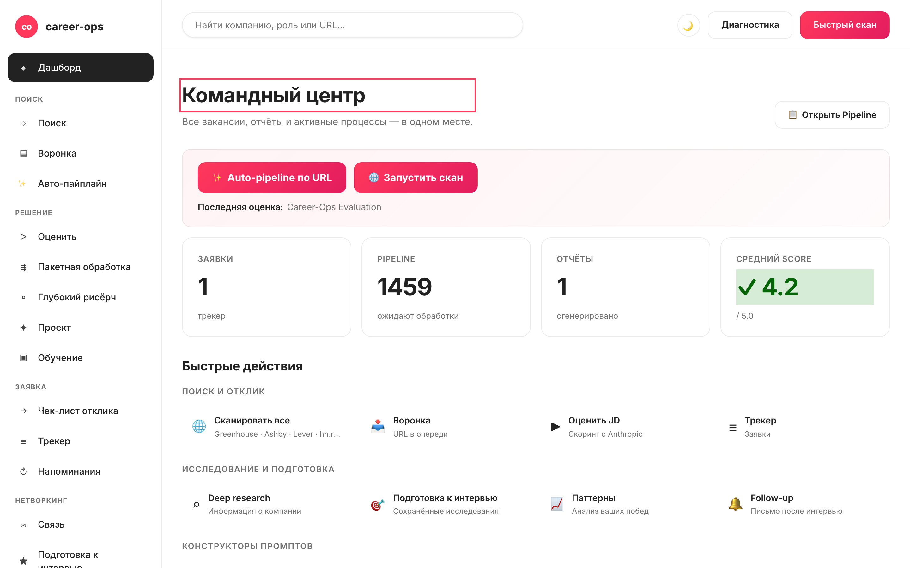

# career-ops-ui

> Чистый docs-style веб-интерфейс для AI-пайплайна поиска работы [career-ops](https://github.com/santifer/career-ops).
> Искать, оценивать, делать deep-dive, подавать заявки и трекать каждый оффер из одной вкладки браузера — вместо беготни между Claude Code, терминалами и markdown-файлами.

[English](README.md) | [Español](README.es.md) | [Português (Brasil)](README.pt-BR.md) | [한국어](README.ko-KR.md) | [日本語](README.ja.md) | **Русский** | [简体中文](README.zh-CN.md) | [繁體中文](README.zh-TW.md)

[](README.md#tests)
[](#tests)
[](README.md#requirements)
[](LICENSE)
[](https://github.com/Fighter90/career-ops-ui/releases/tag/v1.16.0)



## О career-ops

[career-ops](https://career-ops.org) — open-source система поиска работы, которая запускается как slash-команды внутри любого AI CLI (Claude Code, Codex, Cursor, Gemini CLI, GitHub Copilot CLI). Модель-агностична. Оценивает каждую вакансию по шестимерной рубрике 0.0–5.0, генерирует подогнанное PDF-резюме и трекает каждую заявку локально — без облака, без телеметрии, без авто-сабмита.

**Этот репозиторий (career-ops-ui)** — отполированный веб-интерфейс поверх CLI. CLI продолжает владеть заполнением форм (через Playwright MCP) и slash-командами; SPA даёт CRM-стиль поверх тех же `cv.md` / `data/applications.md` / `reports/`. Данные общие.

**Пороги действий по score** (из [career-ops.org/docs](https://career-ops.org/docs)):

| Score | Следующий шаг |
|---|---|
| **≥ 4.5** | `/career-ops apply` — высокий fit, подавайте сразу |
| **4.0 – 4.4** | подача или `/career-ops contacto` для warm intro |
| **3.5 – 3.9** | `/career-ops deep` — сначала рисёрч |
| **< 3.5** | пропустите, если нет персональной причины |

**Канонические гайды** на [career-ops.org/docs](https://career-ops.org/docs):

- [What is career-ops](https://career-ops.org/docs/introduction/what-is-career-ops)
- [Scan job portals](https://career-ops.org/docs/introduction/guides/scan-job-portals)
- [Apply for a job](https://career-ops.org/docs/introduction/guides/apply-for-a-job)
- [Batch-evaluate offers](https://career-ops.org/docs/introduction/guides/batch-evaluate-offers)
- [Set up Playwright](https://career-ops.org/docs/introduction/guides/set-up-playwright)

## Установка одной командой

```bash
curl -fsSL https://raw.githubusercontent.com/Fighter90/career-ops-ui/main/bin/setup.sh | bash
```

Эта команда клонирует оба репо (career-ops + career-ops-ui), ставит зависимости и запускает сервер на http://127.0.0.1:4317.

## Зачем?

[career-ops](https://github.com/santifer/career-ops) — мощная AI-система поиска работы на Claude Code: вставляешь JD → получаешь fit-score 0-5, ATS-оптимизированный PDF и запись в трекере. Внутри Claude Code работает отлично, но данные раскиданы по `cv.md`, `data/applications.md`, `reports/*.md`, `data/pipeline.md`, `portals.yml`, `config/profile.yml` — легко потерять, сложно охватить.

`career-ops-ui` накладывает сверху отполированный UI:

- **Просматривай** трекер, отчёты и pipeline как CRM.
- **Запускай** сканы (Greenhouse / Ashby / Lever / Workable / SmartRecruiters / Workday **и** hh.ru / Habr Career) с live-логами через SSE.
- **Оценивай** JD через Gemini API или получи готовый промпт для Claude.
- **Редактируй** `cv.md` с side-by-side markdown-превью.
- **Поддерживай** систему: doctor, verify, normalize, dedup, merge — каждый одним кликом.

Чисто аддитивно: внутри `career-ops/` ничего не меняется. Все кастомизации остаются твоими.

## Что есть на каждой странице

| Страница         | Что делает                                                                                                         |
| ---------------- | ------------------------------------------------------------------------------------------------------------------ |
| **Дашборд**      | Агрегированные счётчики (apps / pipeline / отчёты), средний score, разбивка по статусам, последние 5 apps + последний отчёт. |
| **Поиск**        | **🌐 Одна кнопка 🌐 Scan** — за один проход обходит каждый включённый источник (ATS adapters (Greenhouse / Ashby / Lever / Workable / SmartRecruiters / Workday) + regional portals (hh.ru / Habr Career)). Live SSE log + кликабельная таблица результатов с chip-фильтрами по стеку/уровню и фильтрами location / Remote-Hybrid / reloc / source. |
| **Pipeline**     | CRUD для `data/pipeline.md`. Прыжок прямо с URL на оценку.                                                          |
| **Оценить**      | Вставь JD → если задан `GEMINI_API_KEY`, запускает `gemini-eval.mjs`; иначе возвращает готовый промпт для Claude. |
| **Deep research**| Генерирует полный промпт `modes/deep.md` для указанной компании/роли.                                              |
| **Apply helper** | Генерирует чек-лист подачи; реальное автозаполнение через Playwright остаётся в `/career-ops apply` внутри Claude Code. |
| **Трекер**       | Filterable таблица по `data/applications.md` (статус, score, free-text). Кнопки one-click для normalize/dedup/merge. |
| **Отчёты**       | Просмотр и чтение каждого отчёта в `reports/` с распарсенным header (Score / Legitimacy / URL).                     |
| **CV**           | Live markdown-редактор для `cv.md` с side-by-side preview + sync-check.                                             |
| **Профиль**      | Read-only вьюха `config/profile.yml` + архетипы.                                                                    |
| **Health**       | Все setup-проверки в badge'ах OK / OPTIONAL / FAIL + кнопки запуска `doctor.mjs` и `verify-pipeline.mjs`.           |

## Требования

| | |
| --- | --- |
| **Node.js** | ≥ 18 |
| **career-ops** | Склонирован и onboarded |
| **Опционально** | `GEMINI_API_KEY` в `.env` для оценки JD одним кликом |
| **Опционально** | `HH_USER_AGENT` в `.env` если запускаешь вне РФ и хочешь, чтобы hh.ru API перестал отвечать 403 |

## Chip-фильтры по стеку и уровню

В таблице вакансий есть multi-select chip'ы для:

- **Стек:** PHP, Symfony, Laravel, Go, Rust, Node.js, TypeScript, Python, Ruby, Java, C#/.NET, C++, Backend, Frontend, Fullstack, Microservices, High-load, Distributed, DevOps/SRE, Data, ML/AI, Mobile, Security, Database, Cloud, API
- **Уровень:** Lead/Tech Lead, Architect, Manager, Principal/Staff, Senior, Middle, Junior

Multi-select внутри категории (OR), пересечение между категориями (AND). Counts показаны; рендерятся только chip'ы с реальными результатами.

## Полная документация

Полная архитектура, API reference, расширенная конфигурация и security notes — см. [English README](README.md).

## Лицензия

MIT. Построено поверх [career-ops](https://github.com/santifer/career-ops) от [santifer](https://santifer.io).

---

## 🌍 Getting Started — первые шаги после установки

После one-command install вы получаете два склонированных репо со скаффолд-шаблонами `cv.md`, `config/profile.yml`, `portals.yml`, `data/applications.md`, `data/pipeline.md` (внутри markeры **EDIT ME**). Health page должна быть полностью зелёной с первого запуска. Замените заглушки на свои данные:

### 1. Создайте CV (`cv.md`)

Три варианта:

- **A — вставьте готовое резюме:** откройте `career-ops/cv.md`, замените EDIT-ME на чистый markdown (Summary, Experience, Projects, Education, Skills).
- **B — загрузите из UI:** клик **CV** в сайдбаре → **📁 Загрузить CV** → выберите `.md`/`.txt` → проверьте preview → клик **💾 Сохранить**.
- **C — продиктуйте Claude Code:** в Claude Code запустите `/career-ops`, вставьте LinkedIn URL, попросите «извлеки моё CV и запиши в cv.md».

Метрики должны быть конкретными («снизил p99 на 38%», не «улучшил производительность»).

### 2. Профиль (`config/profile.yml`)

```bash
$EDITOR career-ops/config/profile.yml
```

Замените заглушки: ФИО, email, локация, LinkedIn, целевые роли, **архетипы** (самое важное — по ним идёт матчинг JD), salary target.

### 3. Сканер (`portals.yml`)

```bash
$EDITOR career-ops/portals.yml
```

Настройте `title_filter.positive` / `negative`. В `tracked_companies` уже есть 3 рабочие board (GitLab, Vercel, Linear). Готовые блоки 24+ компаний — в [`docs/portals-examples.md`](docs/portals-examples.md). Для hh.ru/Habr — настройте `russian_portals.queries`.

### 4. (Опционально) Gemini API key

```bash
echo "GEMINI_API_KEY=your-key" >> career-ops/.env
```

### 5. Проверьте и начинайте работу

Обновите Health → все обязательные чеки зелёные. Затем: **🌐 Сканировать все источники** → таблица вакансий с динамическими chip-фильтрами → копируйте URL → **Pipeline** → **Evaluate**.

Полная документация (архитектура, API, security): см. [English README](README.md).

---

## ✨ Новое в v1.16.0 (server-side auto-pipeline)

> **Главный UX-сдвиг.** До v1.15.0 было 5 ручных кликов через `#/pipeline → #/evaluate → #/cv → #/tracker`. Теперь одна кнопка `✨ Auto-pipeline a URL` (на `#/dashboard` и через `Cmd+K → вставить URL → Enter`) гоняет всю pipeline через наблюдаемый SSE-таймлайн.

### Как работает
1. **Валидация URL** (SSRF + DNS-rebind gate).
2. **Fetch JD** через SSRF-safe proxy.
3. **Оценка против CV** (Anthropic или Gemini), score 0–5 экстрактится из markdown.
4. **Сохранение report** в `reports/<slug>.md` (новый endpoint `POST /api/reports`).
5. **Добавление строки в tracker** со ссылкой на report + URL.

```bash
# Прямой curl (CI / smoke):
curl -N -X POST http://127.0.0.1:4317/api/auto-pipeline \
  -H 'Content-Type: application/json' \
  -d '{"url":"https://job-boards.greenhouse.io/anthropic/jobs/4567"}'
```

SSE-события: `start → step (×5) → done` или `error`. Чистое падение на любом шаге; chain останавливается и возвращает что успели.

### Остальные v1.16.0 highlights
- **SmartRecruiters пагинация** — обходит ВСЕ страницы, не только первые 100. Safety cap: 30 страниц / 3000 jobs.
- **Workday CAPTCHA-fallback** — tenant с CAPTCHA больше не валит весь scan. Рендерит chip 🔒 на карточке Active Companies; остальные tenant'ы продолжают.
- **`#/scan` source filter** — dropdown пересобран из adapter registry: 6 ATSes + hh.ru + Habr, алфавитный порядок, без geo-префиксов.
- **`scripts/import-trending-companies.mjs`** — верифицирует 13 trending компаний из `docs/portals-examples.md` и эмитит paste-ready YAML для твоего `portals.yml`. Запуск: `npm run import:trending`.
- **CI workflow** — `.github/workflows/dashboard-screenshots.yml` регенерит 8 hero PNG и валит build при visual drift'е без свежих коммитов.

### Ссылки
- Полная документация: [README на английском](README.md) — 585 строк с секциями архитектуры, API, безопасности.
- In-app help: `#/help` (16 секций × 8 локалей).
- CHANGELOG: [`CHANGELOG.ru.md`](CHANGELOG.ru.md).
- Канонические docs: [career-ops.org/docs](https://career-ops.org/docs).

---

## Архитектура

| Слой | Stack | Файлы |
|---|---|---|
| Server | Node ≥18, Express 4, js-yaml, multer | `server/index.mjs` (~130 LOC), `server/lib/routes/*.mjs` (13 модулей) |
| SPA | Vanilla JS, hash-router, без фреймворка | `public/index.html`, `public/js/{app,router,api}.js`, `public/js/views/*.js` |
| Styling | Hand-written CSS, docs-style токены, dark theme | `public/css/app.css` |
| Tests | `node --test` (TAP), Express in-process | `tests/*.test.mjs`, Playwright |
| Build | Нет — файлы as-is | — |

Сервер читает parent-файлы (`../cv.md`, `../config/profile.yml`) и пишет ТОЛЬКО на явные user-actions (`POST /api/tracker`, `PUT /api/cv`, `POST /api/reports`, `POST /api/auto-pipeline`).

## API reference

Ключевые endpoints (полный список в [EN README](README.md#api-reference)):

| Method + Path | Назначение |
|---|---|
| `GET /api/health` | system status + 18 checks |
| `GET /api/dashboard` | counts + score-thresholds + activity tail |
| `GET /api/scan-results` | snapshot + `workdayFallback` (v1.17+) |
| `GET /api/stream/scan?source=ats\|regional\|both` | консолидированный SSE |
| `POST /api/pipeline { url }` | add URL (SSRF gate) |
| `GET /api/pipeline/preview?url=` | SSRF-safe proxy + DNS-rebind guard |
| `POST /api/evaluate { jd, save?, mode? }` | Anthropic / Gemini / manual eval |
| `POST /api/reports { slug, markdown }` | persist в `reports/<slug>.md` (v1.16+) |
| `POST /api/auto-pipeline { url }` | SSE 5-step orchestrator (v1.16+) |
| `POST /api/tracker { company, role, … }` | append в `data/applications.md` |
| `GET /api/modes/_profile` + `PUT` | editor `modes/_profile.md` (v1.15+) |
| `POST /api/stream/pdf/inline` | SSE PDF через Playwright |

## Безопасность

- **CSP** строгий: `script-src 'self'` без `'unsafe-inline'`. Handlers через `addEventListener`.
- **SSRF**: каждый user-URL fetch проходит `isValidJobUrl()` — отклоняет loopback, private IPs, опасные schemes, небезопасные redirects.
- **XSS**: входящий markdown через `stripDangerousMarkdown()`.
- **DNS-rebind guard** на `/api/pipeline/preview` и auto-pipeline.
- **Headers**: `X-Content-Type-Options: nosniff`, `X-Frame-Options: DENY`, `Referrer-Policy: same-origin`.
- **Body caps**: 5 MB JSON, 1 MB report, 256 KB profile/modes_profile, 10 MB CV upload.
- Auth нет — single-tenant loopback only. LAN auth → P-12 (v2.0).

## Тесты

- `npm test` — **427** unit + integration. Изоляция через `CAREER_OPS_ROOT=$(mktemp -d)`.
- `npm run test:coverage` — **94 % линий / 83 % веток**.
- `npm run test:e2e` — 20 smoke E2E.
- `npm run test:e2e:full` — 23 comprehensive E2E.
- `npm run test:e2e:browser` — **32** Playwright (smoke + full-cycle + auto-pipeline scenarios).

## A11y (v1.17+)

- ARIA roles: `banner`, `navigation`, `main`, `dialog`, `status`, `search`.
- Focus trap в модалках + восстановление focus к click owner.
- `aria-expanded` sync на sidebar-toggle.
- Метка global search через `visually-hidden` class.

## Ограничения

- **Single-tenant, loopback only** — без login, без multi-user.
- **PDF требует Playwright** в parent.
- **Live LLM требует ANTHROPIC_API_KEY или GEMINI_API_KEY**; без ключа → manual prompt.
- **Workday CAPTCHA-gated tenants** падают в graceful fallback (no jobs); используй `/career-ops scan`.

## License

MIT — см. [LICENSE](LICENSE).

---

## Зачем career-ops-ui

career-ops отличен как CLI: paste URL → /career-ops → report + PDF + tracker row. Но CLI не показывает:

- **filterable table view** каждой просканированной вакансии (filter chips, scope, salary, remote/hybrid badges);
- **dashboard** с KPI counts + последний scan + последний report;
- **markdown editor** + live preview side-by-side для `cv.md`;
- **пагинацию** reports + apply-checklist + interview-prep saved files;
- **history of activity** для аудита что и когда писалось.

Эта UI сохраняет CLI как движок (Claude Code / Codex / Cursor) и добавляет CRM-style panel над теми же `cv.md` / `data/applications.md` / `reports/`. Data shared. Zero lock-in.

## Требования

- **Node.js ≥ 18.** Протестировано на 20.x и 22.x.
- **macOS / Linux** (Windows через WSL).
- **Parent career-ops** склонирован рядом с этим репо (или `CAREER_OPS_ROOT=…`).
- **Опционально**: Playwright + chromium (для PDF + auto-pipeline).
- **Опционально**: ANTHROPIC_API_KEY или GEMINI_API_KEY (без ключа работает в manual-prompt mode).

## Что ты получаешь — постранично

| Страница | Функция |
|---|---|
| `#/dashboard` | KPIs + последний scan + последний report + ✨ Auto-pipeline CTA |
| `#/scan` | Single 🌐 Scan button, fan-out на 6 ATSes + hh.ru + Habr, live SSE log, filterable results table |
| `#/pipeline` | URL queue, inline preview SSRF-safe, dedup |
| `#/evaluate` | JD → score 0–5 (Anthropic / Gemini / manual prompt) |
| `#/batch` | TSV editor для batch evaluate offers (v1.13+) |
| `#/deep` | Deep research по компании + role |
| `#/apply` | Apply checklist (form fields + key notes) |
| `#/tracker` | GFM-таблица каждой оценки + filters по status / score |
| `#/reports` | Paginated список markdown reports + score thresholds card |
| `#/interview-prep` | Saved research files |
| `#/cv` | Markdown editor + live preview + Generate PDF |
| `#/profile` | YAML preview + Career framing card (modes/_profile.md) |
| `#/config` | API keys, Profile YAML, Modes editor |
| `#/health` | 18 checks system status |
| `#/activity` | Audit log каждого state-changing request |
| `#/help` | 16 секций × 8 локалей |

## Конфигурация

```bash
# career-ops/.env
ANTHROPIC_API_KEY=sk-ant-…          # опционально но рекомендовано
GEMINI_API_KEY=AIza…                # опциональный fallback
HH_USER_AGENT="Mozilla/5.0 …"       # опционально для hh.ru с non-RU IPs
ANTHROPIC_MODEL=claude-sonnet-4-6   # опциональный override
GEMINI_MODEL=gemini-2.0-flash       # опциональный override
PORT=4317                           # опционально, default
HOST=127.0.0.1                      # опционально, default
CAREER_OPS_ROOT=/path/to/career-ops # опционально, default ../
```

## Contributing

PRs welcome. Следуй [`docs/sdd/CONVENTIONS.md`](docs/sdd/CONVENTIONS.md):

- Conventional Commits (`feat`, `fix`, `docs`, `chore` и т.д.).
- Тесты покрывают non-trivial изменения (`npm test` должен пройти).
- Без новых runtime deps без обоснования в spec.
- Без редактирования parent-файлов — CLAUDE.md hard rule #1.

Issues / discussions: <https://github.com/Fighter90/career-ops-ui/issues>.
