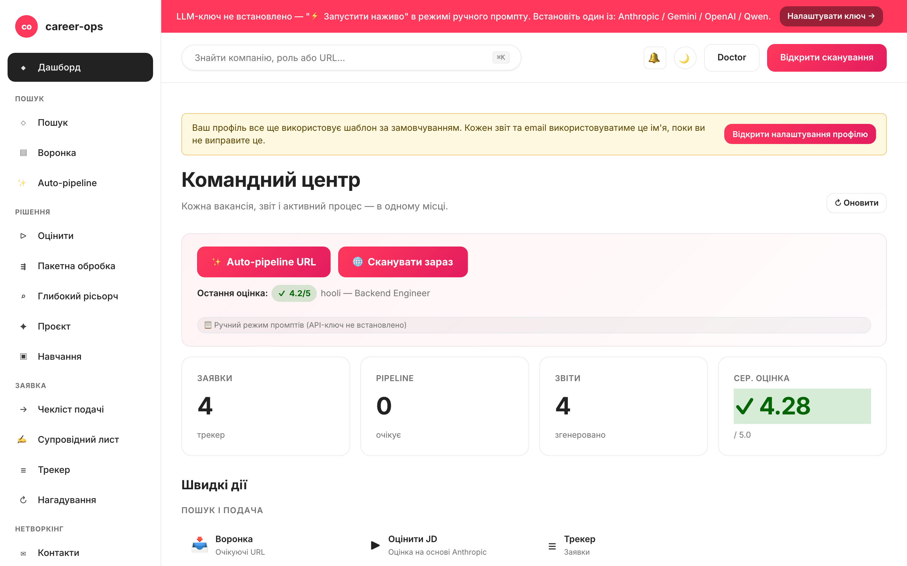

# career-ops-ui

> Лаконічний веб-інтерфейс у стилі технічної документації для AI-конвеєра пошуку роботи [career-ops](https://github.com/Fighter90/career-ops).
> Шукайте вакансії, оцінюйте їх, досліджуйте компанії, подавайте заявки та відстежуйте кожну пропозицію з однієї вкладки браузера — замість перемикання між Claude Code, терміналом і markdown-файлами.

[English](README.md) | [Español](README.es.md) | [Português (Brasil)](README.pt-BR.md) | [한국어](README.ko-KR.md) | [日本語](README.ja.md) | [Русский](README.ru.md) | [简体中文](README.zh-CN.md) | [繁體中文](README.zh-TW.md) | [Français](README.fr.md) | [Polski](README.pl.md) | **Українська** | [Dansk](README.da.md) | [العربية](README.ar.md)

_Неофіційний інтерфейс — не пов'язаний із career-ops / santifer і не схвалений ними._

[](#тести)
[](#тести)
[](#тести)
[](#вимоги)
[](LICENSE)
[](https://github.com/Fighter90/career-ops-ui/releases/tag/v1.79.0)

> **🆕 Останній реліз — v1.79.0**
>
> **Джерело сканування WeWorkRemotely (паритет із батьківським career-ops v1.14.0).** Загальнодошкова RSS-стрічка віддалених вакансій [We Work Remotely](https://weworkremotely.com) тепер є повноцінним джерелом сканування — додайте запис `provider: weworkremotely`, і воно з'явиться у випадаючому списку **Source** на `#/scan` (загалом **26 адаптерів**). Прив'язане до хоста + `redirect:'error'` (захищене від SSRF); заголовки розбиваються за `Company: Role`. Також: ключові слова `title_filter` тепер обрізаються перед перевіркою довжини (батьківський #1261). Базується на v1.78.x (**гео-фільтр сканування**, **автооновлення** результатів, **Enter→Сканування** у глобальному пошуку, клікабельний логотип), v1.77.0 (данська, 13-та локаль) і v1.76.0 (шість джерел ATS на тенант, `trust_filter`, необмежене сканування).
>
> _13 locales · 6 LLM-провайдерів · 26 адаптерів сканера · фільтр за країною · паритет із батьківським career-ops v1.14.0._



## Про проєкт career-ops

[career-ops](https://career-ops.org) — це система пошуку роботи з відкритим кодом, що працює як набір slash-команд усередині будь-якого AI-CLI для програмістів (Claude Code, Gemini CLI, Codex, Qwen Code, OpenCode, GitHub Copilot CLI, Antigravity CLI — інші CLI, сумісні з Claude, також підтримуються через той самий інтерфейс slash-команд). Незалежна від моделі. Оцінює кожну вакансію відносно вашого CV за шестивимірною шкалою 0,0–5,0, генерує індивідуалізовані PDF-резюме та веде локальний трекер заявок — без хмарних акаунтів, телеметрії та автоматичного надсилання.

**Це репозиторій (career-ops-ui)** — доопрацьований веб-інтерфейс поверх career-ops. CLI і надалі відповідає за заповнення форм (через Playwright MCP) та slash-команди; SPA додає CRM-подібну браузерну поверхню над тими самими файлами `cv.md` / `data/applications.md` / `reports/`. Обидва спільно використовують одні й ті самі дані.

**Порогові значення за оцінкою** (з [career-ops.org/docs](https://career-ops.org/docs)):

| Оцінка | Наступний крок |
|---|---|
| **≥ 4,5** | `/career-ops apply` — висока відповідність, надсилайте одразу |
| **4,0 – 4,4** | подавайте або `/career-ops contacto` для теплого знайомства |
| **3,5 – 3,9** | `/career-ops deep` — спочатку дослідіть компанію |
| **< 3,5** | пропустіть, якщо немає конкретної причини |

**Канонічні посібники** на [career-ops.org/docs](https://career-ops.org/docs):

- [Що таке career-ops](https://career-ops.org/docs/introduction/what-is-career-ops)
- [Сканування порталів вакансій](https://career-ops.org/docs/introduction/guides/scan-job-portals)
- [Подання заявки](https://career-ops.org/docs/introduction/guides/apply-for-a-job)
- [Пакетна оцінка пропозицій](https://career-ops.org/docs/introduction/guides/batch-evaluate-offers)
- [Налаштування Playwright](https://career-ops.org/docs/introduction/guides/set-up-playwright)

## Ключові можливості

| Сторінка | Призначення |
|---|---|
| **Дашборд** | Зведені лічильники, середній бал, останні заявки та звіти |
| **Сканування** | Кнопка 🌐 Scan запускає всі налаштовані джерела (Greenhouse / Ashby / Lever / Workable / SmartRecruiters / Workday + hh.ru / Habr Career) за один прохід; результати в реальному часі через SSE |
| **Pipeline** | Управління `data/pipeline.md`; безпечний прев'ю URL (захист від SSRF) |
| **Оцінка** | Вставте опис вакансії → оцінка 0–5 через Anthropic або Gemini; fallback на готовий промпт |
| **Глибокий аналіз** | Дослідження компанії через Anthropic SDK; результати зберігаються в `interview-prep/` |
| **Трекер** | Фільтрована таблиця заявок над `data/applications.md` |
| **CV** | Live-редактор markdown із бічним прев'ю та серверним захистом від XSS |
| **Здоров'я системи** | Значки стану конфігурації; запуск `doctor.mjs` одним кліком |
| **Допомога** | Вбудована документація у 12 мовах (включно з українською) |

## Швидкий старт

> **Важливо — career-ops-ui — це дашборд *поверх* [`Fighter90/career-ops`](https://github.com/Fighter90/career-ops).** Він працює **всередині** проєкту career-ops як `career-ops/web-ui/` і зчитує файли `cv.md`, `config/`, `data/` з батьківської папки через `../`. **Не працює автономно** — вам також потрібен батьківський репозиторій career-ops.

### Варіант 1 — одна команда curl (рекомендовано)

```bash
curl -fsSL https://raw.githubusercontent.com/Fighter90/career-ops-ui/main/bin/setup.sh | bash
```

Клонує **обидва** репозиторії, організовує структуру `career-ops/web-ui/`, встановлює залежності, запускає діагностику та стартує сервер на http://127.0.0.1:4317.

### Варіант 2 — додати UI до наявного проєкту career-ops

```bash
cd career-ops
git clone https://github.com/Fighter90/career-ops-ui.git web-ui
cd web-ui
npm install
npm start
```

Відкрийте http://127.0.0.1:4317 у браузері.

### CLI-команди

```bash
career-ops-ui setup    # bootstrap: встановлення залежностей → діагностика → запуск
career-ops-ui init     # вибір постачальника LLM та вставлення ключа API (інтерактивно)
career-ops-ui doctor   # перевірка Node / проєкту / ключів / Playwright
career-ops-ui run      # запуск сервера на http://127.0.0.1:4317
career-ops-ui open     # відкриття та виведення на передній план вкладки дашборду
career-ops-ui help     # список усіх команд
```

### Вибір постачальника LLM

`init` — це майстер налаштування постачальника: виберіть **Claude / Claude Code** (`ANTHROPIC_API_KEY`), **Codex / OpenCode** (`OPENAI_API_KEY`), **Qwen Code** (`QWEN_API_KEY`) або **Auto** (Anthropic → fallback Gemini). Ключі можна також задати вручну:

```bash
echo "ANTHROPIC_API_KEY=sk-ant-..." >> career-ops/.env
```

Або через вкладку **Налаштування застосунку** (`#/config`) в UI — без перезапуску сервера.

## Вимоги

| | |
|---|---|
| **Node.js** | ≥ 18 (нативні `fetch` та `node:test`) |
| **career-ops** | клонований та налаштований (дивіться вище) |
| **Опціонально** | `ANTHROPIC_API_KEY` або `GEMINI_API_KEY` у `.env` батьківського проєкту для оцінки JD одним кліком |

## Архітектура в короткому викладі

```
career-ops/
├─ cv.md
├─ portals.yml
├─ config/
├─ data/
└─ web-ui/          ← це репозиторій
   ├─ server/       # Express + 15 модулів маршрутів
   ├─ public/       # vanilla JS SPA, без бандлера
   └─ tests/        # 1086 unit + 70 Playwright + 43 e2e
```

Сервер має дві виробничі залежності: `express` та `js-yaml`. Жодного transpile, жодного бандлера — весь UI займає менше 30 KB у мінімізованому вигляді.

## Повна документація

Вичерпна документація доступна лише англійською мовою: **[README.md](README.md)**

Вона містить докладні описи:
- Повного REST API (всі ендпоінти `/api/*`)
- Налаштування сканера порталів (Greenhouse, Ashby, Lever, Workable, hh.ru, Habr Career, RSS)
- Усіх змінних оточення
- Принципів безпеки (SSRF, XSS, rate limiting)
- Архітектурного посібника (SDD, конвенції)

Офіційний сайт: [career-ops.org](https://career-ops.org) · Документація: [career-ops.org/docs](https://career-ops.org/docs)

## Тести

```bash
npm test                    # 1086 unit/integration-тестів
npm run test:e2e            # 20 smoke e2e
npm run test:e2e:full       # 23 comprehensive e2e
npm run test:e2e:browser    # 70 тестів Playwright
npm run test:coverage       # те саме + покриття V8
```

## Ліцензія

MIT. Деталі: [LICENSE](LICENSE).

Побудовано на основі [career-ops](https://github.com/Fighter90/career-ops) від [santifer](https://santifer.io).

[](https://github.com/Fighter90/career-ops-ui/graphs/contributors)
