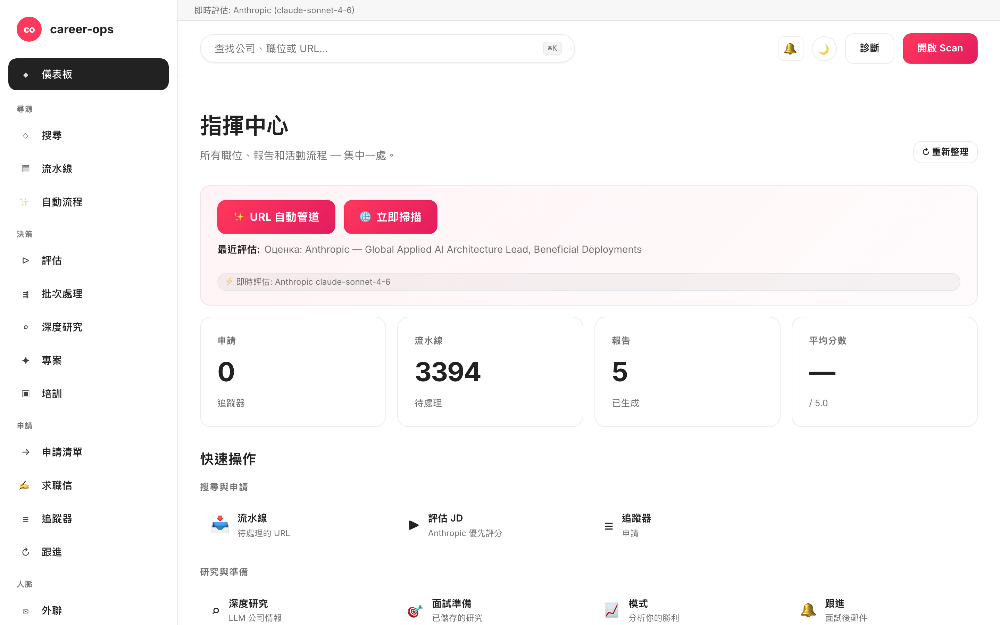

# career-ops-ui

> 用於 [career-ops](https://github.com/santifer/career-ops) AI 求職流水線的 簡潔 docs-style Web 介面。
> 在單個瀏覽器標籤中搜尋、評估、深入研究、申請和追蹤每個職位 — 而不是在 Claude Code、終端機和 markdown 檔案之間來回切換。

[English](README.md) | [Español](README.es.md) | [Português (Brasil)](README.pt-BR.md) | [한국어](README.ko-KR.md) | [日本語](README.ja.md) | [Русский](README.ru.md) | [简体中文](README.zh-CN.md) | **繁體中文**

[](README.md#tests)
[](#tests)
[](README.md#requirements)
[](LICENSE)
[](https://github.com/Fighter90/career-ops-ui/releases/tag/v1.16.0)

> 📦 **v1.9.1** — 伺服器精簡為 130 行的編排器 + `server/lib/routes/` 中的 12 個路由模組。`/api/evaluate` 的 Anthropic 對等(兩個 key 同時存在時優先)。多 CLI 橋接(`AGENTS.md`、`GEMINI.md`)支援 Codex / Aider / Cursor / Gemini CLI。**284 個 unit + 12 個 Playwright 煙霧測試**。完整 production-readiness 評估:[`docs/PRODUCTION-READINESS.md`](docs/PRODUCTION-READINESS.md)。可用於 single-tenant loopback 部署;LAN 暴露的 auth gate 在 v2.0 (P-12)。



## 關於 career-ops

[career-ops](https://career-ops.org) 是一個開源求職系統,作為 slash 命令運行在任何 AI 編碼 CLI(Claude Code、Codex、Cursor、Gemini CLI、GitHub Copilot CLI)內。模型無關。用 6 維 0.0–5.0 評分體系將每個職位與你的 CV 配對,生成客製化 PDF 履歷,並在本地追蹤每次申請 — 無雲帳號,無遙測,無自動提交。

**本倉庫 (career-ops-ui)** 是 CLI 之上的精緻 Web 介面。CLI 繼續擁有 form-fill(經 Playwright MCP)和 slash 命令模式;SPA 在同一 `cv.md` / `data/applications.md` / `reports/` 之上提供 CRM 風格的表面。資料共享。

**按 Score 的行動門檻** (來自 [career-ops.org/docs](https://career-ops.org/docs)):

| Score | 下一步 |
|---|---|
| **≥ 4.5** | `/career-ops apply` — 高配對,立即申請 |
| **4.0 – 4.4** | 申請,或 `/career-ops contacto` (warm intro) |
| **3.5 – 3.9** | `/career-ops deep` — 先調研 |
| **< 3.5** | 除非有特定理由,跳過 |

**規範指南** ([career-ops.org/docs](https://career-ops.org/docs)):

- [What is career-ops](https://career-ops.org/docs/introduction/what-is-career-ops)
- [Scan job portals](https://career-ops.org/docs/introduction/guides/scan-job-portals)
- [Apply for a job](https://career-ops.org/docs/introduction/guides/apply-for-a-job)
- [Batch-evaluate offers](https://career-ops.org/docs/introduction/guides/batch-evaluate-offers)
- [Set up Playwright](https://career-ops.org/docs/introduction/guides/set-up-playwright)

## 一鍵安裝

```bash
curl -fsSL https://raw.githubusercontent.com/Fighter90/career-ops-ui/main/bin/setup.sh | bash
```

此命令複製兩個儲存庫 (career-ops + career-ops-ui),安裝相依性,並在 http://127.0.0.1:4317 啟動伺服器。

## 為什麼?

[career-ops](https://github.com/santifer/career-ops) 是一個強大的基於 Claude Code 的求職系統:貼上 JD → 取得 0-5 適配評分、ATS 最佳化的 PDF 和追蹤器條目。在 Claude Code 內部運作良好,但資料分散在 `cv.md`、`data/applications.md`、`reports/*.md`、`data/pipeline.md`、`portals.yml`、`config/profile.yml` — 容易遺失,難以瀏覽。

`career-ops-ui` 在其上添加一個精緻的 UI:

- **瀏覽** — 像 CRM 一樣瀏覽追蹤器、報告和流水線。
- **觸發** — 觸發掃描 (Greenhouse / Ashby / Lever / Workable / SmartRecruiters / Workday **以及** hh.ru / Habr Career) 並查看即時 SSE 日誌。
- **評估** — 透過 Gemini API 評估 JD 或取得 Claude 的複製貼上 prompt。
- **編輯** — 使用並排 markdown 預覽編輯 `cv.md`。
- **維護** — doctor、verify、normalize、dedup、merge — 每個一鍵完成。

純加法:`career-ops/` 內部不會更改任何內容。你的自訂保持不變。

## 各頁面功能

| 頁面             | 功能                                                                                                              |
| ---------------- | ----------------------------------------------------------------------------------------------------------------- |
| **Dashboard**    | 彙總計數 (apps / pipeline / reports)、平均分數、按狀態分類、最新 5 個 apps + 最新報告。                                     |
| **Scan**         | **🌐 單個 🌐 Scan 按鈕** — 一次掃描所有已啟用的來源(EN:Greenhouse / Ashby / Lever / Workable / SmartRecruiters / Workday,RU:hh.ru + Habr Career)。即時 SSE 日誌 + 帶 stack/level chip 篩選器和 location / Remote-Hybrid / reloc / source 篩選器的可點擊結果表。 |
| **Pipeline**     | 對 `data/pipeline.md` 進行 CRUD。從 URL 直接跳轉到評估。                                                              |
| **Evaluate**     | 貼上 JD → 如果設定了 `GEMINI_API_KEY`,執行 `gemini-eval.mjs`;否則回傳 Claude 的複製貼上 prompt。                       |
| **Deep research**| 為指定的公司/角色產生完整的 `modes/deep.md` prompt。                                                                  |
| **Apply helper** | 產生申請清單;實際的 Playwright 表單填寫仍在 Claude Code 中的 `/career-ops apply` 中。                                    |
| **Tracker**      | `data/applications.md` 上的可篩選表 (狀態、分數、自由文字)。normalize/dedup/merge 一鍵按鈕。                            |
| **Reports**      | 瀏覽和閱讀 `reports/` 中的每個報告,帶解析的 header (Score / Legitimacy / URL)。                                       |
| **CV**           | `cv.md` 的即時 markdown 編輯器,帶並排預覽 + sync-check。                                                              |
| **Profile**      | `config/profile.yml` + 原型的唯讀檢視。                                                                              |
| **Health**       | 所有 setup 檢查在 OK / OPTIONAL / FAIL 徽章中 + 執行 `doctor.mjs` 和 `verify-pipeline.mjs` 的按鈕。                       |

## 要求

| | |
| --- | --- |
| **Node.js** | ≥ 18 |
| **career-ops** | 已複製並 onboard |
| **選用** | `.env` 中的 `GEMINI_API_KEY` 用於一鍵 JD 評估 |
| **選用** | 如果在俄羅斯境外執行並希望 hh.ru API 停止回傳 403,請使用 `.env` 中的 `HH_USER_AGENT` |

## stack 和 level 的 chip 篩選器

職位表包含以下內容的 multi-select chip:

- **Stack:** PHP, Symfony, Laravel, Go, Rust, Node.js, TypeScript, Python, Ruby, Java, C#/.NET, C++, Backend, Frontend, Fullstack, Microservices, High-load, Distributed, DevOps/SRE, Data, ML/AI, Mobile, Security, Database, Cloud, API
- **Level:** Lead/Tech Lead, Architect, Manager, Principal/Staff, Senior, Middle, Junior

每個類別內多選 (OR),類別之間交集 (AND)。顯示計數;只顯示有結果的 chip。

## 完整文件

完整架構、API 參考、進階設定和安全注意事項 — 請參閱 [英文 README](README.md)。

## 授權

MIT。基於 [santifer](https://santifer.io) 的 [career-ops](https://github.com/santifer/career-ops) 構建。

---

## 🌍 Getting Started — 安裝後的第一步

一鍵安裝後,你有兩個複製的儲存庫和腳手架檔案 (`cv.md`、`config/profile.yml`、`portals.yml`、`data/applications.md`、`data/pipeline.md` — 帶 **EDIT ME** 標記)。首次啟動時 Health 頁面應全部為綠色。用真實資料替換預留位置:

### 1. 建立 CV (`cv.md`)

- **A — 貼上現有履歷** 到 `career-ops/cv.md` 中,使用乾淨的 markdown。
- **B — 從 UI 上傳:** 點擊 **CV** → **📁 上傳履歷** → 選擇 `.md`/`.txt` → 檢查預覽 → 點擊 **💾 儲存**。
- **C — 將 LinkedIn 給 Claude Code:** 在 Claude Code 中執行 `/career-ops`,請求「擷取我的 CV 並寫入 cv.md」。

### 2. 個人資料 (`config/profile.yml`)

替換預留位置:姓名、電郵、位置、LinkedIn、目標角色、**archetypes** (最重要)、薪資範圍。

### 3. 掃描器 (`portals.yml`)

調整 `title_filter.positive`/`negative`。已預設 3 個 board (GitLab、Vercel、Linear)。更多內容:[`docs/portals-examples.md`](docs/portals-examples.md)。

### 4. (選用) Gemini API key

```bash
echo "GEMINI_API_KEY=your-key" >> career-ops/.env
```

### 5. 驗證並開始

Health → 全部為綠。**🌐 搜尋所有來源** → 帶 chip 篩選器的表格 → 複製 URL → **Pipeline** → **Evaluate**。

完整文件 (架構、API、安全):[英文 README](README.md)。

---

## ✨ v1.16.0 新功能(伺服端 auto-pipeline)

> **重大 UX 轉變。** v1.15.0 之前需要在 `#/pipeline → #/evaluate → #/cv → #/tracker` 間手動點擊 5 次。現在一個 `✨ Auto-pipeline a URL` 按鈕(在 `#/dashboard` 上以及 `Cmd+K → 貼上 URL → Enter`)在可觀察的 SSE 時間線中執行整個管道。

### 工作方式
1. **驗證 URL**(SSRF + DNS-rebind gate)。
2. **抓取 JD** 經過 SSRF-safe 代理。
3. **對照 CV 評估**(Anthropic 或 Gemini),從 markdown 擷取 0–5 分。
4. **儲存報告** 到 `reports/<slug>.md`(新端點 `POST /api/reports`)。
5. **新增 tracker 列** 引用報告 + URL。

```bash
# 直接 curl (CI / smoke):
curl -N -X POST http://127.0.0.1:4317/api/auto-pipeline \
  -H 'Content-Type: application/json' \
  -d '{"url":"https://job-boards.greenhouse.io/anthropic/jobs/4567"}'
```

SSE 事件: `start → step (×5) → done` 或 `error`。任何步驟的乾淨失敗;chain 停止並回傳已完成內容。

### 其他 v1.16.0 亮點
- **SmartRecruiters 分頁** — 遍歷所有頁面,而非僅前 100。安全上限:30 頁 / 3000 jobs。
- **Workday CAPTCHA-fallback** — CAPTCHA 阻塞的 tenant 不再中止整個掃描。在 Active Companies 卡片渲染 🔒 chip;其他 tenant 繼續。
- **`#/scan` source filter** — 從 adapter registry 重建的下拉選單:6 ATSes + hh.ru + Habr,字母排序,無 geo 前綴。
- **`scripts/import-trending-companies.mjs`** — 驗證 `docs/portals-examples.md` 的 13 個 trending 公司,並輸出可貼到你的 `portals.yml` 的 YAML。執行 `npm run import:trending`。
- **CI workflow** — `.github/workflows/dashboard-screenshots.yml` 重新生成 8 個 hero PNG,如果有未提交的視覺 drift 則建置失敗。

### 參考
- 完整文件: [英文 README](README.md) — 585 列包含架構、API 和安全章節。
- 應用內說明: `#/help`(16 章節 × 8 語言)。
- CHANGELOG: [`CHANGELOG.zh-TW.md`](CHANGELOG.zh-TW.md)。
- 規範文件: [career-ops.org/docs](https://career-ops.org/docs)。

---

## 架構

| 層 | Stack | 檔案 |
|---|---|---|
| Server | Node ≥18, Express 4, js-yaml, multer | `server/index.mjs` (~130 LOC)、`server/lib/routes/*.mjs` (13 模組) |
| SPA | Vanilla JS、hash-router、無框架 | `public/index.html`、`public/js/{app,router,api}.js`、`public/js/views/*.js` |
| Styling | 手寫 CSS、docs-style tokens、dark theme | `public/css/app.css` |
| Tests | `node --test` (TAP)、Express in-process | `tests/*.test.mjs`、Playwright |
| Build | 無 — 檔案 as-is 提供 | — |

伺服器讀取父專案檔案(`../cv.md`、`../config/profile.yml` 等),僅在明確使用者動作(`POST /api/tracker`、`PUT /api/cv`、`POST /api/reports`、`POST /api/auto-pipeline`)時寫入。

## API 參考

關鍵端點(完整列表見 [英文 README](README.md#api-reference)):

| Method + Path | 目的 |
|---|---|
| `GET /api/health` | system status + 18 checks |
| `GET /api/dashboard` | counts + score-thresholds + activity tail |
| `GET /api/scan-results` | 最新 scan + `workdayFallback` (v1.17+) |
| `GET /api/stream/scan?source=ats\|regional\|both` | 合併 SSE |
| `POST /api/pipeline { url }` | 加入 URL (SSRF gate) |
| `GET /api/pipeline/preview?url=` | SSRF-safe 代理 + DNS-rebind guard |
| `POST /api/evaluate { jd, save?, mode? }` | Anthropic / Gemini / manual eval |
| `POST /api/reports { slug, markdown }` | 持久化到 `reports/<slug>.md` (v1.16+) |
| `POST /api/auto-pipeline { url }` | SSE 5-step orchestrator (v1.16+) |
| `POST /api/tracker { company, role, … }` | append 到 `data/applications.md` |
| `GET /api/modes/_profile` + `PUT` | `modes/_profile.md` 編輯器 (v1.15+) |
| `POST /api/stream/pdf/inline` | 經 Playwright 的 SSE PDF |

## 安全說明

- **CSP** 嚴格: `script-src 'self'` 無 `'unsafe-inline'`。處理器經 `addEventListener`。
- **SSRF**: 每次使用者 URL fetch 通過 `isValidJobUrl()` — 拒絕 loopback、私有 IP、危險 scheme、不安全 redirect。
- **XSS**: 輸入 markdown 經過 `stripDangerousMarkdown()`。
- **DNS-rebind guard** 在 `/api/pipeline/preview` 和 auto-pipeline。
- **Headers**: `X-Content-Type-Options: nosniff`、`X-Frame-Options: DENY`、`Referrer-Policy: same-origin`。
- **Body caps**: 5 MB JSON、1 MB report、256 KB profile/modes_profile、10 MB CV upload。
- 無 auth — single-tenant loopback only。LAN auth → P-12 (v2.0)。

## 測試

- `npm test` — **427** 單元 + 整合。`CAREER_OPS_ROOT=$(mktemp -d)` 隔離。
- `npm run test:coverage` — **94 % 列 / 83 % 分支**。
- `npm run test:e2e` — 20 smoke E2E。
- `npm run test:e2e:full` — 23 comprehensive E2E。
- `npm run test:e2e:browser` — **32** Playwright(smoke + full-cycle + auto-pipeline 場景)。

## A11y (v1.17+)

- ARIA roles: `banner`、`navigation`、`main`、`dialog`、`status`、`search`。
- 模態焦點陷阱 + 恢復焦點到 click owner。
- sidebar-toggle 的 `aria-expanded` 同步。
- global search 標籤經 `visually-hidden` 類。

## 限制

- **Single-tenant、loopback only** — 無登入、無多用戶。
- **PDF 需要父專案的 Playwright**。
- **Live LLM 需要 ANTHROPIC_API_KEY 或 GEMINI_API_KEY**;無 key → manual prompt。
- **Workday CAPTCHA-gated tenants** 落入 graceful fallback(no jobs);使用 `/career-ops scan`。

## License

MIT — 見 [LICENSE](LICENSE)。

---

## 為什麼 career-ops-ui

career-ops 作為 CLI 出色:貼上 URL → /career-ops → report + PDF + tracker 列。但 CLI 不顯示:

- 每個掃描職位的**可篩選表格檢視**(filter chips、scope、salary、remote/hybrid 徽章);
- 帶 KPI 計數 + 最新掃描 + 最新報告的**儀表板**;
- 用於 `cv.md` 的**markdown 編輯器** + 並排即時預覽;
- 報告 + apply-checklist + interview-prep 已存檔的**分頁**;
- **活動歷史**,用於稽核何時寫入了什麼。

此 UI 保留 CLI 作為引擎(Claude Code / Codex / Cursor),並在相同的 `cv.md` / `data/applications.md` / `reports/` 之上加上 CRM 風格面板。資料共享。零鎖定。

## 需求

- **Node.js ≥ 18.** 在 20.x 和 22.x 上測試。
- **macOS / Linux**(Windows 透過 WSL)。
- **父 career-ops** 複製在此倉庫旁邊(或 `CAREER_OPS_ROOT=…`)。
- **選用**:Playwright + chromium(用於 PDF + auto-pipeline)。
- **選用**:ANTHROPIC_API_KEY 或 GEMINI_API_KEY(無 key 時在 manual-prompt 模式下運作)。

## 你獲得什麼 — 按頁面

| 頁面 | 功能 |
|---|---|
| `#/dashboard` | KPIs + 最新掃描 + 最新報告 + ✨ Auto-pipeline CTA |
| `#/scan` | 單個 🌐 Scan 按鈕,扇出到 6 ATSes + hh.ru + Habr,即時 SSE log,可篩選結果表格 |
| `#/pipeline` | URL 佇列,inline 預覽 SSRF-safe,dedup |
| `#/evaluate` | JD → 0–5 分(Anthropic / Gemini / manual prompt) |
| `#/batch` | batch evaluate offers 的 TSV 編輯器(v1.13+) |
| `#/deep` | 按公司 + 角色的深度研究 |
| `#/apply` | Apply 清單(form 欄位 + key notes) |
| `#/tracker` | 每次評估的 GFM 表格 + status / score 篩選器 |
| `#/reports` | 分頁的 markdown 報告列表 + score thresholds 卡片 |
| `#/interview-prep` | 已存研究檔案 |
| `#/cv` | Markdown 編輯器 + live preview + Generate PDF |
| `#/profile` | YAML 預覽 + Career framing 卡片(modes/_profile.md) |
| `#/config` | API 金鑰、Profile YAML、Modes 編輯器 |
| `#/health` | 18 項系統狀態檢查 |
| `#/activity` | 每個 state-changing 請求的稽核日誌 |
| `#/help` | 16 個章節 × 8 種語言 |

## 設定

```bash
# career-ops/.env
ANTHROPIC_API_KEY=sk-ant-…          # 選用但推薦
GEMINI_API_KEY=AIza…                # 選用 fallback
HH_USER_AGENT="Mozilla/5.0 …"       # 從非 RU IP 存取 hh.ru 選用
ANTHROPIC_MODEL=claude-sonnet-4-6   # 選用 override
GEMINI_MODEL=gemini-2.0-flash       # 選用 override
PORT=4317                           # 選用,預設
HOST=127.0.0.1                      # 選用,預設
CAREER_OPS_ROOT=/path/to/career-ops # 選用,預設 ../
```

## 貢獻

歡迎 PR。遵循 [`docs/sdd/CONVENTIONS.md`](docs/sdd/CONVENTIONS.md):

- Conventional Commits(`feat`、`fix`、`docs`、`chore` 等)。
- 測試涵蓋 non-trivial 變更(`npm test` 必須通過)。
- 沒有規範中說明就不增加 runtime deps。
- 不編輯 parent 檔案 — CLAUDE.md hard rule #1。

Issues / discussions: <https://github.com/Fighter90/career-ops-ui/issues>。
